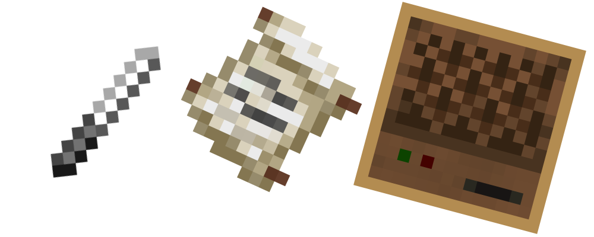
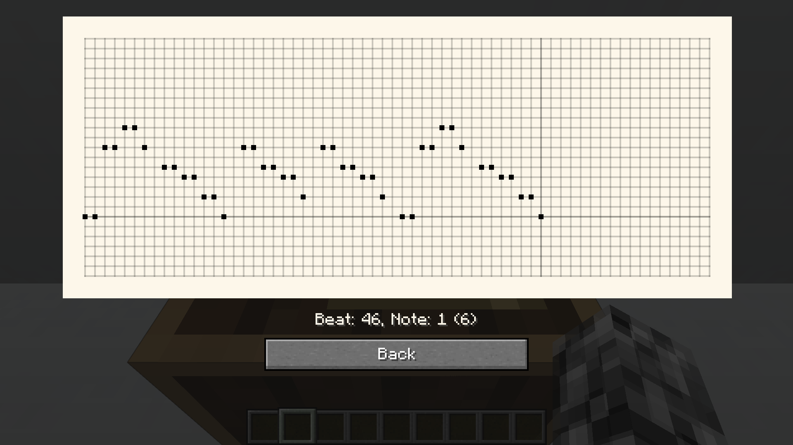
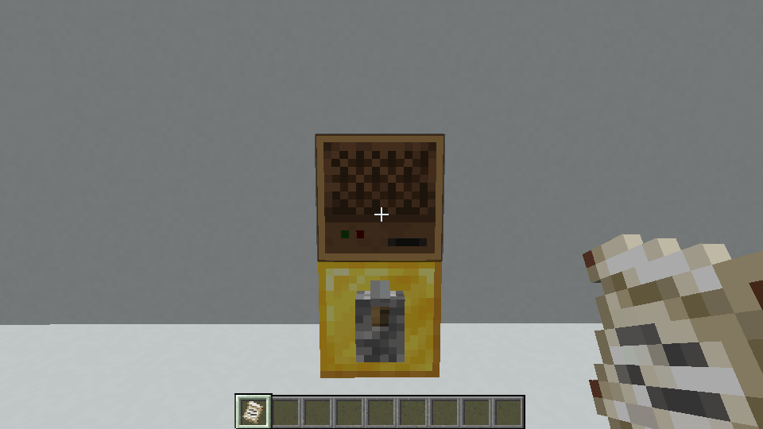
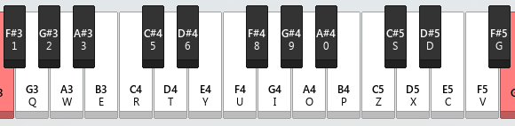

[English version on CurseForge](https://www.curseforge.com/minecraft/mc-mods/cc-mb)

# 纸带八音盒

Forge - 1.20.1 - 0.4.1



---

在纸带打出你喜欢的歌曲，使用八音盒进行播放

---

## 预览

B站上的演奏视频：[BV1Jh4y1y7TT](https://www.bilibili.com/video/BV1Jh4y1y7TT)






## 跳转

<!-- TOC -->
* [纸带八音盒](#纸带八音盒)
  * [预览](#预览)
  * [跳转](#跳转)
  * [模组内容](#模组内容)
    * [八音盒](#八音盒)
    * [纸带](#纸带)
    * [锥子](#锥子)
    * [打孔台](#打孔台)
    * [声响盒](#声响盒)
    * [声响碎片](#声响碎片)
  * [转换规则](#转换规则)
  * [导出工具](#导出工具)
  * [歌曲示例](#歌曲示例)
    * [What is love](#what-is-love)
    * [Beat it](#beat-it)
    * [Bad Apple](#bad-apple)
    * [Canon in D](#canon-in-d)
    * [Blinding Lights](#blinding-lights)
    * [Never Gonna Give You Up](#never-gonna-give-you-up)
    * [Billie Jean](#billie-jean)
  * [下载](#下载)
<!-- TOC -->

---

## 模组内容

### 八音盒

* 根据自己下方的方块决定八音盒的音色
  
  * 与原版的音符盒类似，且可以与其他为音符盒添加音色的模组共同使用(例如：[Instrument ++](https://github.com/Viola-Siemens/Instrument-Plus-Plus)）
  
  * 方块为声响盒时，会按照声响盒的音色演奏

* 使用锥子可调节八音盒的演奏速度
  
  * 单位为 tick/beat 即每一拍所需的 tick （1 tick 约为 0.05 s）
  
  * 速度范围为：[2, 20]
  
  * 默认速度为 10 tick/beat

* 没装纸带时：
  
  * 手持纸带对八音盒使用可装入纸带
  
  * 可以用漏斗向八音盒塞入纸带，纸带以外的物品会被挡在漏斗里

* 装有纸带时：
  
  * 按下Shift并空手对八音盒使用可取出纸带
  
  * 挖掘或使用八音盒可演奏一拍
  
  * 输入红石信号时会按照设置好的速度演奏
    
    * 正上方没有方块时且音色不为空（由声响盒设置时）时，会有音符粒子
  
  * 使用比较器检测会输出 1 ~ 15 强度的红石信号
    
    * 强度 1：还没有演奏或这一拍没有音符
    
    * 强度 n（1<n<15）：这一拍最低的音的序号（从零起）等于 n - 2
    
    * 强度 15：这一拍最低的音的序号（从零起）大于等于 13

* 纸带播完时：
  
  * 若八音盒的正后方有容器，演奏完的纸带会直接装入后方的容器
  
  * 若没有容器或无法放入容器，则会将纸带向前弹出

### 纸带

* 在打孔台打孔，利用不同位置的孔洞储存你的乐曲

* 格式
  
  * 页
    
    * 默认有 1 页
    
    * 最多有 64 页
    
    * 每页固定有 64 拍
  
  * 拍
    
    * 可以在 25 种音高里任意打孔（原版音符盒的音域）

### 锥子

* 在打孔台使用，消耗耐久为纸带打孔

* 设置八音盒的速度
  
  * 默认储存的速度为 10 tick/beat
  * 不对八音盒使用时
    * 按 Shift：储存的速度 - 1
    * 不按 Shift：储存的速度 + 1
  * 对八音盒使用可将其速度设为锥子储存的速度

* 按下 Shift 并对八音盒使用可查看其当前速度

### 打孔台

* 右侧的预览图会根据不同的模式显示提示，单击预览图即可完成特定的操作

* 左上栏位为操作对象，只能放入纸带

* 右上栏位为输入内容，能放入纸带或书与笔

* 下方栏位为工具，能放入锥子、黏液球

* 左上栏纸带的页数除了连接模式均不会发生改变，内容变化的多少由右侧的内容决定

* 查看模式：左上放入纸带
  
  * 查看这个纸带的每一页的孔洞

* 打孔模式：左上放入纸带、下方放入锥子
  
  * 选择指定的一页，在纸带上打孔
  
  * 打孔无法撤销，请仔细确认位置后再动手

* 覆盖（复制）模式：左上，右上放入纸带、下方放入锥子
  
  * 在左上已有的孔洞上按右上的再打一次

* 加载模式：左上放入纸带、右上放入书与笔、下方放入锥子
  
  * 在左上已有的孔洞上按从右上读取到的信息再打一次
  * 关于书与笔上到纸带的转换规则请见[转换规则](#转换规则)

* 连接模式：左上，右上放入纸带、下方放入黏液球
  
  * 将右上连接到左上的最后一页之后

### 声响盒

* 没装声响碎片时
  
  * 手持声响碎片对声响盒使用可装入碎片
  
  * 声响盒向上一格的八音盒会静音演奏

* 装有声响碎片时
  
  * 放入声响碎片可以让声响盒上面的八音盒发出特定的声音
  * 使用可查看当前声响盒的声音事件

### 声响碎片

* 没有记录声音的碎片
  
  * 长按使用键可记录周围的声音，松开使用键会在最后听到的声音所对应的声音事件中

* 存有声音的碎片
  
  * 使用可播放当前储存的声音
  
  * 按下 Shift 使用可随机分配一个当前声音事件下的新声音
    
    * 例如“村民交谈”是一个声音事件，事件中包含一些不同的声音：哼↗、哼 ↘等等

## 转换规则

* 纸带可以按照书与笔中所书写的内容快速打孔，不需要玩家一个一个孔去打了
* 每一拍使用[NOTE BLOCK STUDIO](https://opennbs.org/)中的键位代表音符，使用“.”作为这一拍的结束
  
* 以《小星星》为例：
  * 简谱（0为空拍）
    * 1，1，5，5，6，6，5，0，4，4，3，3，2，2，1
  * 书本内容：
    * r.r.i.i.o.o.i..u.u.y.y.t.t.r
* 如果有多声部，就在对应的拍子那里添加上对应的键位即可

## 导出工具

* 利用[导出工具](https://c20c01.github.io/Mods/MusicBox/Tool)可将.nbs文件转换成可通过书与笔导入纸带的文本
  
  * 只支持新版nbs文件
  
  * 不支持自定义音色，可以先转成原版有的乐器，之后再进行导出

## 歌曲示例

下面是我用在网上找到的nbs文件进行转换后的结果，大家可以在创造模式使用命令方块与下面的命令获取指定歌曲的指定声部。如果你有更棒的版本或者其他歌曲欢迎分享。

### What is love

* Harp

```
/give @p minecraft:writable_book{"pages":["t..u..i..0..o..0..i..t0..6o..t0..ui..0..to..0..u..0..o..t0..uu..o..ti..o..u..o..i..to..ru..o..i..o..u..o.","i..o..u..0..o..0..i..t0..6o..t0..ui..0..to..0..u..0..o..t0..uu..o..ti..o..u..o..i..to..ru..o..i..o..u..o.","i..o..u..x0i....x0i....x0i...x0i...d0i..x0u....x0u....x0u...x0u...d0u..xou....xou....xou...xou...dou..zou....zou....zou.",".zou.t..uzou..ix0i....x0i....x0i...x0i...d0i..x0u....x0u....x0u...x0u...d0u..xou....xou....xou...xou...dou..zou....zou....zou.","i.zou...uzou..0..o..0..i..0..o..0..i..0..o..0..u..0..o..0..u..o..i..o..u..o..i..o..u..o..i..o..u..o.","i..o..u..........t..r..3..t........3..t..r....t........3..t..6..t..t....r....3..5.","r..3..3........3..t..r....t........3..t..r....t..........t..6..t..t....r.......","t..u..i..0..o..0..i..t0..6o..t0..ui..0..to..0..u..0..o..t0..uu..o..ti..o..u..o..i..to..ru..o..i..o..u..o.","ti..uo..iu..0..o..0..i..t0..6o..t0..ui..0..to..0..u..0..o..t0..uu..o..ti..o..u..o..i..to..ru..o..i..o..u..o.","i..o..u..i....i....u..i..0..z..x..c..x..z....o....z..x..c..x..z....o......x....c.x.z...","......i....i....u..i..0..z..x..c..x..z....o....z..x..c..x..z....o......x....c.x.z...","......x0i....x0i....x0i...x0i...d0i..x0u....x0u....x0u...x0u...d0u..xou....xou....xou...xou...dou..zou....zou....zou.",".zou...zou..x0i....x0i....x0i...x0i...d0i..x0u....x0u....x0u...x0u...d0u..xou....xou....xou...xou...dou..zou....zou....zou.",".zou...zou..........t..r..3..t........3..t..r....t........3..t..6..t..t....r....3..5.","r..3..3........3..t..r....t........3..t..r....t........3..t..6..t..t....r.......","t..u..i..0..o..0..i..t0..6o..t0..ui..0..to..0..u..0..o..t0..uu..o..ti..o..u..o..i..to..ru..o..i..o..u..o.","ti..uo..iu..0..o..0..i..t0..6o..t0..ui..0..to..0..u..0..o..t0..uu..o..ti..o..u..o..i..to..ru..o..i..o..u..o.","i..o..u..i....i....u..i..0..z..x..c..x..z....o....z..x..c..x..z....o......x....c.x.z...","......i....i....u..i..0..z..x..c..x..z....o....z..x..c..x..z....o......x....c.x.z...","..t..u..ix0i....x0i....x0i..o.x0i..9.d0i..x0u.u...x0u....x0u...ox0u...9d0u..xou..u..xou....xou...xou.o..dou.9.zou...u.zou....zou.",".zou.t..uzou..ix0i....x0i....x0i..o.x0i..9.d0i..x0u.u...x0u....x0u...ox0u...9d0u..xou..u..xou....xou...xou.o..dou.9.zou...u.zou....zou.",".zou.t..uzou..i.........t..6..t..u....t..........t..u....t..........t..r..........","...............................................................","..............t..u....t..........................t..u....t...........","0..o..0..i..x0..xo..x0..xi..0..zo..0..u..o0..zo..o0..xu..o..zi..o..u..o..oi..oo..ou..o..ii..o..iu..io..i..uo..uu.","0..o..0..i..x0..xo..x0..xi..0..zo..0..u..o0..zo..o0..xu..o..zi..o..u..o..oi..o.o.u..oo..ii..o..u..o..ti..uo..iu.","0..o..0..i..t0..6o..t0..ui..0..to..0..u..0..o..t0..uu..o..ti..o..u..o..i..to..ru..o..i..o..u..o..ti..uo..iu.","0..o..0..i..t0..6o..t0..ui..0..to..0..u..0..o..t0..uu..o..ti..o..u..o..i..to..ru..o..i..o..u..o..ii..o..uu.","i....i....u..i..0..z..x..c..x..z....o....z..x..c..x..z....o......x....c.x.z.........","i....i....u..i..0..z..x..c..x..z....o....z..x..c..x..z....o......x....c.x.z....t..u..i.","0..o..0..i..t0..6o..t0..ui..0..to..0..u..0..o..t0..uu..o..ti..o..u..o..i..to..ru..o..i..o..u..o..ti..uo..iu.","0..o..0..i..t0..6o..t0..ui..0..to..0..u..0..o..t0..uu..o..ti..o..u..o..i..to..ru..xo..i..co..zu..o..xi..o..zu.","x0i....x0i....tx0i..6.x0i.t..ud0i..x0u..t..x0u....x0u...x0u.t..ud0u..xou..t..xou....xou...xou.t..rdou..xzou....czou..z..zou..x.zou...zzou.","x0i....x0i....tx0i..6.x0i.t..ud0i..x0u..t..x0u....x0u...x0u.t..ud0u..xou..t..xou....xou...xou.t..rdou..xzou....czou..z..zou..x.zou...zzou.","x0i....x0i....tx0i..6.x0i.t..ud0i..x0u..t..x0u....x0u...x0u.t..ud0u..xou..t..xou....xou...xou.t..rdou..zou....zou....zou..t.zou.u..izou.","x0i....x0i....tx0i..6.x0i.t..ud0i..x0u..t..x0u....x0u...x0u.t..ud0u..xou..t..xou....xou...xou.t..rdou..zou............t..u.","i",],"display":{"Name":'{"text":"竖琴(Harp)"}'}}
```

* Bass

```
/give @p minecraft:writable_book{"pages":["...............................................................","......i....i....i...i...u..3....3....3...r...r..t....t....t...t...r..u....u....u.",".t...u..i....i....i...i...u..3....3....3...r...r..t....t....t...t...r..u....u....u.",".t...u..i....i....i...i...u..3....3....3...r...r..t....t....t...t...r..u....u....u.",".t...u..i....i....i...i...u..3....3....3...r...r..t....t....t...t...r..u....u....u.",".t...u..i....i....i...i...u..3....3....3...r...r..t....t....t...t...r..u....u....u.",".t...u..i....i....i...i...u..3....3....3...r...r..t....t....t...t...r..u....u....u.",".t...u..i....i....i...i...u..3....3....3...r...r..t....t....t...t...r..u....u....u.",".t...u..i....i....i...i...u..3....3....3...r...r..t....t....t...t...r..u....u....u.",".t...u..q....q....i...i...u..3....3....3...r...r..t....t....t...t...r..u....u....u.",".t...u..q....q....i...i...u..3....3....3...r...r..t....t....t...t...r..u....u....u.",".t...u..i....i....i...i...u..3....3....3...r...r..t....t....t...t...r..u....u....u.",".t...u..i....i....i...i...u..3....3....3...r...r..t....t....t...t...r..u....u....u.",".t...u..i....i....i...i...u..3....3....3...r...r..t....t....t...t...r..u....u....u.",".t...u..i....i....i...i...u..3....3....3...r...r..t....t....t...t...r..u.........","......i....i....i...i...u..3....3....3...r...r..t....t....t...t...r..u....u....u.",".t...u..i....i....i...i...u..3....3....3...r...r..t....t....t...t...r..u....u....u.",".t...u..q....q....i...i...u..3....3....3...r...r..t....t....t...t...r..u....u....u.",".t...u..q....q....i...i...u..3....3....3...r...r..t....t....t...t...r..u....u....u.",".t...u..i....i....i...i...u..3....3....3...r...r..t....t....t...t...r..u....u....u.",".t...u..i....i....i...i...u..3....3....3...r...r..t....t....t...t...r..u....u....u.",".t...u...........................................................","i....i....i...i...u..3....3....3...r...r..t....t....t...t...r..u....u....u...t...u.","iq....iq....i...i.....................iq....iq....i...i....................","i....i....i...i...u..3....3....3...r...r..t....t....t...t...r..u....u....u...t...u.","i....i....i...i...u..3....3....3...r...r..t....t....t...t...r..u....u....u...t...u.","i....i....i...i...u..3....3....3...r...r..t....t....t...t...r..u....u....u...t...u.","i....i....i...i...u..3....3....3...r...r..t....t....t...t...r..u....u....u...t...u.","q....q....i...i...u..3....3....3...r...r..t....t....t...t...r..u....u....u...t...u.","q....q....i...i...u..3....3....3...r...r..t....t....t...t...r..u....u....u...t...u.","i....i....i...i...u..3....3....3...r...r..t....t....t...t...r..u....u....u...t...u.","i....i....i...i...u..3....3....3...r...r..t....t....t...t...r..u....u....u...t...u.","i....i....i...i...u..3....3....3...r...r..t....t....t...t...r..u....u....u...t...u.","i....i....i...i...u..3....3....3...r...r..t....t....t...t...r..u....u....u...t...u.","i....i....i...i...u..3....3....3...r...r..t....t....t...t...r..u....u....u...t...u.","i....i....i...i...u..3....3....3...r...r..t....t....t...t...r..u....u....u...t...u",],"display":{"Name":'{"text":"贝斯(Bass)"}'}}
```

* Bass Drum

```
/give @p minecraft:writable_book{"pages":["...............................................................","...............................................................","...............................................................","......q........q........q........q........q........q........q........q.","......q........q........q........q........q........q........q........q.","......q........q........q........q........q........q........q........q.","......q........q........q........q........q........q........q........q.","......q........q........q........q........q........q........q........q.","......q........q........q........q........q........q........q........q.","......q........q........q........q........q........q........q........q.","......q........q........q........q........q........q........q........q.","......q........q........q........q........q........q........q........q.","......q........q........q........q........q........q........q........q.","......q........q........q........q........q........q........q........q.","......q........q........q........q........q........q........q....q....q.","......q........q........q........q........q........q........q........q.","......q........q........q........q........q........q........q........q.","......q........q........q........q........q........q........q........q.","......q........q........q........q........q........q........q........q.","......q........q........q........q........q........q........q........q.","......q........q........q........q........q........q........q........q.","...............................................................","...............................................................","q........q........q........q........q........q........q........q.......","q........q........q........q........q........q........q........q.......","q........q........q........q........q........q........q...............","q........q........q........q........q........q........q........q.......","q........q........q........q........q........q........q........q.......","q........q........q........q........q........q........q........q.......","q........q........q........q........q........q........q........q.......","q........q........q........q........q........q........q........q.......","q........q........q........q........q........q........q........q.......","q........q........q........q........q........q........q........q.......","q........q........q........q........q........q........q........q.......","q........q........q........q........q........q........q........q.......","q........q........q........q........q........q........q",],"display":{"Name":'{"text":"底鼓(Bass drum)"}'}}
```

* Snare

```
/give @p minecraft:writable_book{"pages":["...............................................................","........g....g....g....g....g....g....g....g....g....g....g....g....g....g...","g....g..p..p..p..p.p.p..p..p..p.p.p..p..p..p.p.p..p..p..p.p.p..p..p..p.p.p..p..p..p.p.p..p..p..p.p.p.","p..p..p.p.p..p..pt..p.p.p..p..pt..p.p.p..p..pt..p.p.p..p..pt..p.p.p..p..pt..p.p.p..p..pt..p.p.p..p..pt..p.p.p.","p..pt..p.p.p..p..pt..p.p.p..p..pt..p.p.p..p..pt..p.p.p..p..pt..p.p.p..p..pt..p.p.p..p..pt..p.p.p..p..pt..p.p.p.","p..pt..p.p.p..p..pt..p.p.p..p..pt..p.p.p..p..pt..p.p.p..p..pt..p.p.p..p..pt..p.p.p..p..pt..p.p.p..p..pt..p.p.p.","p..pt..p.p.p..p..pt..p.p.p..p..pt..p.p.p..p..pt..p.p.p..p..pt..p.p.p..p..pt..p.p.p..p..pt..p.p.p..p..pt..p.p.p.","p..pt..p.p.p..p..pt..p.p.p..p..pt..p.p.p..p..pt..p.p.p..p..pt..p.p.p..p..pt..p.p.p..p..pt..p.p.p..p..pt..p.p.p.","p..pt..p.p.p..p..pt..p.p.p..p..pt..p.p.p..p..pt..p.p.p..p..pt..p.p.p..p..pt..p.p.p..p..pt..p.p.p..p..pt..p.p.p.","p..pt..p.p.qp..p..qpt..p.p.p..p..pt..p.p.p..p..pt..p.p.p..p..pt..p.p.p..p..pt..p.p.p..p..pt..p.p.p..p..pt..p.p.p.","p..pt..p.p.qp..p..qpt..p.p.p..p..pt..p.p.p..p..pt..p.p.p..p..pt..p.p.p..p..pt..p.p.p..p..pt..p.p.p..p..pt..p.p.p.","p..pt..p.p.p..p..pt..p.p.p..p..pt..p.p.p..p..pt..p.p.p..p..pt..p.p.p..p..pt..p.p.p..p..pt..p.p.p..p..pt..p.p.p.","p..pt..p.p.p..p..pt..p.p.p..p..pt..p.p.p..p..pt..p.p.p..p..pt..p.p.p..p..pt..p.p.p..p..pt..p.p.p..p..pt..p.p.p.","p..pt..p.p.p..p..pt..p.p.p..p..pt..p.p.p..p..pt..p.p.p..p..pt..p.p.p..p..pt..p.p.p..p..pt..p.p.p..p..pt..p.p.p.","p..pt..p.p.p..p..pt..p.p.p..p..pt..p.p.p..p..pt..p.p.p..p..pt..p.p.p..p..pt..p.p.p..p..pt..p.p.p..p..p..p.p.p.","p..p..p.p.p..p..pt..p.p.p..p..pt..p.p.p..p..pt..p.p.p..p..pt..p.p.p..p..pt..p.p.p..p..pt..p.p.p..p..pt..p.p.p.","p..pt..p.p.p..p..pt..p.p.p..p..pt..p.p.p..p..pt..p.p.p..p..pt..p.p.p..p..pt..p.p.p..p..pt..p.p.p..p..pt..p.p.p.","p..pt..p.p.qp..p..qpt..p.p.p..p..pt..p.p.p..p..pt..p.p.p..p..pt..p.p.p..p..pt..p.p.p..p..pt..p.p.p..p..pt..p.p.p.","p..pt..p.p.qp..p..qpt..p.p.p..p..pt..p.p.p..p..pt..p.p.p..p..pt..p.p.p..p..pt..p.p.p..p..pt..p.p.p..p..pt..p.p.p.","p..pt..p.p.p..p..pt..p.p.p..p..pt..p.p.p..p..pt..p.p.p..p..pt..p.p.p..p..pt..p.p.p..p..pt..p.p.p..p..pt..p.p.p.","p..pt..p.p.p..p..pt..p.p.p..p..pt..p.p.p..p..pt..p.p.p..p..pt..p.p.p..p..pt..p.p.p..p..pt..p.p.p..p..pt..p.p.p.","p..pt..p...........................................................","p..p..p..p.p.p..p..p..p.p.p..p..p..p.p.p..p..p..p.p.p..p..p..p.p.p..p..p..p.p.p..p..p..p.p.p..p..p..p.p","q....qt........t........t........t....q....qt........t........t........t...","p..p..pt..p.p.p..p..pt..p.p.p..p..pt..p.p.p..p..pt..p.p.p..p..pt..p.p.p..p..pt..p.p.p..p..pt..p.p.p..p..pt..p.p","p..p..pt..p.p.p..p..pt..p.p.p..p..pt..p.p.p..p..pt..p.p.p..p..pt..p.p.p..p..pt..p.p.p..p..pt..p.p.pt..p..pt..p.p","p..p..pt..p.p.p..p..pt..p.p.p..p..pt..p.p.p..p..pt..p.p.p..p..pt..p.p.p..p..pt..p.p.p..p..pt..p.p.p..p..pt..p.p","p..p..pt..p.p.p..p..pt..p.p.p..p..pt..p.p.p..p..pt..p.p.p..p..pt..p.p.p..p..pt..p.p.p..p..pt..p.p.p..p..pt..p.p","qp..p..qpt..p.p.p..p..pt..p.p.p..p..pt..p.p.p..p..pt..p.p.p..p..pt..p.p.p..p..pt..p.p.p..p..pt..p.p.p..p..pt..p.p","qp..p..qpt..p.p.p..p..pt..p.p.p..p..pt..p.p.p..p..pt..p.p.p..p..pt..p.p.p..p..pt..p.p.p..p..pt..p.p.p..p..pt..p.p","p..p..pt..p.p.p..p..pt..p.p.p..p..pt..p.p.p..p..pt..p.p.p..p..pt..p.p.p..p..pt..p.p.p..p..pt..p.p.p..p..pt..p.p","p..p..pt..p.p.p..p..pt..p.p.p..p..pt..p.p.p..p..pt..p.p.p..p..pt..p.p.p..p..pt..p.p.p..p..pt..p.p.p..p..pt..p.p","p..p..pt..p.p.p..p..pt..p.p.p..p..pt..p.p.p..p..pt..p.p.p..p..pt..p.p.p..p..pt..p.p.p..p..pt..p.p.p..p..pt..p.p","p..p..pt..p.p.p..p..pt..p.p.p..p..pt..p.p.p..p..pt..p.p.p..p..pt..p.p.p..p..pt..p.p.p..p..pt..p.p.p..p..pt..p.p","p..p..pt..p.p.p..p..pt..p.p.p..p..pt..p.p.p..p..pt..p.p.p..p..pt..p.p.p..p..pt..p.p.p..p..pt..p.p.p..p..pt..p.p","p..p..pt..p.p.p..p..pt..p.p.p..p..pt..p.p.p..p..pt..p.p.p..p..pt..p.p.p..p..pt..p.p.p..p..pt..p.p.pt..p..pt..p.","p",],"display":{"Name":'{"text":"小军鼓(Snare)"}'}}
```

* Hat

```
/give @p minecraft:writable_book{"pages":["...............................................................","...............................................................","...............................................................","...............................................................","......................................................i..u..t..i...","u....t...........................................................","...............................................................","...............................................................","...............................................................","......q....q.....................................................","......q....q.....................................................","...............................................................","...............................................................","...............................................................","...............................................................","...............................................................","...............................................................","......q....q.....................................................","......q....q.....................................................","...............................................................","...............................................................","...............................................................","...............................................................","q....q............................q....q...........................","...............................................................","...............................................................","...............................................................","...............................................................","q....q...........................................................","q....q",],"display":{"Name":'{"text":"击鼓沿(Hat)"}'}}
```

---

### Beat it

* Harp

```
/give @p minecraft:writable_book{"pages":["...............................................................","...............................................................","...............................................................","...............................................................","...............................................................","................................68..0..9..0..0..0..9..0..52p..0..9....9......0.","689..0..0..0..9..0..9..8..259..8..9..........0..169..8..6..5..6....5..6..52u..6..5..3..5....6..6.","688..6..........6..6..526..5..............68..0..9..0..0..0..9..0..52p..0..9....0......0.","689..0..0..0..9..0..9..8..259..8..9..........0..168..8..6..5..6....5..6..526....5..3..5....6...","638..6..........0..0..25p..0..9...0.....9....680..0..............520..0............0.","86..0..0..0..s....0..s..52..0............9..36..8..9....8..9....9..25..8..9....8..6....9.","36..8..9....8..9....9..25..8..9....8....9....638..6..........6....5u..5..........8...","868..6..........6....2u6..5..............68..0..9..0..0..0..9..0..52p..0..9....0......0.","689..0..0..0..9..0..9..8..259..8..9..........0..168..8..6..5..6....5..6..526..6..5..3..5....6...","688..6..........6....5uu..5..............68..0..9..0..0..0..9..0..52p..0..9....0......0.","689..0..0..0..9..0..9..8..259..8..9..........0..168..8..6..5..6....5..6..526..6..5..3..5....6...","688..6..........0..0..5up..0..9....0....9....68..0..............520..0............0.","68..0..0..0..s....0..s..52..0............9..68..8..9....8..9....9..52..8..9....8..6....9.","68..8..9....8..9....9..52..8..9....8....9....68..0..............520..0............0.","68..0..0..0..s....0..s..52..0............9..68..8..9....8..9....9..52..8..9....8..6....9.","68..8..9....8..9....9..52..8..9....8....9....8..6..8..6..8..6..8..6..8..6..8..6..8..6..8..6.","8..6..8..6..8..6..8..6..........55........66........................8..6..8..6.","8..6..8..6..8..6..8..6..8..6..8..6..855..6..8..6..866..6..8..6..8..6.....................","................855.6...8..6..855..6..8..6..866..6..8..6.........................","..........................3......68..............5..52...............","68......v.d.s.v.gv.d.s.vg.v.d.u5s.vg.vd.s.zs.z.09.z.sz.0.90....0..16.....0..0s.v.d0.g.dv.d.v.s0.sd.52.v.s0.s.dv.s.0d.0.9...8.s...","680.s...s.0.d0.s.9......18..52.....9s.dc....5.6...5..86..re.w2.1u..6.5.3.5...6.53.5..2u.6.53.5...6.53.2.......","68....g.i9.0d..s..d.0.g....u2.d.s.9..8.9.....i8.u6.t5.e3.s.1e8.p.p.d.s.8.p.8.pd.s8.p.d.s.8p.8.p.52d.s8.s.v.s.9s.9.s...p0.u3.52..s.","63......d.d.dv.v.vg.g.g.g.g.g.25g9.9.9..............63..0..............2u0..0............0.","63..0..0..0..s....0..s..2u..0............9..63..8..9....8..9....9..2u..8..9....8..6....9.","63..8..9....8..9....9..2u..8..9....8....9....63..0..............2u0..0............0.","63..0..0..0..s....0..s..2u..0............9..63..8..9....8..9....9..2u..8..9....8..6....9.","63..8..9....8..9....9..2u..8..9....8....9....63..0..............2u0..0............0.","63..0..0..0..s....0..s..2u..0............9..63..8..9....8..9....9..2u..8..9....8..6....9.","63..8..9....8..9....9..2u..8..9....8....9....63..0..............2u0..0............0.","63..0..0..0..s....0..s..2u..0............9..63..8..9....8..9....9..2u..8..9....8..6....9.","63..8..9....8..9....9..2u..8..9....8....9....8..6",],"display":{"Name":'{"text":"竖琴(Harp)"}'}}
```

* Bass

```
/give @p minecraft:writable_book{"pages":["ii................ii................yy................yy...............","ii................ii................1rtt..1..1t..1..1r..1..1t..1..1r..1..1r..1..1..1r..1t..1.","1r..1..1t..1..1r..1..1t..1..1r..1..1r..1..1..1r..1t..1..1r..1..1t..1..1r..1..1t..1..1r..1..1r..1..1..1r..1t..1.","1r..1..1t..1..1r..1..1t..1..1r..1..1r..1..1..1r..1t..661....11..33..88..66......uu....66..55....55......66.","..11..33..88..66......uu....66..55..........66....11..33..88..66......uu....66..55....55......66.","..11..33..88..66......uu....66..55............6..660d..606d....606d......595s..595s....595s...........","..606d..660d....606d......595s..559s....595s..............e8ep..ee8p....e8ep......559s..559s....595s...........","..606d..606d....606d......595s..595s....595s............65..660d..606d5..6..606d8..6..5..595s6..595su..6..595s..6..u..6..5..6.","5..606d..660d5..6..606d8..6..5..595s6..559su..6..595s..6..u..6..5..6..5..e8ep6..ee8p6..6..e8ep8..6..5..559s6..559su..6..595s..6..u..6..5..6.","5..606d..606d..6..606d8..6..5..595s6..595su..6..595s..6........66....11..33..88..66......uu....66..55....55......66.","..11..33..88..66......uu....66..55..........66....11..33..88..66......uu....66..55....55......66.","..11..33..88..66......uu....66..55..........66....11..33..88..66......uu....66..55....55......66.","..11..33..88..66......uu....66..55............6..660d..606d....606d......595s..595s....595s...........","..606d..660d....606d......595s..559s....595s..............e8ep..ee8p....e8ep......559s..559s....595s...........","..606d..606d....606d......595s..595s....595s............65..660d..606d5..6..606d8..6..5..595s6..595su..6..595s..6..u..6..5..6.","5..606d..660d5..6..606d8..6..5..595s6..559su..6..595s..6..u..6..5..6..5..e8ep6..ee8p6..6..e8ep8..6..5..559s6..559su..6..595s..6..u..6..5..6.","5..606d..606d..6..606d8..6..5..595s6..595su..6..595s..6......11..66....11..33..88..66......uu....66..55....55......66.","..11..33..88..66......uu....66..55..........66....11..33..88..66......uu....66..55....55......66.","..11..33..88..66......uu....66..55..........66....11..33..88..66......uu....66..55....55......66.","..11..33..88..66......uu....66..55..........66....11..33..88..66......uu....66..55....55......66.","..11..33..88..66......uu....66..55..............66..66....66......66..66....66...........","..66..66....66......66..66....66..............66..66....66......66..66....66...........","..66..66....66......66..66....66..............66..66....66......66..66....66...........","..66..66....66......66..66....66..............66..66....66......66..66....66...........","..66..66....66......66..6gs..9s.9.6gs.0.d....zi.8p.69.ru.66....60d..66d....66d......55s..55s..9..55s......0..d...","..606d..660d....606d......595s..559s....595s..............e8ep..ee8p....e8ep......559s..559s....595s...........","..606d..606d....606d......595s..595s....595s............6..660d..606d....606d......595s..595s....595s....d.......","..606d..660d....606d......595s..559s....595s..............e8ep..ee8p....e8ep......559s..559s....595s...........","..606d..606d....606d......595s..595s....595s..........66....11..33..88..66......uu....66..55....55......66.","..11..33..88..66......uu....66..55..........66....11..33..88..66......uu....66..55....55......66.","..11..33..88..66......uu....66..55..........66....11..33..88..66......uu....66..55....55......66.","..11..33..88..66......uu....66..55..........66....11..33..88..66......uu....66..55....55......66.","..11..33..88..66......uu....66..55..........66....11..33..88..66......uu....66..55....55......66.","..11..33..88..66......uu....66..55..........66....11..33..88..66......uu....66..55....55......66.","..11..33..88..66......uu....66..55..........66....11..33..88..66......uu....66..55....55......66.","..11..33..88..66......uu....66..55..........66....11..33..88..66......uu....66..55....55......66.","..11..33..88..66......uu....66..55..........66",],"display":{"Name":'{"text":"贝斯(Bass)"}'}}
```

* Bass Drum

```
/give @p minecraft:writable_book{"pages":["...............................................................","...............................................................","...............................................................","..............................r..r........r........r..........r.....","r........r........r..........r......r........r........r..........r.....","r........r........r..........r......r........r........r..........r.....","r........r........r..........r......r........r........r..........r.....","r........r........r..........r......r........r........r..........r.....","r........r........r..........r......r........r........r..........r.....","r........r........r..........r....r..r........r........r..........r.....","r........r........r..........r......r........r........r..........r.....","r........r........r..........r......r........r........r..........r.....","r........r........r..........r......r........r........r..........r.....","r........r........r..........r......r........r........r..........r.....","r........r........r..........r......r........r........r..........r.....","r........r........r..........r......r........r........r..........r.....","r........r........r..........r....r..r........r........r..........r.....","r........r........r..........r......r........r........r..........r.....","r........r........r..........r......r........r........r..........r.....","r........r........r..........r......r........r........r..........r.....","r........r........r..........r......r........r........r..........r.....","r........r........r..........r......r........r........r..........r.....","r........r........r..........r......r........r........r..........r.....","r........r........r..........r......r........r........r..........r.....","r........r........r..........r....r..........r........r..........r.....","r........r........r..........r......r........r........r..........r.....","r........r........r..........r......r........r........r..........r.....","r........r........r..........r......r........r........r..........r.....","r........r........r..........r....r..r........r........r..........r.....","r........r........r..........r......r........r........r..........r.....","r........r........r..........r......r........r........r..........r.....","r........r........r..........r......r........r........r..........r.....","r........r........r..........r....r..r........r........r..........r.....","r........r........r..........r....r..r........r........r..........r.....","r........r........r..........r......r........r........r..........r.....","r........r........r..........r......r........r........r..........r.....","r........r........r..........r",],"display":{"Name":'{"text":"底鼓(Bass drum)"}'}}
```

* Snare

```
/give @p minecraft:writable_book{"pages":["...............................................................","...............................................................","...............................................................","..........................t..t..t..c..c..ct..c..c..c..ct..c..c..c..ct..c..c..c..ct..c.","c..c..ct..c..c..c..ct..c..c..c..ct..c..c..c..ct..c..c..c..ct..c..c..c..ct..c..c..c..ct..c..c..c..ct..c.","c..c..ct..c..c..c..ct..c..c..c..ct..c..c..c..ct..c..i..c..ct..c..c..c..ct..c..c..c..ct..c..c..c..ct..c.","c..c..ct..c..c..c..ct..c..c..c..ct..c..c..c..ct..c..c..c..ct..c..c..c..ct..c..c..c..ct..c..c..c..ct..c.","c..c..ct..c..c..c..ct..c..c..c..ct..c..c..c..ct..c..p..c..ct..c..c..c..ct..c..c..c..ct..c..c..c..ct..c.","c..c..ct..c..c..c..ct..c..c..c..ct..c..c..c..ct..c..c..c..ct..c..c..c..ct..c..c..c..ct..c..c..c..ct..c.","c..c..ct..c..c..c..ct..c..c..c..ct..c..c..c..ct..i..c..c..ct..c..c..c..ct..c..c..c..ct..c..c..c..ct..c.","c..c..ct..c..c..c..ct..c..c..c..ct..c..c..c..ct..c..c..c..ct..c..c..c..ct..c..c..c..ct..c..c..c..ct..c.","c..c..ct..c..c..c..ct..c..c..c..ct..c..c..c..ct..c..i..c..ct..c..c..c..ct..c..c..c..ct..c..c..c..ct..c.","c..c..ct..c..c..c..ct..c..c..c..ct..c..c..c..ct..c..i..c..ct..c..c..c..ct..c..c..c..ct..c..c..c..ct..c.","c..c..ct..c..c..c..ct..c..c..c..ct..c..c..c..ct..c..c..c..ct..c..c..c..ct..c..c..c..ct..c..c..c..ct..c.","c..c..ct..c..c..c..ct..c..c..c..ct..c..c..c..ct..c..p..c..ct..c..c..c..ct..c..c..c..ct..c..c..c..ct..c.","c..c..ct..c..c..c..ct..c..c..c..ct..c..c..c..ct..c..c..c..ct..c..c..c..ct..c..c..c..ct..c..c..c..ct..c.","c..c..ct..c..c..c..ct..c..c..c..ct..c..c..c..ct..z..i..c..ct..c..c..c..ct..c..c..c..ct..c..c..c..ct..c.","c..c..ct..c..c..c..ct..c..c..c..ct..c..c..c..ct..c..c..c..ct..c..c..c..ct..c..c..c..ct..c..c..c..ct..c.","c..c..ct..c..c..c..ct..c..c..c..ct..c..c..c..ct..c..c..c..ct..c..c..c..ct..c..c..c..ct..c..c..c..ct..c.","c..c..ct..c..c..c..ct..c..c..c..ct..c..c..c..ct..c..c..c..ct..c..c..c..ct..c..c..c..ct..c..c..c..ct..c.","c..c..ct..c..c..c..ct..c..c..c..ct..c..c..c..ct..c..i..c..ct..c..c..c..ct..c..c..c..ct..c..c..c..ct..c.","c..c..ct..c..c..c..ct..c..c..c..ct..c..c..c..ct..c..c..c..ct..c..c..c..ct..c..c..c..ct..c..c..c..ct..c.","c..c..ct..c..c..c..ct..c..c..c..ct..c..c..c..ct..c..c..c..ct..c..c..c..ct..c..c..c..ct..c..c..c..ct..c.","c..c..ct..c..c..c..ct..c..c..c..ct..c..c..c..ct..c..c..c..ct..c..c..c..ct..c..c..c..ct..c..c..c..ct..c.","c..c..ct..c..c..c..ct..c..c..c..ct..c..c..c..ct..t..tc..c..ct..c..c..c..ct..c..c..c..ct..c..c..c..ct..c.","c..c..ct..c..c..c..ct..c..c..c..ct..c..c..c..ct..c..c..c..ct..c..c..c..ct..c..c..c..ct..c..c..c..ct..c.","c..c..ct..c..c..c..ct..c..c..c..ct..c..c..c..ct..c..p..c..ct..c..c..c..ct..c..c..c..ct..c..c..c..ct..c.","c..c..ct..c..c..c..ct..c..c..c..ct..c..c..c..ct..c..c..c..ct..c..c..c..ct..c..c..c..ct..c..c..c..ct..c.","c..c..ct..c..c..c..ct..c..c..c..ct..c..c..c..ct..z..c..c..ct..c..c..c..ct..c..c..c..ct..c..c..c..ct..c.","c..c..ct..c..c..c..ct..c..c..c..ct..c..c..c..ct..c..c..c..ct..c..c..c..ct..c..c..c..ct..c..c..c..ct..c.","c..c..ct..c..c..c..ct..c..c..c..ct..c..c..c..ct..c..c..c..ct..c..c..c..ct..c..c..c..ct..c..c..c..ct..c.","c..c..ct..c..c..c..ct..c..c..c..ct..c..c..c..ct..c..c..c..ct..c..c..c..ct..c..c..c..ct..c..c..c..ct..c.","c..c..ct..c..c..c..ct..c..c..c..ct..c..c..c..ct..z..p..c..ct..c..c..c..ct..c..c..c..ct..c..c..c..ct..c.","c..c..ct..c..c..c..ct..c..c..c..ct..c..c..c..ct..c..c..c..ct..c..c..c..ct..c..c..c..ct..c..c..c..ct..c.","c..c..ct..c..c..c..ct..c..c..c..ct..c..c..c..ct..c..c..c..ct..c..c..c..ct..c..c..c..ct..c..c..c..ct..c.","c..c..ct..c..c..c..ct..c..c..c..ct..c..c..c..ct..c..c..c..ct..c..c..c..ct..c..c..c..ct..c..c..c..ct..c.","c..c..ct..c..c..c..ct..c..c..c..ct..c..c..c..ct..c",],"display":{"Name":'{"text":"小军鼓(Snare)"}'}}
```

* Hat

```
/give @p minecraft:writable_book{"pages":["...............................................................","............................................r................r...","............r................r................r................r...","..x..x....x....r..x..x....x........r...................................","...............................................................","...............................................................","...............................................................","...............................................................","...............................................................","...............................................................","...............................................................","...............................................................","...............................................................","...............................................................","...............................................................","...............................................................","...............................................................","...............................................................","...............................................................","...............................................................","...............................................................","..................................x........x....x........x.........","..x........x....x........x.........................................","..................................x........x....x........x.........","..x........x....x........x",],"display":{"Name":'{"text":"击鼓沿(Hat)"}'}}
```

---

### Bad Apple

* Harp

```
/give @p minecraft:writable_book{"pages":["...............................................................","...............................................................","6...d..d.s.d.6...d..d.s.d.6...d..d.s.d.6..6.8.9..8.9.6...d..d.s.d.6...d..d.s.d.6...d..d.s.d.9..8.9.8..6.8","6...d..d.s.d.6...d..d.s.d.6...d..d.s.d.6..6.8.9..8.9.6...d..d.s.d.6...d..d.s.d.6...d..d.s.d.9.8.9..8.6.8.","6..u..8..9..0....d..s..0....6....0..9..8..u..6..u..8..9..0....9..8..u..6..u..8..u..6..t..u.","6..u..8..9..0....d..s..0....6....0..9..8..u..6..u..8..9..0....9..8..u....8....9....0...","6..u..8..9..0....d..s..0....6....0..9..8..u..6..u..8..9..0....9..8..u..6..u..8..u..6..t..u.","6..u..8..9..0....d..s..0....6....0..9..8..u..6..u..8..9..0....9..8..u....8....9....0...","s..d..0..9..0....9..0..s..d..0..9..0....9..0..9..8..u..5..6....5..6..u..8..9..0..6....0..s.","s..d..0..9..0....9..0..s..d..0..9..0....9..0..9..8..u..5..6....5..6..u..8..9..0..6....0..s.","s..d..0..9..0....9..0..s..d..0..9..0....9..0..9..8..u..5..6....5..6..u..8..9..0..6....0..s.","s..d..0..9..0....9..0..s..d..0..9..0....0d..sv..dg..sv..0d..9s..00....9..0..69..68..6u..u5..6....0..s.","s..d..0..9..0....9..0..s..d..0..9..0....9..0..9..8..u..5..6....5..6..u..8..9..0..6....0..s.","s..d..0..9..0....9..0..s..d..0..9..0....9..0..9..8..u..5..6....5..6..u..8..9..0..6....0..s.","s..d..0..9..0....9..0..s..d..0..9..0....9..0..9..8..u..5..6....5..6..u..8..9..0..6....0..s.","s..d..0..9..0....9..0..s..d..0..9..0....d0..vs..gd..vs..d0..s9..00....9..0..96..86..u6..5u..68.......","6...d..d.s.d.6...d..d.s.d.6...d..d.s.d.6..6.8.9..8.9.6...d..d.s.d.6...d..d.s.d.6...d..d.s.d.9..8.9.8..6.8","6...d..d.s.d.6...d..d.s.d.6...d..d.s.d.6..6.8.9..8.9.6...d..d.s.d.6...d..d.s.d.6...d..d.s.d.9.8.9..8.6.8.","6..u..8..9..0....d..s..0....6....0..9..8..u..6..u..8..9..0....9..8..u..6..u..8..u..6..t..u.","6..u..8..9..0....d..s..0....6....0..9..8..u..6..u..8..9..0....9..8..u....8....9....0...","6..u..8..9..0....d..s..0....6....0..9..8..u..6..u..8..9..0....9..8..u..6..u..8..u..6..t..u.","6..u..8..9..0....d..s..0....6....0..9..8..u..6..u..8..9..0....9..8..u....8....9....0...","s..d..0..9..0....9..0..s..d..0..9..0....9..0..9..8..u..5..6....5..6..u..8..9..0..6....0..s.","s..d..0..9..0....9..0..s..d..0..9..0....9..0..9..8..u..5..6....5..6..u..8..9..0..6....0..s.","s..d..0..9..0....9..0..s..d..0..9..0....9..0..9..8..u..5..6....5..6..u..8..9..0..6....0..s.","s..d..0..9..0....9..0..s..d..0..9..0....0d..sv..dg..sv..0d..9s..00....9..0..69..68..6u..u5..6....p..x.","x..c..p..o..p....o..p..x..c..p..o..p....o..p..o..i..8..t..y....t..y..8..i..o..p..y....p..x.","x..c..p..o..p....o..p..x..c..p..o..p....o..p..o..i..8..t..y....t..y..8..i..o..p..y....p..x.","x..c..p..o..p....o..p..x..c..p..o..p....o..p..o..i..8..t..y....t..y..8..i..o..p..y....p..x.","x..c..p..o..p....o..p..x..c..p..o..p....c..g..cz..gz..cx..xz..pp....cp..cz..op..ip..8p..xp..cc.......","o..o.p..o.p..o..o.p..o.p..o..o.p..o.p..o..o.p..o.p..o..o.p..o.p..o..o.p..o.p..o..o.p..o.p..o..o.p..o.p",],"display":{"Name":'{"text":"竖琴(Harp)"}'}}
```

* Bass

```
/give @p minecraft:writable_book{"pages":["...............................................................","...............................................................","6...6..d.s.d.6...d..d.s.d.6...d..d.s.d.6..6.8.9..8.9.6...6..d.s.d.6...d..d.s.d.6...d..d.s.d.9..8.9.8..6.8","6...6..d.s.d.6...d..d.s.d.6...d..d.s.d.6..6.8.9..8.9.6...6..d.s.d.6...d..d.s.d.6...d..d.s.d.9.8.9..8.6.8.","6...6..d.s.d.6...d..d.s.d.6...d..d.s.d.6..6.8.9..8.9.e...p..p.o.p.e...p..p.o.p.5...s..s.p.s.t...x..x.z.x","6...6..d.s.d.6...d..d.s.d.6...d..d.s.d.6..6.8.9..8.9.e...p..p.o.p.e...p..p.o.p.5...s..s.p.s.t...x..x.z.x","6...6..d.s.d.6...d..d.s.d.6...d..d.s.d.6..6.8.9..8.9.e...p..p.o.p.e...p..p.o.p.5...s..s.p.s.t...x..x.z.x","6...6..d.s.d.6...d..d.s.d.6...d..d.s.d.6..6.8.9..8.9.e...p..p.o.p.e...p..p.o.p.5...s..s.p.s.t...x..x.z.x","e...p..p.o.p.e...p..p.o.p.5...s..s.p.s.5...s..s.p.s.6...6..d.s.d.6...d..d.s.d.6...d..d.s.d.9..8.9.8..6.8","e...p..p.o.p.e...p..p.o.p.5...s..s.p.s.5...s..s.p.s.6...d..d.s.d.6...d..d.s.d.6...d..d.s.d.9..8.9.8..6.8","e...p..p.o.p.e...p..p.o.p.5...s..s.p.s.5...s..s.p.s.6...d..d.s.d.6...d..d.s.d.6...d..d.s.d.9..8.9.8..6.8","e...p..p.o.p.e...p..p.o.p.5...s..s.p.s.5...s..s.p.s.6...d..d.s.d.6...d..d.s.d.6...d..d.s.d.9..8.9.8..6.8","e.e.e.e.e.e.e.e.e.e.e.e.e.e.e.e.5.5.5.5.5.5.5.5.5.5.5.5.5.5.5.5.6.6.6.6.6.6.6.6.6.6.6.6.6.6.6.6.6.6.6.6.6.6.6.6.6.6.6.6.6.6.6.6","e.e.e.e.e.e.e.e.e.e.e.e.e.e.e.e.5.5.5.5.5.5.5.5.5.5.5.5.5.5.5.5.6.6.6.6.6.6.6.6.6.6.6.6.6.6.6.6.6.6.6.6.6.6.6.6.6.6.6.6.6.6.6.6","e.e.e.e.e.e.e.e.e.e.e.e.e.e.e.e.5.5.5.5.5.5.5.5.5.5.5.5.5.5.5.5.6.6.6.6.6.6.6.6.6.6.6.6.6.6.6.6.6.6.6.6.6.6.6.6.6.6.6.6.6.6.6.6","e.e.e.e.e.e.e.e.e.e.e.e.e.e.e.e.5.5.5.5.5.5.5.5.5.5.5.5.5.5.5.5.6.6.6.6.6.6.6.6.6.6.6.6.6.6.6.6.........9.9.9.9.8.8.8.8","6...6..d.s.d.6...d..d.s.d.6...d..d.s.d.6..6.8.9..8.9.6...6..d.s.d.6...d..d.s.d.6...d..d.s.d.9..8.9.8..6.8","6...6..d.s.d.6...d..d.s.d.6...d..d.s.d.6..6.8.9..8.9.6...6..d.s.d.6...d..d.s.d.6...d..d.s.d.9.8.9..8.6.8.","6...d..d.s.d.6...d..d.s.d.6...d..d.s.d.6..6.8.9..8.9.e...p..p.o.p.e...p..p.o.p.5...s..s.p.s.t...x..x.z.x","6...d..d.s.d.6...d..d.s.d.6...d..d.s.d.6..6.8.9..8.9.e...p..p.o.p.e...p..p.o.p.5...s..s.p.s.t...x..x.z.x","6...d..d.s.d.6...d..d.s.d.6...d..d.s.d.6..6.8.9..8.9.e...p..p.o.p.e...p..p.o.p.5...s..s.p.s.t...x..x.z.x","6...d..d.s.d.6...d..d.s.d.6...d..d.s.d.6..6.8.9..8.9.e...p..p.o.p.e...p..p.o.p.5...s..s.p.s.t...x..x.z.x","e...p..p.o.p.e...p..p.o.p.5...s..s.p.s.5...s..s.p.s.6...d..d.s.d.6...d..d.s.d.6...d..d.s.d.9..8.9.8..6.8","e...p..p.o.p.e...p..p.o.p.5...s..s.p.s.5...s..s.p.s.6...d..d.s.d.6...d..d.s.d.6...d..d.s.d.9..8.9.8..6.8","e...p..p.o.p.e...p..p.o.p.5...s..s.p.s.5...s..s.p.s.6...d..d.s.d.6...d..d.s.d.6...d..d.s.d.9..8.9.8..6.8","e...p..p.o.p.e...p..p.o.p.5...s..s.p.s.5...s..s.p.s.6...d..d.s.d.6...d..d.s.d.6...d..d.s.d.9..8.9.8..6.8","r.r.r.r.r.r.r.r.r.r.r.r.r.r.r.r.t.t.t.t.t.t.t.t.t.t.t.t.t.t.t.t.y.y.y.y.y.y.y.y.y.y.y.y.y.y.y.y.y.y.y.y.y.y.y.y.y.y.y.y.y.y.y.y","r.r.r.r.r.r.r.r.r.r.r.r.r.r.r.r.t.t.t.t.t.t.t.t.t.t.t.t.t.t.t.t.y.y.y.y.y.y.y.y.y.y.y.y.y.y.y.y.y.y.y.y.y.y.y.y.y.y.y.y.y.y.y.y","r.r.r.r.r.r.r.r.r.r.r.r.r.r.r.r.t.t.t.t.t.t.t.t.t.t.t.t.t.t.t.t.y.y.y.y.y.y.y.y.y.y.y.y.y.y.y.y.y.y.y.y.y.y.y.y.y.y.y.y.y.y.y.y","r.r.r.r.r.r.r.r.r.r.r.r.r.r.r.r.t.t.t.t.t.t.t.t.t.t.t.t.t.t.t.t................................","o..o.p..o.p..o..o.p..o.p..o..o.p..o.p..o..o.p..o.p..o..o.p..o.p..o..o.p..o.p..o..o.p..o.p..o..o.p..o.p",],"display":{"Name":'{"text":"贝斯(Bass)"}'}}
```

* Bass Drum

```
/give @p minecraft:writable_book{"pages":["t....t....t....t.t.t.t.t....t....t....t..t..t....t....t....t.t.t.t.t....t....t....t..t.","t....t....t....t.t.t.t.t....t....t....t..t..t....t....t....t.t.t.t.t....t....t....t...","s....s....s....s....s....s....s....s..s..s....s....s....s....s....s....s....s..s.","s....s....s....s....s....s....s....s..s..s....s....s....s....s....s....s....s..s.","s....s....s....s....s....s....s....s..s..s....s....s....s....s....s....s....s..s.","s....s....s....s....s....s....s....s..s..s....s....s....s....s....s....s....s..s.","s....s....s....s....s....s....s....s..s..s....s....s....s....s....s....s....s..s.","s....s....s....s....s....s....s....s..s..s....s....s....s....s....s....s....s..s.","s....s....s....s....s....s....s....s..s..s....s....s....s....s....s....s....s..s.","s....s....s....s....s....s....s....s..s..s....s....s....s....s....s....s....s..s.","s....s....s....s....s....s....s....s..s..s....s....s....s....s....s....s....s..s.","s....s....s....s....s....s....s....s..s..s....s....s....s....s....s....s....s..s.","...............................................................","...............................................................","...............................................................","........................................................8.8.8.8.8.8.8.8","s....s....s....s....s....s....s....s..s..s....s....s....s....s....s....s....s..s.","s....s....s....s....s....s....s....s..s..s....s....s....s....s....s....s....s..s.","s....s....s....s....s....s....s....s..s..s....s....s....s....s....s....s....s..s.","s....s....s....s....s....s....s....s..s..s....s....s....s....s....s....s....s..s.","s....s....s....s....s....s....s....s..s..s....s....s....s....s....s....s....s..s.","s....s....s....s....s....s....s....s..s..s....s....s....s....s....s....s....s..s.","s....s....s....s....s....s....s....s..s..s....s....s....s....s....s....s....s..s.","s....s....s....s....s....s....s....s..s..s....s....s....s....s....s....s....s..s.","s....s....s....s....s....s....s....s..s..s....s....s....s....s....s....s....s..s.","s....s....s....s....s....s....s....s..s..s....s....s....s....s....s....s....s..s.","...............................................................","...............................................................","...............................................................","...............................................................","p.p.p.p.p.p.p.p.p.p.p.p.p.p.p.p.p.p.p.p.p.p.p.p.p.p.p.p.p.p.p.p.p",],"display":{"Name":'{"text":"底鼓(Bass drum)"}'}}
```

* Snare

```
/give @p minecraft:writable_book{"pages":["...............................................................","............................................................t...","p.p.p8.p.p.p.p8.p.p.p.p8.p.p.p.p8.p.p.p.p8.p.p.p.p8.p.p.p.p8.p.p.p.p.p.p.p.p8.p.p.p.p8.p.p.p.p8.p.p.p.p8.p.p.p.p8.p.p.p.p8.p.p.p.p8.p.p.p.p.p","p.p.p8.p.p.p.p8.p.p.p.p8.p.p.p.p8.p.p.p.p8.p.p.p.p8.p.p.p.p8.p.p.p.p.p.p.p.p8.p.p.p.p8.p.p.p.p8.p.p.p.p8.p.p.p.p8.p.p.p.p8.p.p.p.p8.p.p.p.p.p","..8....8....8....8....8....8....8........8....8....8....8....8....8....8.....","..8....8....8....8....8....8....8........8....8....8....8....8....8....8.....","..8....8....8....8....8....8....8........8....8....8....8....8....8....8.....","..8....8....8....8....8....8....8........8....8....8....8....8....8....8.....","..8....8....8....8....8....8....8........8....8....8....8....8....8....8.....","..8....8....8....8....8....8....8........8....8....8....8....8....8....8.....","..8....8....8....8....8....8....8........8....8....8....8....8....8....8.....","..8....8....8....8....8....8....8........8....8....8....8....8....8....8.....","...............................................................","...............................................................","...............................................................","........................................................8.8.8.8.8.8.8.8","p.p.p8.p.p.p.p8.p.p.p.p8.p.p.p.p8.p.p.p.p8.p.p.p.p8.p.p.p.p8.p.p.p.p.p.p.p.p8.p.p.p.p8.p.p.p.p8.p.p.p.p8.p.p.p.p8.p.p.p.p8.p.p.p.p8.p.p.p.p.p","p.p.p8.p.p.p.p8.p.p.p.p8.p.p.p.p8.p.p.p.p8.p.p.p.p8.p.p.p.p8.p.p.p.p.p.p.p.p8.p.p.p.p8.p.p.p.p8.p.p.p.p8.p.p.p.p8.p.p.p.p8.p.p.p.p8.p.p.p.p.p","..8....8....8....8....8....8....8........8....8....8....8....8....8....8.....","..8....8....8....8....8....8....8........8....8....8....8....8....8....8.....","..8....8....8....8....8....8....8........8....8....8....8....8....8....8.....","..8....8....8....8....8....8....8........8....8....8....8....8....8....8.....","..8....8....8....8....8....8....8........8....8....8....8....8....8....8.....","..8....8....8....8....8....8....8........8....8....8....8....8....8....8.....","..8....8....8....8....8....8....8........8....8....8....8....8....8....8.....","..8....8....8....8....8....8....8........8....8....8....8....8....8....8.....","...............................................................","...............................................................","...............................................................","...............................................................","p.p.p.p.p.p.p.p.p.p.p.p.p.p.p.p.p.p.p.p.p.p.p.p.p.p.p.p.p.p.p.p.p",],"display":{"Name":'{"text":"小军鼓(Snare)"}'}}
```

* Hat

```
/give @p minecraft:writable_book{"pages":["..t.t...t.t...t.t.......t.t...t.t...t.t.......t.t...t.t...t.t.......t.t...t.t...t.t....","..t.t...t.t...t.t.......t.t...t.t...t.t.......t.t...t.t...t.t.......t.t...t.t...t.t....","...............................................................","...............................................................","...............................................................","...............................................................","...............................................................","...............................................................","...............................................................","...............................................................","...............................................................","...............................................................","...............................................................","...............................................................","...............................................................","........................................................8.8.8.8.8.8.8.8","...............................................................","...............................................................","...............................................................","...............................................................","...............................................................","...............................................................","...............................................................","...............................................................","...............................................................","...............................................................","...............................................................","...............................................................","...............................................................","...............................................................","p.p.p.p.p.p.p.p.p.p.p.p.p.p.p.p.p.p.p.p.p.p.p.p.p.p.p.p.p.p.p.p.p",],"display":{"Name":'{"text":"击鼓沿(Hat)"}'}}
```

---

### Canon in D

* Harp

```
/give @p minecraft:writable_book{"pages":["x8t........syw........pte........o51........ieq........8wt........ieq........o5w.......","gxt....8....osw....i....xp1....t....go1....y....pit....e....x8t....w....piq....e....so5....w...","gxt..t..8..o..cs..w..y..o..xp..e..t..8..so..1..5..8..pi..q..e..t..o8..t..w..t..pi..q..e..t..soy..w..5..y.","x1..s..xt..t..5w..o..yq..8..t1..t..5t..e..51..8..oy..p..it..8..ye..i..8t..y..tw..5..ee..w..qt..1..y5..q..1w..y.","xt..y..x1..i..ow..y..sw..i..81..e..pw..q..yw..q..o1..y..et..e..ie..5..8t..5..oe..w..yq..1..xy..e..ow..e..sw..q.","o1..8.i.ot..8.i.ow.w.e.5.t.y.8.i.8e..t.y.8t..1.q.w1.e.w.q.w.1.q.w.qq..p.o.ie..8.y.8t.y.t.y.8w.i.o.p.iq..e.w.ee..5.t.w5.e.5.t.yw.8.i.o","ot..8w.i.o1..8t.i.ow.w.e.5.ty.y.8.i.8e..t1.y.8t..8e.i.o1.p.o.i.o5.8.i.o.iq..pt.o.ie..8q.y.8t.y.t.y.8w.i.o.p.iq..e.w.et..5.t.ww.e.5.t.yy.8.i.o","8xt..1..w..g..gsw..iy..gw..c..xpe..t..1..x..xo1..c5..x1..s..piq..e..t..p..o8t..w..t..o..xiq..ze..pt..z..oyw..5..y...","8ot....w..8ot..8ow..ip..8ow..yi..t8e....1..t8e..t81..yi..t81..5y..etq....t..ip..8ot....t....xpq..zo..piq..z..sow....w...","oxgt....t....osc5....w....8pxe....e....8osw....1....tipq....q....t8o1....t....etiq....q....w5yw....y...","t8t....w....5y....w....ete....1....w5....1....qeq....t....1w....t....qeq....t....w5yw.......","1ttt",],"display":{"Name":'{"text":"竖琴(Harp)"}'}}
```

---

### Blinding Lights

* Harp

```
/give @p minecraft:writable_book{"pages":["................................................yy........y......t.","y..8....e....tt..y..e..y........y......t..y..8....e....t......ot..8....y....t.....","o..8....y....t..y..yw..................w......q......1....yy........y......t.","y..8....e....tt..y..e..y........y......t..y..8....e....t......ot..8....y....t.....","o..8....y....t..y..yw..................w......q......1....yy........y......t.","y..8....e....tt..y..e..y........y......t..y..8....e....t......ot..8....y....t.....","o..8....y....t..y..yw..................w......q......1....yy........y......t.","y..8....e....tt..y..e..y........y......t..y..8....e....t......ot..8....y....t.....","o..8....y....t..y..yw..................w......q......1....yy........y......t.","y..8....e....tt..y..e..y........y......t..y..8....e....t......ot..8....y....t.....","o..8....y....t..y..yw",],"display":{"Name":'{"text":"竖琴(Harp)"}'}}
```

* Bass

```
/give @p minecraft:writable_book{"pages":["................................................y........y.......","y........y..t..y..e..........e........e..........e....e..t........t.......","t........t....y..w..........w........w......q......1....y........y.......","y........y..t..y..e..........e........e..........e....e..t........t.......","t........t....y..w..........w........w......q......1....y........y.......","y........y..t..y..e..........e........e..........e....e..t........t.......","t........t....y..w..........w........w......q......1....y........y.......","y........y..t..y..e..........e........e..........e....e..t........t.......","t........t....y..w..........w........w......q......1",],"display":{"Name":'{"text":"贝斯(Bass)"}'}}
```

* Bass Drum

```
/give @p minecraft:writable_book{"pages":["................e........e........e........e..e......e........e.......","e........e..e......e........e........e........e..e......e........e.......","e........e..e......e........e........e........e..e......e........e.......","e........e..e......e........e........e........e..e......e........e.......","e........e..e......e........e........e........e..e......e........e.......","e........e..e......e........e........e........e..e......e........e.......","e........e..e......e........e........e........e..e......e........e.......","e........e..e......e........e........e........e..e......e........e.......","e........e..e......e........e........e........e..e",],"display":{"Name":'{"text":"底鼓(Bass drum)"}'}}
```

* Snare

```
/give @p minecraft:writable_book{"pages":["....................e........e........e........e........e........e...","....e........e........e........e........e........e........e........e...","....e........e........e........e........e........e........e........e...","....e........e........e........e........e........e........e........e...","....e........e........e........e........e........e........e........e...","....e........e........e........e........e........e........e........e...","....e........e........e........e........e........e........e........e...","....e........e........e........e........e........e........e........e...","....e........e........e........e........e........e",],"display":{"Name":'{"text":"小军鼓(Snare)"}'}}
```

* Hat

```
/give @p minecraft:writable_book{"pages":["..........................................v....v....v..v..v....v..v..v.","..v..v..v....v....v....v..v..v....v..v..v....v..v..v....v....v....v..v..v....v..v..v.","..v..v..v....v....v....v..v..v....v..v..v....v..v..v....v....v....v..v..v....v..v..v.","..v..v..v....v....v....v..v..v....v..v..v....v..v..v....v....v....v..v..v....v..v..v.","..v..v..v....v....v....v..v..v....v..v..v....v..v..v....v....v....v..v..v....v..v..v.","..v..v..v....v....v....v..v..v....v..v..v....v..v..v....v....v....v..v..v....v..v..v.","..v..v..v....v....v....v..v..v....v..v..v....v..v..v....v....v....v..v..v....v..v..v.","..v..v..v....v....v....v..v..v....v..v..v....v..v..v....v....v....v..v..v....v..v..v.","..v..v..v....v....v....v..v..v....v..v..v....v..v..v....v....v",],"display":{"Name":'{"text":"击鼓沿(Hat)"}'}}
```

* Guitar

```
/give @p minecraft:writable_book{"pages":["................................................ycip...............","................ept8................................tx8o...............","................ycos................................ycip...............","................ept8................................tx8o...............","................ycos................................ycip...............","................ept8................................tx8o...............","................ycos................................ycip...............","................ept8................................tx8o...............","................ycos",],"display":{"Name":'{"text":"吉他(Guitar)"}'}}
```

* Bell

```
/give @p minecraft:writable_book{"pages":["................................................y...............","..........t..y..e..................................t...............","............y..w..................w......q......1....y...............","..........t..y..e..................................t...............","............y..w..................w......q......1....y...............","..........t..y..e..................................t...............","............y..w..................w......q......1....y...............","..........t..y..e..................................t...............","............y..w..................w......q......1....y...............","..........t..y..e..................................t...............","............y..w",],"display":{"Name":'{"text":"铃铛(Bell)"}'}}
```

* Chime

```
/give @p minecraft:writable_book{"pages":["................................................yy........y......t.","y..8....e....t......ey........y......t..y..8....e....t......to..8....y....t.....","o..8....y....t....y..w................................yy........y......t.","y..8....e....t......ey........y......t..y..8....e....t......to..8....y....t.....","o..8....y....t....y..w................................yy........y......t.","y..8....e....t......ey........y......t..y..8....e....t......to..8....y....t.....","o..8....y....t....y..w................................yy........y......t.","y..8....e....t......ey........y......t..y..8....e....t......to..8....y....t.....","o..8....y....t....y..w................................y........y......t.","y..8....e....t......y........y......t..y..8....e....t......o..8....y....t.....","o..8....y....t....y",],"display":{"Name":'{"text":"管钟(Chime)"}'}}
```

---

### Never Gonna Give You Up

* Harp

```
/give @p minecraft:writable_book{"pages":["................................u1358s......6r9d........9..2d......u35v......9.g.v.s","u1358......6r9d......9....2....u5..u35..s9.9s..9s.9s.9s.9s.9s.u1358s......6r9d........9..2d......u35v......9.g.v.s","5318......6r9d......9....2....u52....s9.9s..9s.9s.9s.9s.9s.u135................32...............","u531..............9..u3159....9..r63d....uv..d..s5..53u1................32...............","531u9................u315..uv....r63d....s5....03..153s08..............6rudz9................9v0s8.","351................u531s80...06s8...6urd9....9.9.9.0.s.0.u1358s......6r9d........9..2d......u35v......9.g.v.s","u1358......6r9d......9....2....u5..u35..9.9..9.9.0.s.s.u1358s......6r9d........9..2d......u35v......9.g.v.s","5318......6r9d......9....2....u52....s9.9s..9s.9s.9s.9s.9s.u135................32...............","u531..............9..u3159....9..r63d....uv..d..s5..53u1................32...............","531u................u315..6d..uv..r63uv....6d......153s08..............6rudz9................9v0s8.","351................u531s80...06s8...6urd9......92.03.s5.03.u1358s......6r9d........9..2d......u35v......9.g.v.s","u1358......6r9d......9....2....u5..u35..9.9..9.9.0.s.s.u1358s......6r9d........9..2d......u35v......9.g.v.s","5318......6r9d......9....2....u52....s9.9s..9s.9s.9s.9s.9s.u1358s......6r9d........9..2d......u35v......9.g.v.s","u1358......6r9d......9....2....u5..u35..9.9..9.9.0.s.s.u1358s......6r9d........9..2d......u35v......9.g.v.s","5318......6r9d......9....2....u52....s9.9s..9s.9s.9s.9s.9s.9..............u.6.s9u...s9u...69z......2...","9..............u.6.s9u...s9u...69......2....9..............u.6.s9u...s9u...69z......2...","9..............u.6.s9u...s9u...69......2....9..9.0.s.0.v..9.0.s.0.v..u0.6.s9u...s9u...69z......2...","9..9.0.s.0.v..9.0.s.0.v..u0.6.s9u...s9u...69......2....9..9.0.s.0.v..9.0.s.0.v..u0.6.s9u...s9u...69z......2...","9..9.0.s.0.v..9.0.s.0.v..u0.6.s9u...s9u...69.........................................","..............9..u5319....9..6urd....uv..d..s5.................................","................u531d..d6..d..6urv..d........153s08..............6rudz9................9v0s8.","351................u531s80...06s8...6urd9......92.0.s5.0.u1358s......6r9d........9..2d......u35v......9.g.v.s","u1358......6r9d......9....2....u5..u35..9.9..9.9.0.s.s.u1358s......6r9d........9..2d......u35v......9.g.v.s","5318......6r9d......9....2....u52....s9.9s..9s.9s.9s.9s.9s.u1358s......6r9d........9..2d......u35v......9.g.v.s","u1358......6r9d......9....2....u5..u35..9.9..9.9.0.s.s.u1358s......6r9d........9..2d......u35v......9.g.v.s","5318......6r9d......9....2....u52....s9.9s..9s.9s.9s.9s.9s.................s9u...s9u...69z.........","................s9u...s9u...69..........................s9u...s9u...69z.........","................s9u...s9u...69..........................s9u...s9u...69z.........","................s9u...s9u...69........30",],"display":{"Name":'{"text":"竖琴(Harp)"}'}}
```

* Bass

```
/give @p minecraft:writable_book{"pages":["............................3.2.1.u.6..6.6..r.3..2..2....6.2.u..u.r..r.3....3.3..r.3.","6..6.r..r.3..2..2....6.6.u..u.u..r.3....2..5.3..5.6..6.6..r.3..2..2....6.2.u..u.r..r.3....3.3..r.3.","6..6.r..r.3..2..2....6.6.u..u.u..r.3....2..5.3..5.3..3.3..5.r..2..3....u.3...2.3..5.r....3....2.2","3..3.3..5.r..2..3....2.2.6..6.2..2.2....2.2..2.3.3.3..3.3..5.r..2..3....u.3...2.3..5.r....3....2.2","3..3.3..5.r..2..3....2.2.6..6.2..2.2....2.2..2.3.3.3..3.5..5.r..2..3.....2.3..3.5..5.r..2..3....2.2","3..3.5..5.r..2..3.....2.3..3.5..5.r..2..3..u..2.u.6..6.6..r.3..2..2....6.2.u..u.r..r.3....3.3..r.3.","6..6.r..r.3..2..2....6.6.u..u.u..r.3....2..5.3..5.6..6.6..r.3..2..2....6.2.u..u.r..r.3....3.3..r.3.","6..6.r..r.3..2..2....6.6.u..u.u..r.3....2..5.3..5.3..3.3..5.r..2..3....u.3...2.3..5.r....3....2.2","3..3.3..5.r..2..3....2.2.6..6.2..2.2....2.2..2.3.3.3..3.3..5.r..2..3....u.3...2.3..5.r....3....2.2","3..3.3..5.r..2..3....2.2.6..6.2..2.2....2.2..2.3.3.3..3.5..5.r..2..3.....2.3..3.5..5.r..2..3....2.2","3..3.5..5.r..2..3.....2.3..3.5..5.r..2..3..u..2.u.6..6.6..r.3..2..2....6.2.u..u.r..r.3....3.3..r.3.","6..6.r..r.3..2..2....6.6.u..u.u..r.3....2..5.3..5.6..6.6..r.3..2..2....6.2.u..u.r..r.3....3.3..r.3.","6..6.r..r.3..2..2....6.6.u..u.u..r.3....2..5.3..5.6..6.6..r.3..2..2....6.2.u..u.r..r.3....3.3..r.3.","6..6.r..r.3..2..2....6.6.u..u.u..r.3....2..5.3..5.6..6.6..r.3..2..2....6.2.u..u.r..r.3....3.3..r.3.","6..6.r..r.3..2..2....6.6.u..u.u..r.3....2..5.3..5.3..3.3..5.r..2..3....u.3...2.3..5.r....3....2.2","3..3.3..5.r..2..3....2.2.6..6.2..2.2....2.2..2.3.3.3..3.3..5.r..2..3....u.3...2.3..5.r....3....2.2","3..3.3..5.r..2..3....2.2.6..6.2..2.2....2.2..2.3.3.3..3.3..5.r..2..3....u.3...2.3..5.r....3....2.2","3..3.3..5.r..2..3....2.2.6..6.2..2.2....2.2..2.3.3.3..3.3..5.r..2..3....u.3...2.3..5.r....3....2.2","3..3.3..5.r..2..3....2.2.6..6.2..2.2....2.2..2.3.3................................","...............................................................","................................3..3.5..5.r..2..3.....2.3..3.5..5.r..2..3....2.2","3..3.5..5.r..2..3.....2.3..3.5..5.r..2..3..u..2.u.6..6.6..r.3..2..2....6.2.u..u.r..r.3....3.3..r.3.","6..6.r..r.3..2..2....6.6.u..u.u..r.3....2..5.3..5.6..6.6..r.3..2..2....6.2.u..u.r..r.3....3.3..r.3.","6..6.r..r.3..2..2....6.6.u..u.u..r.3....2..5.3..5.6..6.6..r.3..2..2....6.2.u..u.r..r.3....3.3..r.3.","6..6.r..r.3..2..2....6.6.u..u.u..r.3....2..5.3..5.6..6.6..r.3..2..2....6.2.u..u.r..r.3....3.3..r.3.","6..6.r..r.3..2..2....6.6.u..u.u..r.3....2..5.3..5.3..3.3..5.r..2..3....u.3...2.3..5.r....3....2.2","3..3.3..5.r..2..3....2.2.6..6.2..2.2....2.2..2.3.3.3..3.3..5.r..2..3....u.3...2.3..5.r....3....2.2","3..3.3..5.r..2..3....2.2.6..6.2..2.2....2.2..2.3.3................................","..............................3",],"display":{"Name":'{"text":"贝斯(Bass)"}'}}
```

* Bass Drum

```
/give @p minecraft:writable_book{"pages":["......................v.v..v.v.v.o.o.r.r.r....r....r....r....r....r....r....r...","r....r....r....r....r....r....r....r....r....r....r....r....r....r....r....r...","r....r....r....r....r....r....r....r....r....r....r....r....r....r....r....r...","r....r....r....r....r....r....r....r....r....r....r....r....r....r....r....r...","r....r....r....r....r....r....r....r....r....r....r....r....r....r....r....r...","r....r....r....r....r....r....r....r....r....r....r....r....r....r....r....r...","r....r....r....r....r....r....r....r....r....r....r....r....r....r....r....r...","r....r....r....r....r....r....r....r....r....r....r....r....r....r....r....r...","r....r....r....r....r....r....r....r....r....r....r....r....r....r....r....r...","r....r....r....r....r....r....r....r....r....r....r....r....r....r....r....r...","r....r....r....r....r....r....r....r....r....r....r....r....r....r....r....r...","r....r....r....r....r....r....r....r....r....r....r....r....r....r....r....r...","r....r....r....r....r.v.v..r.v.o..ro.o.o.o.r....r....r....r....r....r....r....r....r...","r....r....r....r....r....r....r....r....r....r....r....r....r....r....r....r...","r....r....r....r....r..v.v.vr.v.o.o.or.o.r.r.r.r.r.r.r....r....r....r....r....r....r....r...","r....r....r....r....r....r....r....r....r....r....r....r....r....r....r....r...","r....r....r....r....r....r....r....r....r....r....r....r....r....r....r....r...","r....r....r....r....r....r....r....r....r....r....r....r....r....r....r....r...","r....r....r....r....r..v.v.vr.v.o.o.or.o.r.r.r.r.r.r.r....r....r....r....r....r....r....r...","r....r....r....r....r....r....r....r....r....r....r....r....r....r....r....r...","r....r....r....r....r....r....r....r....r....r....r....r....r....r....r....r...","r....r....r....r....r....r....r....r....r....r....r....r....r....r....r....r...","r....r....r....r....r....r....r....r....r....r....r....r....r....r....r....r...","r....r....r....r....r....r....r....r....r....r....r....r....r....r....r....r...","r....r....r....r....r....r....r....r....r....r....r....r....r....r....r....r...","r....r....r....r....r....r....r....r....r....r....r....r....r....r....r....r...","r....r....r....r....r....r....r....r....r....r....r....r....r....r....r....r...","r....r....r....r....r....r....r....r",],"display":{"Name":'{"text":"底鼓(Bass drum)"}'}}
```

* Snare

```
/give @p minecraft:writable_book{"pages":["................................c..c.c.ct..c.c.c..c.c.ct..c.c.c..c.c.ct..c.c.c..c.c.ct..z.","c..c.c.ct..c.c.c..c.c.ct..c.c.c..c.c.ct..z..c..c.c.ct..z..c..c.c.ct..c.c.c..c.c.ct..c.c.c..c.c.ct..c.c.c..c.c.ct..z.","c..c.c.ct..c.c.c..c.c.ct..c.c.c..c.c.ct..z..c..c.c.ct..z..c..c.c.ct..c.c.c..c.c.ct..c.c.c..c.c.ct..c.c.c..c.c.ct..z.","c..c.c.ct..c.c.c..c.c.ct..c.c.c..c.c.ct..z..c..c.c.ct..z..c..c.c.ct..c.c.c..c.c.ct..c.c.c..c.c.ct..c.c.c..c.c.ct..z.","c..c.c.ct..c.c.c..c.c.ct..c.c.c..c.c.ct..z..c..c.c.ct..z..z..c.c.ct..c.c.c..c.c.ct..c.c.c..c.c.ct..c.c.c..c.c.ct..z.","c..c.c.ct..c.c.c..c.c.ct..c.c.c..ct.c.c.t.z..ct..ct.ct.ct.t.zt.t.c..c.c.ct..c.c.c..c.c.ct..c.c.c..c.c.ct..c.c.c..c.c.ct..z.","c..c.c.ct..c.c.c..c.c.ct..c.c.c..c.c.ct..z..c..c.c.ct..z..c..c.c.ct..c.c.c..c.c.ct..c.c.c..c.c.ct..c.c.c..c.c.ct..z.","c..c.c.ct..c.c.c..c.c.ct..c.c.c..c.c.ct..z..c..c.c.ct..z..c..c.c.ct..c.c.c..c.c.ct..c.c.c..c.c.ct..c.c.c..c.c.ct..z.","c..c.c.ct..c.c.c..c.c.ct..c.c.c..c.c.ct..z..c..c.c.ct..z..c..c.c.ct..c.c.c..c.c.ct..c.c.c..c.c.ct..c.c.c..c.c.ct..z.","c..c.c.ct..c.c.c..c.c.ct..c.c.c..c.c.ct..z..c..c.c.ct..z..z..c.c.ct..c.c.c..c.c.ct..c.c.c..c.c.ct..c.c.c..c.c.ct..z.","c..c.c.ct..c.c.c..c.c.ct..c.c.c..ct.c.c.t.z..ct..ct.ct.ct.t.zt.t.c..c.c.ct..c.c.c..c.c.ct..c.c.c..c.c.ct..c.c.c..c.c.ct..z.","c..c.c.ct..c.c.c..c.c.ct..c.c.c..c.c.ct..z..c..c.c.ct..z..c..c.c.ct..c.c.c..c.c.ct..c.c.c..c.c.ct..c.c.c..c.c.ct..z.","c..c.c.ct..c.c.c..c.c.ct..c.c.c..c.c.ct..z..c..c.c.ct..z..c..c.c.ct..c.c.c..c.c.ct..c.c.c..c.c.ct..c.c.c..c.c.ct..z.","c..c.c.ct..c.c.c..c.c.ct..c.c.c..c.c.ct..z..c..c.c.ct..z..c..c.c.ct..c.c.c..c.c.ct..c.c.c..c.c.ct..c.c.c..c.c.ct..z.","c..c.c.ct..c.c.c..c.c.ct..c.c.c....t..z......t....c..c.c.ct..c.c.c..c.c.ct..c.c.c..c.c.ct..c.c.c..c.c.ct..z.","c..c.c.ct..c.c.c..c.c.ct..c.c.c..c.c.ct..z..c..c.c.ct..z..c..c.c.ct..c.c.c..c.c.ct..c.c.c..c.c.ct..c.c.c..c.c.ct..z.","c..c.c.ct..c.c.c..c.c.ct..c.c.c..c.c.ct..z..c..c.c.ct..z..c..c.c.ct..c.c.c..c.c.ct..c.c.c..c.c.ct..c.c.c..c.c.ct..z.","c..c.c.ct..c.c.c..c.c.ct..c.c.c..c.c.ct..z..c..c.c.ct..z..c..c.c.ct..c.c.c..c.c.ct..c.c.c..c.c.ct..c.c.c..c.c.ct..z.","c..c.c.ct..c.c.c..c.c.ct..c.c.c..c.c.ct..z..c..c.c.ct..z..c..c.c.ct..c.c.c..c.c.ct..c.c.c..c.c.ct..c.c.c..c.c.ct..z.","c..c.c.ct..c.c.c..c.c.ct..c.c.c..c.c.ct..z..c..c.c.ct..z..c..c.c.ct..c.c.c..c.c.ct..c.c.c..c.c.ct..c.c.c..c.c.ct..z.","c..c.c.ct..c.c.c..c.c.ct..c.c.c..c.c.ct..z..c..c.c.ct..z..z..c.c.3ct..c.c.c..c.c.3ct..c.c.c..c.c.3ct..c.c.c..c.c.3ct..z.","c..c.c.3ct..c.c.c..c.c.3ct..c.c.c..3ct.c.c.3t.z..3ct..3ct.3ct.3ct.3t.3zt.3t.c..c.c.ct..c.c.c..c.c.ct..c.c.c..c.c.ct..c.c.c..c.c.ct..z.","c..c.c.ct..c.c.c..c.c.ct..c.c.c..c.c.ct..z..c..c.c.ct..z..c..c.c.ct..c.c.c..c.c.ct..c.c.c..c.c.ct..c.c.c..c.c.ct..z.","c..c.c.ct..c.c.c..c.c.ct..c.c.c..c.c.ct..z..c..c.c.ct..z..c..c.c.ct..c.c.c..c.c.ct..c.c.c..c.c.ct..c.c.c..c.c.ct..z.","c..c.c.ct..c.c.c..c.c.ct..c.c.c..c.c.ct..z..c..c.c.ct..z..c..c.c.ct..c.c.c..c.c.ct..c.c.c..c.c.ct..c.c.c..c.c.ct..z.","c..c.c.ct..c.c.c..c.c.ct..c.c.c..c.c.ct..z..c..c.c.ct..z..c..c.c.ct..c.c.c..c.c.ct..c.c.c..c.c.ct..c.c.c..c.c.ct..z.","c..c.c.ct..c.c.c..c.c.ct..c.c.c..c.c.ct..z..c..c.c.ct..z..c..c.c.c..c.c.c..c.c.c..c.c.c..c.c.c..c.c.c..c.c.c..z.","c..c.c.c..c.c.c..c.c.c..c.c.c..c.c.c..z..c..c.c.c..z..c..c.c.c..c.c.c..c.c.c..c.c.c..c.c.c..c.c.c..c.c.c..z.","c..c.c.c..c.c.c..c.c.c..c.c.c..c.c.c..z..c..c.c",],"display":{"Name":'{"text":"小军鼓(Snare)"}'}}
```

* Flute

```
/give @p minecraft:writable_book{"pages":["...............................................................","...............................................................","....................................0..z..s..s..d..z...0.9.............","..0..0..z..s..0....9..9....9..d............0..0..z..s..0..s..d....z..0..z.0.9.......","..0..0..z..s..0..9....d..d..d..v..d........s..........d..v..d....d..d..v..d..9..9...","......9..0..z..s..0....d..v..d......9.0.s.0.v...v...d......9.0.s.0.d...d...s...z.0..9.0.s.0","s....d..z...0.9....9..d..s..s........9.0.s.0.v....v..d......9.0.s.0.9....s..s...z.0..9.0.s.0","s....d..z0...0.9....9..d....s..............s..s..0..s..d........z..0..9.........","..0..0..z..s..0..9......9..9..d....v..d..s....0..0..z..s..0..s..d....z..0..z.0.9.......","..0..0..z..s..0..9......d..v..v....d......s..........d..v..d....d..d..v..d..9..9...","......9..0..z..s..0....d..v..d......9.0.s.0.v...v...d......9.0.s.0.d...d...s...z.0..9.0.s.0","s....d..z...0.9....9..d..s..s........9.0.s.0.v....v..d......9.0.s.0.9....s..s...z.0..9.0.s.0","s....d..z0...0.9....9..d....s........9.0.s.0.v...v...d......9.0.s.0.d...d...s...z.0..9.0.s.0","s....d..z...0.9....9..d..s..s........9.0.s.0.v....v..d......9.0.s.0.9....s..s...z.0..9.0.s.0","s....d..z0...0.9....9..d....s........9.0.s.0................................","...............................................................","...............................................................","...............................................................","....................................0..0z..zs..s..sd..dz..z.0.9.0.9...........","..0..0..0z..zs..s0..0..9..9..9..9..9d..d..........0..0..0z..zs..s0..0s..sd..d..z..z0..0z.0.z9.0.9.....","..0..0..0z..zs..s0..09..9..d..d..d..dv..vd..d......s..........d..v..d....d..d..v..d..9..9...","......9..0..z..s..0....d..v..d......9.0.s.0.v...v...d......9.0.s.0.d...d...s...z.0..9.0.s.0","s....d..z...0.9....9..d..s..s........9.0.s.0.v....v..d......9.0.s.0.9....s..s...z.0..9.0.s.0","s....d..z0...0.9....9..d....s............v...v...d......9.0.s.0.d...d...s...z.0..9.0.s.0","s....d..z...0.9....9..d..s..s........9.0.s.0.v....v..d......9.0.s.0.9....s..s...z.0..9.0.s.0","s....d..z0...0.9....9..d....s........9.0.s.0",],"display":{"Name":'{"text":"长笛(Flute)"}'}}
```

---

### Billie Jean

* Harp

```
/give @p minecraft:writable_book{"pages":["...............................................................","...............................................................",".................w58......e69..........5yo......e69..........w58......e69........",".5yo......e69..........w58....5.5.e69..5..e..w..e..5yo..w..5..e69w.w.e..w..5....w58..5..5..e695..5..e..w..e",".5yow..5....e69....w..2..1..wt8......wt8......1.2.1..wt8....1.2.wt81......1.2.1..w58......e69........",".5yo..1.w...e69....w.2...1..wt8......wt8......w.2.1..wt8...w..2.wt81.....w..2.1..w58......e69........",".5yo......e69..........w58....5.5.e69..5..e..w..e..5yo..w..5..e69w.w.e..w..5....w58..5..5..e695..5..e..w..e",".5yow..5....e69....w..2..1..wt8......wt8......1.2.1..wt8....1.2.wt81......1.2.1..w58......e69........",".5yo......e69..........tw8.y.8...y.8...o.y...t.8..51o.8.8..y.8.........5.8.twy.8.8....8.y.8..y9...t.8",".1w..............y..tw8..y.8..y.8..8..y...t8.8.o.51..8.8..y.8....51....5.8.twxgo..t..t.y...8..y...t8.",".52eup..u.u.u.8.52e..v9s..52e..52e8..52e9..w58....8.8.e69..y..5....5..58yo..8...y.e69....5......w58.8...8..e869..y..5..5..",".58yo..o....ep69....o..9..8..wt8xg.........8....8...s..p..p....8..t....5..w58......e69........",".5yo..8.o...e69p...o...9..8..wt8xg..........8....8..s..p..p....8..t....5..w58......e69........",".5yo......e69..........w85....5.5.e69..5..e..w..e..5yo..w..5..e69w.w6.e..w..5e....w58..5..5..e695..5..e..w..e",".5yow..5....e69..e..w..2w..1..wt81......wt8......1.2.1..wt8....1.2.wt81......1.2.1..w58......e69........",".5yo..1.w...e69....w.2...1..wt8......wt8......w.2.1..wt8...w..2.wt81.....w..2.1..w58......e69........",".5yo......e69..........w58....5.5.e69..5..e..w..e..5yo..w..5..e69w.w6.e..w.e.5...5.w58..5..5..e695..5..e..w..e",".5yow..5....e69.e...w.w.2..1..wt81......wt8......1.2.1..wt8....1.2.wt81......1.2.1..w58......e69........",".5yo......e69..........tw8g.y.8...y.8...o.y...t.8..51o.8.8..y.8....9..o..s.5.8.twyg.8.8....8.y.8..y9...tx.8",".1ws..............y..tw8g..y.8..y.8..8..y...t8.8.o.51..8.8..y.8....519..o..5s.8.twog..t..t.y...tw8..tw..tw.8.tw",".52euv9..u.u.u.8...9g....52e8v..9..w58....8.8.e69..y..5....5..58yo..8...y.e69....5......w58.8...8..e869..y..5..5..",".58yo..o....ep69....o..9..8..wt8xg.........8....8...s..p..p....8..t....5..w58......e69.s.o..g.x.s..",".5yo......e69.y..8.......w58....8.8.e69..y..5....5..58yo..8...y.e69....5......w58.8...8..e869..y..5..5..",".58yo..o....ep69....o..9..8..wt8xg.........8....8...s..p..p....8..t....5..w58......e69.s.o..g.x.s..",".5yo..8.o...e69p.y..o8...9..8..wt8xg..........8....8..s..p..p....8..t....5..w58......e69.s.o..g.x.s..",".5yo......e69.y..8.......w58......e69..........5yo......e69..........w58......e69........",".5yo......e69...8g..8g.....w58......e69..........5yo......e69...8g..8g.....w58......e69........",".5yo..8.o...ep69...o...9..8..wt8xg..........8....8..s..p..p....8..t....5..w58......e69.s.o..g.x.s..",".5yo......e69.y..8.......w58....8.8.e69..y..5....5..58yo..8...y.e69....5......w58.8...8..e869..y..5..5..",".58yo..o....ep69....o..9..8..wt8xg.........8....8...s..p..p....8..t....5..w58......e69.s.o..g.x.s..",".5yo..8.o...e69p.y..o8...9..8..wt8xg..........8....8..s..p..p....8..t....5..w58......e69.s.o..g.x.s..",".5yo......e69.y..8.......w58....8.8.e69..y..5....5..58yo..8...y.e69....5......w58....8.8.e69..y..5....5",".58yo..8...y.e69...8g.5.8g.....w58....8.8.e69..y..5....5..58yo..8...y.e69....5......w58....8.8.e69..y..5....5",".58yo..8...y.e69...8g.5.8g.....w58....8.8.e69..y..5....5..58yo..8...y.e69....5......w58....8.8.e69..y..5....5",".58yo..8...y.e69...8g.5.8g.....w58....8.8.e69..y..5....5..58yo..8...y.e69....5......w58......e69",],"display":{"Name":'{"text":"竖琴(Harp)"}'}}
```

* Bass

```
/give @p minecraft:writable_book{"pages":[".................................81..5..y..81..y..5..e..5..81..5..y..81..y..5..e..5",".81..5..y..81..y..5..e..5..81..5..y..81..y..5..e..5..81..5..y..81..y..5..e..5..81..5..y..81..y..5..e..5",".81..5..y..81..y..5..e..5..81..5..y..81..y..5..e..5..81..5..y..81..y..5..e..5..81..5..y..81..y..5..e..5",".81..5..y..81..y..5..e..5..8..5..y..8..y..5..e..5..8..5..y..8..y..5..e..5..8..5..y..8..y..5..e..5",".8..5..y..8..y..5..e..5..p..8..o..p....8..y..8..p..8..o..p....8..y..5..8..5..y..8..y..5..e..5",".8..5..y..8..y..5..e..5..p..8..o..p....8..y..8..p..8..o..p....8..y..5..8..5..y..8..y..5..e..5",".8..5..y..8..y..5..e..5..8..5..y..8..y..5..e..5..8..5..y..8..y..5..e..5..8..5..y..8..y..5..e..5",".8..5..y..8..y..5..e..5..p..8..o..p....8..y..8..p..8..o..p....8..y..5..8..5..y..8..y..5..e..5",".8..5..y..8..y..5..e..5..t.......t.t......t..8.....g..1o.1..g..c..es..t.......t.t......t",".8.......1.1......e..t.......t.t......t..8.....g..1o.1..g..c..es..t.......t.t....t..w",".5..5..5..5..5..5..5..5..8..5..y..8..y..5..e..5..8..5..y..8..y..5..e..5..8..5..y..8..y..5..e..5",".8..5..y..8..y..5..e..5..p8g.8.8g.8.og.8.pg.8.g.8.8g.8.yg.8.8g.8.pg.8.8g.8.og..p8g.8.g.8.8g.8.yg.8.5g.8.8g..5..y..8..y..5..e..5",".8..5..y..8..y..5..e..58g.8g.p8g.8.8g.8.og.8.pg.8.g.8.8g.8.yg.8.8g.8.pg.8.8g.8.og..p8g.8.g.8.8g.8.yg.8.5g.8.8g..5..y..8..y..5..e..5",".8..5..y..8..y..5..e..58g.8g.8s..5..y..8..y..5..e..5..8..5..y..8.d.y..5..ep..5..8s..5..y..8..y..5..e..5",".8..5..y..8..yp..5..eo..5..p8..8..o..p....8..y..8..p..8..o..p....8..y..5..8..5..y..8..y..5..e..5",".8..5..y..8..y..5..e..5..p..8..o..p....8..y..8..p..8..o..p....8..y..5..8..5..y..8..y..5..e..5",".8..5..y..8..y..5..e..5..8s..5..y..8..y..5..e..5..8..5..y..8..y..5..e..5..8..5..y..8..y..5..e..5",".8..5..y..8..y..5..e..5..p..8..o..p....8..y..8..p..8..o..p....8..y..5..8..5..y..8..y..5..e..5",".8..5..y..8..y..5..e..5..t.......t.t......t..8.......1.1......e..t.......t.t......t",".8.......1.1......e..t.......t.t......t..8.......1.1......e..t.......t.t....t..w",".5..5..5..5..5..5..5..5..8..5..y..8..y..5..e..5..8..5..y..8..y..5..e..5..8..5..y..8..y..5..e..5",".8..5..y..8..y..5..e..5..p8g.8.8g.8.og.8.pg.8.g.8.8g.8.yg.8.8g.8.pg.8.8g.8.og..p8g.8.g.8.8g.8.yg.8.5g.8.8g..5..y..8..y..5..e..5",".8..5..y..8..y..5..e..58g.8g.8s.s.5s.p.y.oz.8s..y.s.5.s.e..5s..8s.s.5s.p.y.o.8s..y.p.5.o.ep.op.5zs..8s.s.5s.p.y.ozs.8..y.s.5..ezs..5s",".8s.s.5s.p.y.o.8s..y.s.5i.p.e.o.5g.cg.p8g.8.8g.8.ogv.8.pg.8.g.8.8g.8.yg.8.8g.8.pg.8.8g.8.og..p8g.8.g.8.8g.8.yg.8.5g.8.8g.s.5.z.y..8s..y..5..e..5",".8.s.5.z.y.s.8..y..5..e..58g.8g.p8g.8.8g.8.og.8.pg.8.g.8.8g.8.yg.8.8g.8.pg.8.8g.8.og..p8g.8.g.8.8g.8.yg.8.5g.8.8g.s.5.z.y..8s..y..5..e..5",".8.s.5.z.y.s.8..y..5..e..58.8.8s.s.5t.p.y.o.8zs..y..5..e..58.8.8s.s.5t.p.y.opz.8s..y..5..e..58.8.8s.s.5.p.y.o.8s..y..5..e..58","8.8s.s.5t.p.y.o.8.8.ys.s.5.p.e.o.58.8.8s.s.5p.p.y.o.8zs..y..5..e..58.8.8s.s.5.p.y.o.8.8.ys.s.5.p.e.o.58.8.8s.s.5p.p.y.o.8zs..y..5..e..58","8.8s..5.p.yo.zs.8..y..5..e..5..p8g.8.8g.8.og.8.pg.8.g.8.8g.8.yg.8.8g.8.pg.8.8g.8.og..p8g.8.g.8.8g.8.yg.8.5g.8.8g..5..y..8..y..5..e..5",".8..5..y..8..y..5..e..5..8..5..y..8..y..5..e..5..8..5..y..8..y..5..e..5..8..5..y..8..y..5..e..5",".8..5..y..8..y..5..e..5..p8g.8.8gz.8p.og.8o.pg.8.go.8.8g.8p.yg.8.8g.8.pg.8z.8gp.8.og.o.p8g.8.go.8.8g.8.yg.8.5g.8.8g..5..y..8..y..5..e..5",".8..5..y..8..y..5..e..58g.8g.p8g.8.8gz.8p.og.8o.pg.8.go.8.8g.8p.yg.8.8g.8.pg.8z.8gp.8.og.o.p8g.8.go.8.8g.8.yg.8.5g.8.8g..5..y..8..y..5..e..5",".8..5..y..8..y..5..e..58g.8g.8s.s.5t.p.y.o.8zs..y..5..e..58.8.8s.s.5t.p.y.opz.8s..y..5..e..58.8.8s.s.5.p.y.o.8s..y..5..e..58","8.8s.s.5t.p.y.o.8.8.ys.s.5.p.e.o.58.8.8s.s.5t.p.y.o.8zs..y..5..e..58.8.8s.s.5t.p.y.o.8zs..y..5..e..58.8.8s.s.5p.p.y.o.8zs..y..5..e..58","8.8s.s.5.p.y.o.8.8.ys.s.5.p.e.o.58.8.8s.s.5p.p.y.o.8zs..y..5..e..58.8.8s.s.5t.p.y.o.8zs..y..5..e..58.8.8s.s.5t.p.y.o.8zs..y..5..e..58","8.8s.s.5t.p.y.o.8zs..y..5..e..58.8.8s.s.5t.p.y.o.8zs..y..5..e..58.8.8s.s.5t.p.y.o.8zs..y..5..e..58.8.8s.s.5t.p.y.o.8zs..y..5..e..5",],"display":{"Name":'{"text":"贝斯(Bass)"}'}}
```

* Bass Drum

```
/give @p minecraft:writable_book{"pages":[".r........r........r........r........r........r........r........r......",".r........r........r........r........r........r........r........r......",".r........r........r........r........r........r........r........r......",".r........r........r........r........r........r........r........r......",".r........r........r........r........r........r........r........r......",".r........r........r........r........r........r........r........r......",".r........r........r........r........r........r........r........r......",".r........r........r........r........r........r........r........r......",".r........r........r........r........r........r........r........r......",".r........r........r........r........r........r........r........r......",".r........r........r........r........r........r...o.i....r........r......",".r........r........r........r........r........r........r........r......",".r........r........r........r........r........r........r........r......",".r........r........r........r........r........r........r........r......",".r........r........r........r........r........r........r........r......",".r........r........r........r........r........r........r........r......",".r........r........r........r........r........r........r........r......",".r........r........r........r........r........r........r........r......",".r........r........r........r........r........r........r........r......",".r........r........r........r........r........r........r........r......",".r........r........r........r........r........r...o.i....r........r......",".r........r........r........r........r........r........r........r......",".r........r...o.i....r........r........r........r...o.i....r........r......",".r........r........r........r........r........r........r........r......",".r........r........r........r........r........r........r........r......",".r........r...o.i....r........r........r........r........r........r......",".r........r........r........r........r........r...o.i....r........r......",".r........r........r........r........r........r........r........r......",".r........r...o.i....r........r........r........r...o.i....r........r......",".r........r........r........r........r........r........r........r......",".r........r........r........r........r........r........r........r......",".r........r...o.i....r........r........r........r...o.i....r........r......",".r........r...o.i....r........r........r........r........r........r......",".r........r........r........r........r........r...o.i....r........r......",".r........r........r........r........r........r........r........r",],"display":{"Name":'{"text":"底鼓(Bass drum)"}'}}
```

* Snare

```
/give @p minecraft:writable_book{"pages":[".c..c..3c..c..c..c..3c..c..c..c..3c..c..c..c..3c..c..c..c..3c..c..c..c..3c..c..c..c..3c..c..c..c..3c..c",".c..c..3c..c..c..c..3c..c..c..c..3c..c..c..c..3c..c..c..c..3c..c..c..c..3c..c..c..c..3c..c..c..c..3c..c",".c..c..3c..c..c..c..3c..c..c..c..3c..c..c..c..3c..c..c..c..3c..c..c..c..3c..c..c..c..3c..c..c..c..3c..c",".c..c..3c..c..c..c..3c..c..c..c..3c..c..c..c..3c..c..c..c..3c..c..c..c..3c..c..c..c..3c..c..c..c..3c..c",".c..c..3c..c..c..c..3c..c..c..c..3c..c..c..c..3c..c..c..c..3c..c..c..c..3c..c..c..c..3c..c..c..c..3c..c",".c..c..3c..c..c..c..3c..c..c..c..3c..c..c..c..3c..c..c..c..3c..c..c..c..3c..c..c..c..3c..c..c..c..3c..c",".c..c..3c..c..c..c..3c..c..c..c..3c..c..c..c..3c..c..c..c..3c..c..c..c..3c..c..c..c..3c..c..c..c..3c..c",".c..c..3c..c..c..c..3c..c..c..c..3c..c..c..c..3c..c..c..c..3c..c..c..c..3c..c..c..c..3c..c..c..c..3c..c",".c..c..3c..c..c..c..3c..3c.3.c..c..3c..c..c..c..3c..c..c..c..3c..c..c..c..3ct..c..c..c..3c..c..c..c..3c..c",".c..c..3c..c..c..c..3ct..c..c..c..3c..c..c..c..3c..c..c..c..3c..c..c..c..3ct..c..c..c..3c..c..c..c..3c..c",".c..c..3c..c..c..c..3ct..c..c..c..3c..c..c..c..3c..c..c..c..3c..c..c..c..3c..c.c.c..c..3c..c..c..c..3c..c",".c..c..3c..c..c..c..3c..c..c..c..3c..c..c..c..3c..c..c..c..3c..c..c..c..3c..c..c..c..3c..c..c..c..3c..c",".c..c..3c..c..c..c..3c..c..c..c..3c..c..c..c..3c..c..c..c..3c..c..c..c..3c..c..c..c..3c..c..c..c..3c..c",".c..c..3c..c..c..c..3c..c..c..c..3c..c..c..c..3c..c..c..c..3c..c..c..c..3c..c..c..c..3c..c..c..c..3c..c",".c..c..3c..c..c..c..3c..c..c..c..3c..c..c..c..3c..c..c..c..3c..c..c..c..3c..c..c..c..3c..c..c..c..3c..c",".c..c..3c..c..c..c..3c..c..c..c..3c..c..c..c..3c..c..c..c..3c..c..c..c..3c..c..c..c..3c..c..c..c..3c..c",".c..c..3c..c..c..c..3c..c..c..c..3c..c..c..c..3c..c..c..c..3c..c..c..c..3c..c..c..c..3c..c..c..c..3c..c",".c..c..3c..c..c..c..3c..c..c..c..3c..c..c..c..3c..c..c..c..3c..c..c..c..3c..c..c..c..3c..c..c..c..3c..c",".c..c..3c..c..c..c..3c..3c.3.c..c..3c..c..c..c..3c..c..c..c..3c..c..c..c..3ct..c..c..c..3c..c..c..c..3c..c",".c..c..3c..c..c..c..3ct..c..c..c..3c..c..c..c..3c..c..c..c..3c..c..c..c..3ct..c..c..c..3c..c..c..c..3c..c",".c..c..3c..c..c..c..3ct..c..c..c..3ct..c..c..c..3c..c..c..c..3c..c..c..c..3c..c..c..c..3c..c..c..c..3c..c",".c..c..3c..c..c..c..3c..c..c..c..3c..c..c..c..3c..c..c..c..3c..c..c..c..3c..c..c..c..3c..c..c..c..3c..c",".c..c..3c..c..c..c..3c..c..c..c..3c..c..c..c..3c..c..c..c..3c..c..c..c..3c..c..c..c..3c..c..c..c..3c..c",".c..c..3c..c..c..c..3c..c..c..c..3c..c..c..c..3c..c..c..c..3c..c..c..c..3c..c..c..c..3c..c..c..c..3c..c",".c..c..3c..c..c..c..3c..c..c..c..3c..c..c..c..3c..c..c..c..3c..c..c..c..3c..c..c..c..3c..c..c..c..3c..c",".c..c..3c..c..c..c..3c..c..c..c..3c..c..c..c..3c..c..c..c..3c..c..c..c..3c..c..c..c..3c..c..c..c..3c..c",".c..c..3c..c..c..c..3c..c..c..c..3c..c..c..c..3c..c..c..c..3c..c..c..c..3c..c..c..c..3c..c..c..c..3c..c",".c..c..3c..c..c..c..3c..c..c..c..3c..c..c..c..3c..c..c..c..3c..c..c..c..3c..c..c..c..3c..c..c..c..3c..c",".c..c..3c..c..c..c..3c..c..c..c..3c..c..c..c..3c..c..c..c..3c..c..c..c..3c..c..c..c..3c..c..c..c..3c..c",".c..c..3c..c..c..c..3c..c..c..c..3c..c..c..c..3c..c..c..c..3c..c..c..c..3c..c..c..c..3c..c..c..c..3c..c",".c..c..3c..c..c..c..3c..c..c..c..3c..c..c..c..3c..c..c..c..3c..c..c..c..3c..c..c..c..3c..c..c..c..3c..c",".c..c..3c..c..c..c..3c..c..c..c..3c..c..c..c..3c..c..c..c..3c..c..c..c..3c..c..c..c..3c..c..c..c..3c..c",".c..c..3c..c..c..c..3c..c..c..c..3c..c..c..c..3c..c..c..c..3c..c..c..c..3c..c..c..c..3c..c..c..c..3c..c",".c..c..3c..c..c..c..3c..c..c..c..3c..c..c..c..3c..c..c..c..3c..c..c..c..3c..c..c..c..3c..c..c..c..3c..c",".c..c..3c..c..c..c..3c..c..c..c..3c..c..c..c..3c..c..c..c..3c..c.c.c..c.c.3c..c.c.c..c..3c..c..c..c..3c..c",],"display":{"Name":'{"text":"小军鼓(Snare)"}'}}
```

* Hat

```
/give @p minecraft:writable_book{"pages":["...............................................................","...............x..x..x..x..x........................................","...............................................................","...............................................................","...............................................................","...............................................................","...............................................................","...............................................................","...............................................................","...............................................................",".....................r........r........r........r........r........r..",".....r........r........r........r........r........r........r........r..",".....r........r........r........r........r........r........r........r..",".....r........r..................................................","...............................................................","...............................................................","...............................................................","...............................................................","...............................................................","...............................................................",".....................r........r........r........r........r........r..",".....r........r........r........r........r........r........r........r..",".....r........r........r........r........r........r........r........r..",".....r........r........r........r........r........r........r........r..",".....r........r........r........r........r........r........r........r..",".....r........r........r........r........r........r........r........r..",".....r........r........r........r........r........r........r........r..",".....r........r........r........r........r........r........r........r..",".....r........r........r........r........r........r........r........r..",".....r........r........r........r........r........r........r........r..",".....r........r........r........r........r........r........r........r..",".....r........r........r........r........r........r........r........r..",".....r........r........r........r........r........r........r........r..",".....r........r........r........r........r........r........r........r..",".....r........r........r........r........r........r........r........r",],"display":{"Name":'{"text":"击鼓沿(Hat)"}'}}
```

## 下载

* 推荐在[CurseForge](https://www.curseforge.com/minecraft/mc-mods/cc-mb)下载。
* 也可以在[Releases](https://github.com/C20C01/MusicBox/releases)中下载，Mod文件名一般遵循"cc_mb-x.x.x.jar"，点击即可下载。