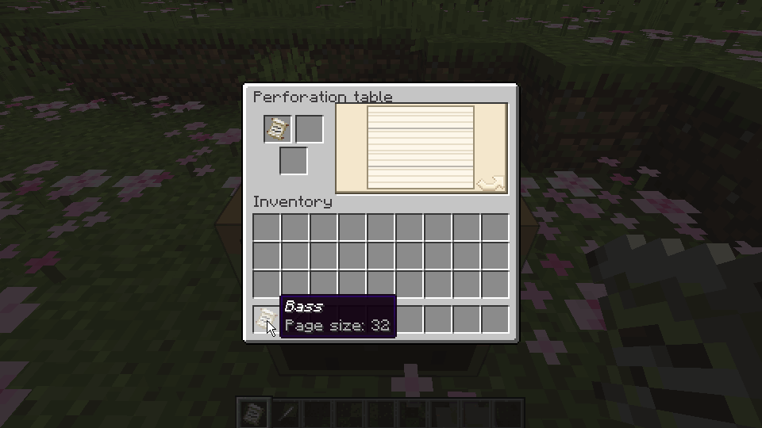

**[中文](README/README_zh.md) | English**

# Music box

Version 0.5.1

**Punch songs on the Note Grid and play it with the Music Box!**

## Preview

### Automation

↑ Output different signals according to the content of the note grid with the comparator.

### Punch

↑ Punching holes at the perforation table for the note grid.

## Jump to

* [Music Box](#music-box-1)
* [Note Grid](#note-grid)
* [Note Grid Page](#note-grid-page)
* [Awl](#awl)
* [Perforation Table](#perforation-table)
* [Sound Shard](#sound-shard)
* [Sound Box](#sound-box)
* [Get reference data](#get-reference-data)

## Content

### Music Box

Load and play your note grid.

* Determine the timbre of the music box according to the block below:
    * Similar to the original note block, and can be used with other mods that add timbre to the note block(
      e.g. [Instrument ++](https://github.com/Viola-Siemens/Instrument-Plus-Plus)).
    * When the block is a sound box, it will play according to its timbre.
* Use the awl to adjust the playing speed of the music box:
    * The unit is `tick/beat`, which is the number of `tick`s consumed per beat.
    * The speed range is: `[1, 20]`.
    * The default speed is `10` ticks/beat.
* Without note grid:
    * Use a note grid to insert it into the music box.
    * Use a hopper to insert the note grid into the music box, and items outside the note grid will be blocked in the
      hopper.
* With note grid:
    * Press Shift and use with empty hand to take out the note grid.
    * Digging or using the music box will play one beat.
    * When activated by a redstone signal:
        * Play the note grid at the set speed.
        * Using a comparator will output a redstone signal of `[1, 15]` strength:
            * Strength `1`: not played yet or no notes in this beat.
            * Strength `n (1<n<15)`: the index of the lowest note in this beat (starting from zero) is `n-2`.
            * Strength `15`: the index of the lowest note in this beat (starting from zero) is greater than or equal to
              `13`.
    * When not activated by a redstone signal:
        * You can use the hopper to suck out the note grid.
        * Use the note grid or book and quill on the music box to superimpose its content on the current note grid. (
          Only available in creative mode)
* When the note grid is finished:
    * If there is a container behind the music box, the note grid will be directly placed in the container.
    * If there is no container, or it cannot be placed in the container, it will be ejected forward.

### Note Grid

The carrier of the track.

* Use to enter the note grid page (view mode).
* Content format:
    * Page:
        * Default `1` page.
        * Up to `64` pages.
        * Each page has `64` beats.
    * Beat:
        * Can punch in any of the `25` pitches (the pitch of the note block).

### Note Grid Page

The page for viewing and editing the content of the note grid.

* View mode:
    * Press Space to switch to play mode.
    * When not playing:
        * Use the mouse wheel to flip the page.
    * When playing:
        * Use the `black` line to indicate the progress.
        * Use the mouse wheel to adjust the playing speed.
        * The default timbre is `Harp`, and if the player has a sound shard in the main hand or off hand, it will try to
          play according to its timbre.
        * It can only be heard by yourself.
* Punch mode:
    * When there is no reference data:
        * Similar to the view mode, but the note grid can be punched with the left mouse button and the chosen note
          pluses the chosen beat will be played with the right mouse button.
            * Punching cannot be undone, so be sure to confirm the position before you start.
    * When there is reference data:
        * The content of the reference data will be displayed on the note grid.
        * The play mode in the view mode will be replaced by the punching mini-game:
            * Use the `red` line to indicate the progress.
            * Press any mouse button or the `z`/`x` key on the keyboard to punch a whole beat within `5` ticks:
                * If the punch fails, the awl will take `16` damage.
                * Stop when you encounter reference data that has not been punched, and continue after punching.

### Awl

A tool for punching or viewing and adjusting the speed of the music box.

* Use without Shift on the music box to set its speed to the speed stored in the awl.
* Use with Shift on the music box to view its current speed.
* The speed stored in the awl:
    * The default value and range are the same as the speed of the music box.
    * Use without Shift: `+1`.
    * Use with Shift: `-1`.

### Perforation Table

A table for viewing, punching, and connecting the note grid.

* Use to enter the perforation table page:
    * If you need to use the timbre of the sound shard in the page, you need to hold the sound shard before entering.
* Perforation table page:
    * Page composition:
        * The preview image on the right will display prompts according to different modes, and clicking on the preview
          image will trigger a specific operation.
        * The left upper bar is the `operation object`, which can only be placed with a note grid.
        * The right upper bar is the `input content`, which can be placed with a note grid or a book and quill.
        * The lower bar is the `tool`, which can be placed with an awl or slime balls.
    * View mode:
        * The `operation object` is not empty, and the `tool` is empty.
        * You can enter the view mode of the [note grid page](#note-grid-page):
            * The `operation object` is the object to be viewed.
            * The `input content` is the reference data.
    * Punch mode:
        * The `operation object` is not empty, and the `tool` is an awl.
        * You can enter the punch mode of the [note grid page](#note-grid-page):
            * The `operation object` is the object to be punched.
            * The `input content` is the reference data.
            * Each hole consumes `1` durability, and the tool will automatically exit the mode after it is broken.
    * Connection mode:
        * The `operation object` is not empty, the `input content` is a note grid, and the combined note grid length
          does
          not exceed `64` pages.
        * You can connect two note grids:
            * Connect the `input content` to the end of the `operation object`.
            * The `input content` and the `tool` will be consumed.

### Sound Shard

An item that listens, records, and plays sound.

* Listen sound:
    * When the sound shard does not record sound, use it to listen to the surrounding sound.
    * When a new sound event is received, it will be displayed in text form.
    * When stopping using, the last sound listened to will be recorded and displayed in text form.
    * Only the sound event will be recorded when listening to sound, not the sound seed.
* Record sound:
    * Sound event:
        * Such as "moo", "baa", etc.
    * Sound seed:
        * Used to determine the specific sound in the sound event. In the same sound event, different seeds will play
          different sounds.
    * Play sound:
        * When the sound shard records sound, it can play its sound:
            * When the sound seed exists, the same seed will be used every time it is played, and the same sound will be
              played.
            * When the sound seed does not exist, a random seed will be used every time it is played, and the sound
              played will be different.
        * Playback interval:
            * The default is `55` ticks.
            * For each level of efficiency enchantment, the interval is reduced by `10` ticks, up to a maximum of
              `50` ticks.

### Sound Box

Load and play sound shards.

* Without sound shard:
    * Use a sound shard with sound to load the sound shard.
    * The note block above will play silently.
* With sound shard:
    * When digging, using, or activating with a redstone signal, play the sound of the sound shard:
        * When the note block above is a note block, it will no longer play.
    * The note block above will play according to the sound of the sound shard.
    * When a lightning rod adjacent to and pointing to this sound box is struck by lightning, the sound seed of the
      sound shard will be refreshed and fixed.

## Get reference data

By writing the content of the book and quill, it can be used as reference data to facilitate the punching of the note.

* Conversion rule:
    * Each beat uses the keys in the [Note Block Studio](https://opennbs.org/) to represent the notes, using "." as the
      end of the beat.
    * Take "Twinkle Twinkle Little Star" as an example:
        * Numbered musical notation: `1, 1, 5, 5, 6, 6, 5, 0, 4, 4, 3, 3, 2, 2, 1`.
        * Book content: `r.r.i.i.o.o.i..u.u.y.y.t.t.r`.
    * Use the [NBS File Export Tool](https://c20c01.github.io/Mods/MusicBox/Tool) to automatically convert your `nbs`
      file into the content of the book and quill:
        * Only supports new version nbs files. If it cannot be loaded, please use the new version
          of [Note Block Studio](https://opennbs.org/) to upgrade the file format.
        * Custom timbre is not supported, you can convert it to the original timbre first, and then export it.

[Here](README/Songs.md) are some results exported using nbs files(collected from the Internet,
some of which have been modified).

# [Download on CurseForge](https://www.curseforge.com/minecraft/mc-mods/cc-mb/files)😘