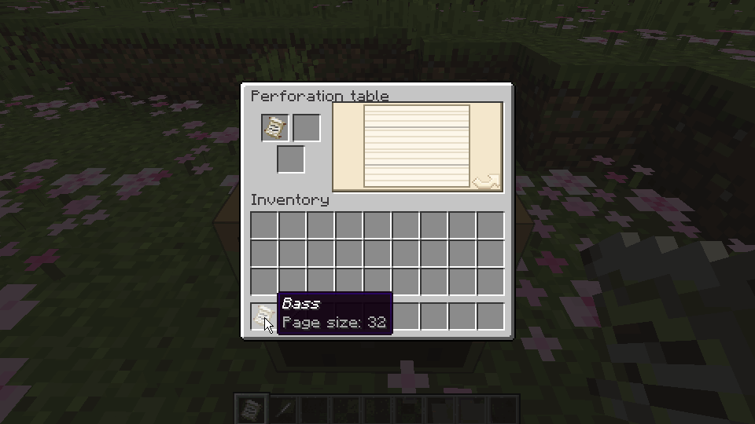
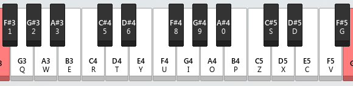

**中文 | [English](../README.md)**

# 纸带八音盒

版本 0.5.1


**在纸带上打出你喜欢的曲子，并用八音盒演奏！**

## 预览

### 控制自动化


↑ 通过比较器按照纸带的内容输出不同的红石信号。

### 打孔



↑ 在打孔台为纸带打孔。

## 跳转

* [八音盒](#八音盒)
* [纸带](#纸带)
* [纸带页面](#纸带页面)
* [锥子](#锥子)
* [打孔台](#打孔台)
* [声响碎片](#声响碎片)
* [声响盒](#声响盒)
* [获取参考数据](#获取参考数据)

## 模组内容

### 八音盒

装载、演奏纸带。

* 根据自己下方的方块决定八音盒的音色：
    * 与原版的音符盒类似，且可以与其他为音符盒添加音色的模组共同使用(
      例如：[Instrument ++](https://github.com/Viola-Siemens/Instrument-Plus-Plus)）。
    * 方块为声响盒时，会按照其音色演奏。
* 使用锥子可调节八音盒的演奏速度：
    * 单位为`tick/beat`即每一拍所需的`tick`。
    * 速度范围为：`[1, 20]`。
    * 默认速度为`10`tick/beat。
* 没装纸带时：
    * 可以对八音盒使用纸带以将其装入。
    * 可以用漏斗向八音盒塞入纸带，纸带以外的物品会被挡在漏斗里。
* 装有纸带时：
    * 按下潜行键并空手使用八音盒可取出其纸带。
    * 挖掘或使用八音盒可演奏一拍。
    * 被红石信号激活时：
        * 按照设置好的速度演奏纸带上的内容。
        * 使用比较器检测会输出`[1, 15]`强度的红石信号：
            * 强度`1`：还没有演奏或这一拍没有音符。
            * 强度`n (1<n<15)`：这一拍最低音的序号（从零起）等于`n-2`。
            * 强度`15`：这一拍最低的音的序号（从零起）大于等于`13`。
    * 没有被红石信号激活时：
        * 可使用漏斗取出纸带。
        * 对八音盒使用纸带或书与笔，可将其内容叠加至当前的纸带上。（仅创造模式可用）
* 纸带播放完毕时：
    * 若八音盒的正后方有容器，纸带会直接装入该容器。
    * 若没有容器或无法放入容器，则会将其向前弹出。

### 纸带

储存曲目的载体。

* 使用可进入纸带页面（查看模式）。
* 内容格式：
    * 页：
        * 默认有`1`页。
        * 最多有`64`页。
        * 每页固定有`64`拍。
    * 拍：
        * 可以在`25`种音高里任意打孔（原版音符盒的音域）。

### 纸带页面

查看、编辑纸带内容的页面。

* 查看模式：
    * 按下空格可切换播放模式。
    * 没有播放时：
        * 使用滚轮翻页。
    * 播放时：
        * 使用`黑色`进度条表示进度。
        * 使用滚轮调整播放速度。
        * 默认音色为`竖琴(Harp)`，如果玩家主手或副手有声响碎片，会尝试按其音色演奏。
        * 只有自己能听到。
* 打孔模式：
    * 没有参考数据时：
        * 与查看模式基本相同，左键可在纸带上打孔：
            * 打孔无法撤销，请仔细确认位置后再动手。
    * 有参考数据时：
        * 参考数据中的内容会显示在纸带上。
        * 查看模式中的播放模式会被打孔小游戏替代：
            * 使用`红色`进度条表示进度。
            * 按鼠标任意键或键盘`z`/`x`键可为`5`tick内最近的整个拍子打孔：
                * 如果打孔失败，会扣除锥子`16`点耐久。
                * 遇到没有被打的参考数据时停下，打孔后才会继续。

### 锥子

打孔、查看和调节八音盒速度的工具。

* 不按潜行键并对八音盒使用可将其速度设为锥子储存的速度。
* 按下潜行键并对八音盒使用可查看其当前速度。
* 锥子储存的速度：
    * 默认值和范围与八音盒的速度相同。
    * 不按潜行键并使用：`+1`。
    * 按下潜行键并使用：`-1`。

### 打孔台

对纸带进行查看、打孔、连接的操作台。

* 使用可进入打孔台页面：
    * 若需要在页面内使用声响碎片的音色，需手持声响碎片。
* 打孔台页面：
    * 页面构成：
        * 右侧的预览图会根据不同的模式显示提示，单击预览图即可触发特定的操作。
        * 左上栏位为`操作对象`，只能放入纸带。
        * 右上栏位为`输入内容`，能放入纸带或书与笔。
        * 下方栏位为`工具`，能放入锥子、黏液球。
    * 查看模式：
        * 需要`操作对象`不为空，`工具`为空。
        * 可以进入查看模式的[纸带页面](#纸带页面)：
            * `操作对象`为查看的对象。
            * `输入内容`为参考数据。
    * 打孔模式：
        * 需要`操作对象`不为空，`工具`为锥子。
        * 可以进入打孔模式的[纸带页面](#纸带页面)：
            * `操作对象`为打孔的对象。
            * `输入内容`为参考数据。
            * 每个孔消耗`1`点耐久，`工具`坏掉后会自动退出该模式。
    * 连接模式：
        * 需要`操作对象`不为空，`输入内容`为纸带，`工具`为黏液球，且合并后的纸带长度不超过`64`页。
        * 可以连接两个纸带：
            * `操作对象`在前，`输入内容`在后。
            * `输入内容`与`工具`会被消耗。

### 声响碎片

接收、记录、播放声音。

* 监听声音：
    * 当声响碎片没有记录声音时，使用可监听周围的声音。
    * 当监听到新的声音事件时，会有文本提示。
    * 停止接收声音时，其最后监听到的声音会被记录，并有文本提示。
    * 监听声音只会记录声音事件，不会记录声音种子。
* 记录声音：
    * 声音事件：
        * 如“哞”、“咩”等。
    * 声音种子：
        * 用于确定声音事件中的具体声音。在同一个声音事件中，不同的种子会播放不同的声音。
* 播放声音：
    * 当声响碎片录有声音时，使用可播放其声音：
        * 声音种子存在时，每次播放都会使用相同的种子，发出同样的声音。
        * 声音种子不存在时，每次播放都会使用随机的种子，发出的声音会有所不同。
    * 播放间隔：
        * 默认为`55`tick。
        * 每有`1`级效率附魔，间隔减少`10`tick，最多减少`50`tick。

### 声响盒

装载、演奏声响碎片。

* 没装声响碎片时：
    * 对声响盒使用存有声音的声响碎片可装入碎片。
    * 其上方的八音盒会静音演奏。
* 装有声响碎片时：
    * 挖掘、使用或受到红石信号激活时，演奏声响碎片的声音：
        * 当其上方为八音盒时，不再因此演奏。
    * 其上方的八音盒会按照声响碎片的声音演奏。
    * 相邻且指向此声响盒的避雷针被闪电击中时，会刷新并固定声响碎片的声音种子。

## 获取参考数据

通过编写书与笔的内容，可以将其作为参考数据，为纸带的打孔提供便利。



* 转换规则：
    * 每一拍使用[Note Block Studio](https://opennbs.org/)中的键位代表音符，使用“.”作为这一拍的结束。
    * 以《小星星》为例：
        * 简谱（0为空拍）：`1，1，5，5，6，6，5，0，4，4，3，3，2，2，1`。
        * 书本内容：`r.r.i.i.o.o.i..u.u.y.y.t.t.r`。
    * 如果有多声部，就在对应的拍子那里添加上对应的键位即可。
* 使用[NBS 文件导出工具](https://c20c01.github.io/Mods/MusicBox/Tool)可将你的`nbs`文件自动转换成书与笔的内容：
    * 只支持新版nbs文件。无法加载时，请使用新版[Note Block Studio](https://opennbs.org/)重新保存以更新文件格式。
    * 不支持自定义音色，可以先转成原版有的乐器，之后再进行导出。

### 一些参考数据

#### Hotel California

原曲作者：Eagles，nbs文件作者：Cranium

<details><summary>1.20</summary>

竖琴(Harp)

```
/give @p minecraft:writable_book{"display":{"Name":'{"text":"Hotel California - 竖琴(Harp)"}'},"pages":["ee................................81................1...............","ow................................yy...............................","iq................................81...............................","yy................................81...............................","ee................................81................1...............","ow................................yy................ey...............","qq................................81...............................","yy................................81...............................","....8..8..8....y..y..y....8................8....8..y...y...y...............","....y..8..8....y..y..y....y..8............8...8...8....y..y..y..t..e...........","....8..8..8....y..t..t....y..8............t..8..8..8..y...t...t...............","..t..y..y..y..y..y..t..y....t..y..8..........y..8..8..8..y...y...y..8.............","t....8..8..i....8..8..i....y..8..........5..y..8..8..8..y...y...y...............","5......t..y..y..y..t..y..y...y...8..8..8..8..8e..8...8...8..y...y...y..t..e...........","e....8..8..8..y...t...t....y..8..........w....w..w..8....y..t..t........1.......","q....y..y..y..y..y..t..yq....t..8..........3..y..8..y..8....o....8..y......1..3..e..5.","t....pti..tpi....tpi..tpi..tpi..i..tpi......yso....tpi..tpi..o8..to8..8o..8o....ip....8o..pi....ip....8o....8..8.","8..y..y..y......80..80..80..y9..y9..y9......y..y..ye..t..t..t..5........t........y....8...","tpii..tpi..tpi..tpi....tpi....tpi..tpi....tpi....yso....tpi..tpi..to8..to8ip....ip....8o....t..w..t..8..ip..8o....8..8.","8..y..y..y......yi..8o..8o..yi..yi..yi......8..i..i..8..8..8.........................","t....8..8..8....y..y..y....8....y....y....5....8....8..y...y...y...............","5....y..8..8....y..y..y....y..8..........e.....8...8....y....y..t..e....t....t...","e....8..8..8....y..t..t....y..8..........w....8....8..y...t...t........1.......","q....y..y..y..y..y..t..y....t..y..83........3....8..8..8..y..3.y...ye..8......5.......","t....8..8..i....8..80s..ipx....y..8..........5....8....8..y0s...y.0s..80s...............","5......t..y..y..y..t9z..yos..y...y...8..8..8..8..8e..8...8...8..y...y.i0..y9p..t..e...........","e....8....8..8..8..tu0..8ip..y..t..t....y..8....8w............y..ts9..t8o........1.......","q....y..y..y..y..y..t80..yipq....t..8......80....803....8..y..8....o....8..y......1..3..e..5.","t....pti..tpi....tpi..tpi..tpi..i..tpi......yso....tpi..tpi..o8..to8..x..x..8....t....y....o....zs....8..8.","8..y..y..y......80..80..80..y9..y9..y9......y..y..ye..t..t..t..5........t........y....8..tp.","tpii..tpi..tpi..tpi....tpi....tpi..tpi....tpi....yso....tpi..tpi..to8..to8..p........x..x..p....8....gg....8c..8.","8..y..y..y......yi..8o..8o..yi..yi..yi......8..i..i..8..8..8.........................","ee....8..8....i....8..i....y..8..........81..3..8....8..8...8...1y..8.............","ow..8..y....y....y....8..y...y...y..8......yy....8..8..8..y....t..t...............","iq..t..8..8..8....y..t..t..y..8............81..w....8..8..y...y...t..t.............","yy..e..y..y....y..t....y..t....y..8....y..t..818....8......8..y..y..y..8.............","t....8....i....8..80s..ipx....y..8......1..1..5....8....8..y0s...y.0s..80s...............","5......t..y..y..y..t9z..yos..y...y.......8..8..8e..8...8...8..y...y.i0..y9p..t..e...........","e....8..8....y...t.u0..tip....y..8..........w......w..8....y..ts9..t8o........1.......","q....y..y..y..y..y..t80..yipq....t..8......80....803..8..8....o..8......y1..8u..1....8....o...","pt............o....y........t....8..t..35........5....w...................ey","t5....8..t..e....e....t....8..t..e..w..e..w..pe....x..p....8..o..i..........p..8..c...","e....x....c....p..o..p..x..p....i....o..w..yw....x....8....t....t........1.......","tq....i....i....y..t..yq..8s...8s...i2....y..t..83..8..o..8..8..p..y...t.8...............","8t..8..o..8..8..p..8..p..8..8..8..p..y...t.y..t..85...............................","o5........y..8..t....e....o....p....o....oe....x..t..p..0..o..9..............w...","e....e....t....y..t..y....o..8....t..y..t..8w..i..9..o..p..8......t........y1.....y..","8q......o....o..8....8q........82....t....83......o....o..8....8........t....e...","ept...............yi.x..x..x..x..8...t.e..3..05...............................68","g5....g..g..v..v..v..v..c..c..c..c..c.x...c..x..pe........o..8....t..y....o........yo..8p.","pxe..8p..os..yi..8p..t8..yo..et..t8..1w..w5..1w....t1..yq....t8w....8o..t8..oc..8x..8o....t8........1....t8...","yiq............yi....8oq........ip2........803............0s....px........sc.......","xgt..px..8p..xg..px..8p..xg..px..8p..xg..px..8p..xg..px..8p....sc5..0s..y0..sc..0s..y0..sc..0s..g0...............","sc5..os..yo..sc..os..yo..sc..os..yo..sc..os..yo..sc..os..yo....pxe..9p..y9..px..9p..y9..px..9p..c9...............","pxe..ip..ti..px..ip..ti..px..ip..ti..px..ip..ti..px..ip..ti....oxw..8o..t8..ox..8o..t8..ox..8o..xg........1.......","ipq..ti..ey..ip..yi..ey..ip..yi..eyq..ip..yi..ey..ip2..yi..ey....0s3..80..58..0s..80..58..0s..80..sg...............","xgt..px..8p..xg..px..8p..xg..px..8p..xg..px..8p..xg..px..8p....sc5..0s..y0..sc..0s..y0..sc..0s..g0...............","sc5..os..yo..sc..os..yo..sc..os..yo..sc..os..yo..sc..os..yo....pxe..9p..y9..px..9p..y9..px..9p..c9...............","pxe..ip..ti..px..ip..ti..px..ip..ti..px..ip..ti..px..ip..ti....oxw..8o..t8..ox..8o..t8..ox..8o..xg........1.......","ipq..ti..ey..ip..yi..ey..ip..yi"]}
```

贝斯(Bass)

```
/give @p minecraft:writable_book{"display":{"Name":'{"text":"Hotel California - 贝斯(Bass)"}'},"pages":["et8....e..t..e..8..e..t..p........t....y....83....y..8..y..s..8..y..3...............","ww....y..o..y..p....o..w....y..o..y....y..o..y2....8..t..8..t..e..2..p...............","qq....t..e..i..t..e..q..p....q....w....t....tt....o..8..t..x..8..t..1....t..8..t....t..8.","yy....e..t..e..i..e..i..pe....e..t..e....e..t..11....3..y..3..8..y..3..s...............","e1et....e..t..e..8..e..t..py........t8....y....83y....y..8..y..s..8t..y..35...............","ww5....y..o..y..p....o..wt....y..o..y....y..o..y2e..p..8t..t9..8t..tp..e9..2t..pc...............","qqe....t..e..i..t..e..q..p5....q....wt....t....ttw....o..8..t..x..8..t..1to....t..8..t....t8..8.","yy....ei..tp..ec..ii..e..ic..pe8..i..e..tc..ei..i..e..tc..11....3..yp..3..88..y0..3p..s0...............","e..e..8ee..pe8t..e..8..e8e..8et..p..p..8e..e8..t....e8y..ye8..83..8..s3yy..g3y..y..s..3y8..s3yy..g3..s..83y..3y......3y..3y.","ww..w..ywy..owyo..y..p..wy..ywo..w..o..ywy..wyo..y....wyy..8wyo..y2..y..pe88..ce8t..8..t..e8e..pe82..p..p..ye8..e8......e8..e8.","qq..q..te8t..ie8e..i..t..e8e..te8q..ip..i..te8q..e8..w....e8t..we8..tt..t..ot8o..xt88..t..x..t88..ot8t..x1..o..t8t..t88..t....t8t..t88.","yy..y..eye..yet..e..i..eye..eyi..ype..y..eye..eyt..e....eye..yeyt..11..1..53y3..83yy..3..8..3yy..53y3..8s....3y..53y..8....3y..3y.","eet..e..8e..pe8......e8..8e..et..p..8e..e8..et....e8..ye8..8035..8..s3y..g3y......3y..s3y..g50..s..83y..3y......3y..3y.","ww5..w..yw..owy......wy..yw..w5..o..yw..wy..w5....wy..8wy..y92e..y..pe8..ce8......e8..pe8..c2e..p..ye8..e8..2e....e8..e8.","qqe..q..te8..ie8......e8..te8..qe..i..te8..e8..qe....e8..we8..t81w..t..ot8..xt8......t8..ot8..xw8..o..t8..t8..t....t8..t8.","yyi..y..ey..ye......ey..ey..yyyi..y..ey..ey..yi....ey..yey..135..1..53y..83y......3y..53y..858....3y..3y..e1..53..t3ye..y35.","itti..t..qpi..pi..pi..pi..pi..tpi..iti....ti..t..i....p....xt8..o..to8..o8..o8..o8..o8..oo8..xt8......o..x8o....o...","858..5..108..08..08..08..08..508..858......5..858....5....eet8....p8..p8..55p8..p8..p8..p8..ttet....t8....yy....88...","iiti..t..qpi..pi..pi..pi..pi..tpi..iti....ti..t..i....p....xt8..o..to8..o8..o8..o8..o8..oo8..xt8......o..tt8....o...","yyi..e..ypi..pi..pi..pi..pi..epi..yyi......e..yyi....e....115..5..808..08..08..08..08..508..858......5..158.......","e..e..8ee..pe8t..e..8..e8e..8et..p..p..8e..e8..st....e8sy..ye8..803..8..s3yy..g3y..y..s..3y8..s3yy..g3..s..83y..3y......3y..3y.","ww..w..ywy..owyo..y..p..wy..ywo..w..o..ywy..wyo..y....wyy..8wyo..y92..y..pe88..ce8t..8..t..e8e..pe82..p..p..ye8..e8..p....e8..e8.","qq..q..te8t..ie8e..i..t..e8e..te8q..ip..i..te8q..e8..w....e8t..we8..t8t..t..ot8o..xt88..t..x..t88..ot8t..x1..o..t8t..t88..tt....t8t..t88.","yy..y..eye..yet..e..i..eye..eyi..ype..y..eye..eyt..8e....eye..yeyt..11..1..53y3..83yy..3..8..3y8y..53y3..89s....3y..53y..80....3y..3y.","eet..e..8e..pe8......e8..8e..et..p..8e..e8..et....e8..ye8..8035..8..s3y..g3y......3y..s3y..g50..s..83y..3y......3y..3y.","ww5..w..yw..owy......wy..yw..w5..o..yw..wy..w5....wy..8wy..y92e..y..pe8..ce8......e8..pe8..c2e..p..ye8..e8..2e....e8..e8.","qqe..q..te8..ie8......e8..te8..qe..i..te8..e8..qe....e8..we8..t81w..t..ot8..xt8......t8..ot8..xw8..o..t8..t8..t....t8..t8.","yyi..y..ey..ye......ey..ey..yyyi..y..ey..ey..yi....ey..yey..135..1..53y..83y......3y..53y..858....3y..3y..e1..53..t3ye..y35.","itti..t..qpi..pi..pi..pi..pi..tpi..iti....ti..t..i....p....xt8..o..to8..o8..o8..o8..o8..oo8..xt8......o..x8o....o...","858..5..108..08..08..08..08..508..858......5..858....5....eet8....p8..p8..55p8..p8..p8..p8..ttet....t8....yy....88...","iiti..t..qpi..pi..pi..pi..pi..tpi..iti....ti..t..i....p....xt8..o..to8..o8..o8..o8..o8..oo8..xt8......o..tt8....o...","yyi..e..ypi..pi..pi..pi..pi..epi..yyi......e..yyi....e....858...............................","et8....e..t..e..8..e..t..p........t....y....83....y..8..y..s..8..y..3...............","ww....y..o..y..p....o..w....y..o..y....y..o..y2....8..t..8..t..e..2..p...............","qq....t..e..i..t..e..q..p....q....w....t....tt....o..8..t..x..8..t..1....t..8..t....t..8.","yy....e..t..e..i..e..i..pe....e..t..e....e..t..11....3..y..3..8..y..3..s...............","eet..e..8e..pe8......e8..8e..et..p..8e..e8..et....e8..ye8..8035..8..s3y..g3y......3y..s3y..g50..s..83y..3y......3y..3y.","ww5..w..yw..owy......wy..yw..w5..o..yw..wy..w5....wy..8wy..y92e..y..pe8..ce8......e8..pe8..c2e..p..ye8..e8..2e....e8..e8.","qqe..q..te8..ie8......e8..te8..qe..i..te8..e8..qe....e8..we8..t81w..t..ot8..xt8......t8..ot8..xw8..o..t8..t8..t....t8..t8.","yyi..y..ey..ye......ey..ey..yyyi..y..ey..ey..yi....ey..yey..115..1..5..8........5..8..u08..808...........","et8..e..8p8..pp8..p8..p8..p8..8p8..et..p..8....t8......y..8058..8..s08..g05..08..08..08..s08..g15..s..8....58.......","ww5..w..yoy..ooy..oy..oy..oy..yoy..w5..o..y....5y......t..y9t9..y..pp9..cp9..p9..p9..p9..pp9..cyt..p..y....t9....y...","qqt..q..tpi..ipi..pi..pi..pi..tpi..qt..i..t....ti......w..t8t8..t..oo8..xo8..o8..o8..o8..oo8..tt..x..t....tt8.......","yyy..y..epi..ypi..pi..pi..pi..epi..yyy..y..e....yi......y..115..1..508..808..08..08..08..508..858......5..858.......","et8..e..8p8..pp8..p8..p8..p8..8p8..et..p..8....t8......y..8058..8..s08..g05..08..08..08..s08..g15..s..8....58....8...","ww5..w..yoy..ooy..oy..oy..oy..yoy..w5..o..y....5y......t..y9t9..y..pp9..cp9..p9..p9..p9..pp9..cyt..p..y....t9.......","qqt..q..tpi..ipi..pi..pi..pi..tpi..qt..i..t....ti......w..t8t8..t..oo8..xo8..o8..o8..o8..oo8..tt..x..t....tt8.......","yyy..y..epi..ypi..pi..pi..pi..epi..yyy..y..e....yi......y..115..1..508..808..08..08..08..508..858......5..858.......","ppt8....pp8..p8..ep8..p8..p8..8p8..pet..8..p....t8......y..8058..8..s08..g05..08..08..08..08..15..s..g..s..g50.......","ww5..w..yoy..ooy..oy..oy..oy..yoy..w5..y..o..y..o5y........y9t9..y..pp9..cp9..p9..p9..p9..pp9..yt..c..p..y..ct9.......","qqt..q..tpi..ipi..pi..pi..pi..tpi..qt..i..t....ti......w..t8t8..t..oo8..xo8..o8..o8..o8..oo8..xt8..o..t....tt8.......","yyy..y..epi..ypi..pi..pi..pi..epi..yyyi..e..y....yi........115..1..508..808..08..08..08..508..858......5..858.......","ppt8..p..pp8..pp8..pp8..pp8..pp8..pp8..pet..p..p..p..pt8....p....8058..8..808..808..808..808..808..808..858..8..8..8..858....8...","oo5y..o..ooy..ooy..ooy..ooy..ooy..ooy..o5y..o..o..o..o5y....o....y9t9..y..yp9..yp9..yp9..yp9..yp9..yp9..yt9..y..y..y..yt9....y...","iiti..i..ipi..ipi..ipi..ipi..ipi..ipi..iti..i..i..i..iti....i....t8t8..t..to8..to8..to8..to8..to8..to8..tt8..t..t..t..ttt8....t...","yyyi..y..ypi..ypi..ypi..ypi..ypi..ypi..yyyi..y..y..y..yyi....y....8858..8..808..808..808..808..808..808..858..8..8..8..858....8...","ppt8..p..pp8..pp8..pp8..pp8..pp8..pp8..pet..p..p..p..pt8....p....8058..8..808..808..808..808..808..808..858..8..8..8..858....8...","oo5y..o..ooy..ooy..ooy..ooy..ooy..ooy..o5y..o..o..o..o5y....o....y9t9..y..yp9..yp9..yp9..yp9..yp9..yp9..yt9..y..y..y..yt9....y...","iiti..i..ipi..ipi..ipi..ipi..ipi..ipi..iti..i..i..i..iti....i....t8t8..t..to8..to8..to8..to8..to8..to8..tt8..t..t..t..ttt8....t...","yyyi..y..ypi..ypi..ypi..ypi..ypi..ypi"]}
```

底鼓(Bass Drum)

```
/give @p minecraft:writable_book{"display":{"Name":'{"text":"Hotel California - 底鼓(Bass drum)"}'},"pages":["...............................................................","...............................................................","...............................................................","...............................................................","...............................................................","...............................................................","...............................................................","........................................................or....or...","r................r............r....r................r............r...","r................r............r....r................r............r...","r................r............r....r................r............r...","r................r............r....r................r............r...","r................r............r....r................r............r...","r................r............r....r................r............r...","r................r............r....r................r............r...","r................r............r....r................r............i..i.","r................r................r................r...............","r................r................r................r........o..o.....","r................r................r................r............r...","r................r............r....r................r...............","r................r............r....r................r............r...","r................r............r....r................r............r...","r................r............r....r................r............r...","r................r............r....r................r............r...","r................r............r....r................r........v..v..r...","r................r............r....r................r............r...","r................r............r....r................r............r...","r................r............r....r................r............i..i.","r................r................r................r...............","r................r................r................r........o..o.....","r................r................r................r............r...","r................r............r....r...............................","...............................................................","...............................................................","...............................................................","....................................o......i......r...v.v..v..v..v..o...","r................r............r....r................r..........r..r...","r................r............r....r................r............r...","r................r............r....r................r............r...","r................r............r....r...............................","r................r............r....r................r..v.v.v..o..o....r...","r................r............r....r............r....r..o..o......v..o...","r................r............r....r................r...............","r................r............r....r................r..v.v.v..v......v..v.","r................r............r....r................r........r..r..r...","r................r............r....r................r..o.o.o..o......yx..yx.","r................r............r....r................r...............","r................r................r................y..v.v.v..v..v..v..o...","r................r................r....v......v..v......x..v..x..v..v..v...","r................r................r................r..v.v.v..v..v....o...","r................r................r..................v..v......o..o...","r................r................r..................x.x.x..x..v.v.v.v.x...","r................r................r................r...............","r................r................r................r...............","r................r................r................r...............","r................r........................o..o..o..o..rv.v.v.v.ro.o.o.o.rv.v.v.v.ro.o.o.o","r................r................r................r...............","r................r................r................r...............","r................r................r................r...............","r"]}
```

小军鼓(Snare)

```
/give @p minecraft:writable_book{"display":{"Name":'{"text":"Hotel California - 小军鼓(Snare)"}'},"pages":["...............................................................","...............................................................","...............................................................","...............................................................","g...............................................................","g................................g................g.g.g......g.g.g.....","g.g.g.............................................................","g...............................................................","c....c..c..tc....c....c....c..c..tc....c....c....c..c..ct....c....c....c..c..ct....c...","c....c..c..ct....c....c....c..c..ct....c....c....c..c..ct....c....c....c..c..ct....c...","c....c..c..ct....c....c....c..c..ct....c....c....c..c..ct....c....c....c..c..ct....c...","c....c..c..ct....c....c....c..c..ct....c....c....c..c..ct....c....c....c..c..ct....c...","c....c..c..ct....c....c....c..c..ct....c....c....c..c..ct....c....c....c..c..ct....c...","c....c..c..ct....c....c....c..c..ct....c....c....c..c..ct....c....c....c..c..ct....c...","c....c..c..ct....c....c....c..c..ct....c....c....c..c..ct....c....c....c..c..ct....c...","c....c..c..ct....c....c....c..c..ct....c....c....c..c..ct....c....c....t....t..t.....","p....c..c..tc....c....c....c..c..t....c....c....c..c..ct....c....c....c..c..zt....zt...","c....c..c..ct....c..c..c........ct....ct....c....c..c..ct....c..c....t.t.t..t......t..t.","p....c..c..tc....c....c....c..c..t....tz....c....c..c..ct....c....c....c..c..ct....c...","c....c..c..ct........c........ct....c....c....c..c..ct....c....z..t.t.t..t..pz..ct..t...","c....c..c..ct....c....c....c..c..t........c....c..c..ct....c....c....c..c..ct....c...","c....c..c..ct....c....c....c..c..ct....c....c....c..c..ct....c....c....c..c..ct....t...","c....c..c..ct....c....c....c..c..ct....c....c....c..c..ct....c....c....c..c..ct....c...","c....c..c..ct....c....c....c..c..ct....c....c....c..c..ct....c....c....c..c..ct....c...","c....c..c..ct....c....c....c..c..ct....c....c....c..c..ct....c....c....c..c..c....t...","c....c..c..ct....c....c....c..c..ct....c....c....c..c..ct....c....c....c..c..ct....c...","c....c..c..ct....c....c....c..c..ct....c....c....c..c..ct....c....c....c..c..ct....c...","c....c..c..ct....c....c....c..c..ct....c....c....c..c..ct....c....c....t....t..t.....","p....c..c..tc....c....c....c..c..t....c....c....c..c..ct....c........c..c..zt....zt...","c....c..c..ct....c..c..c........ct....ct....c....c..c..ct....c..c....t.t.t..t......t..t.","p....c..c..tc....c....c....c..c..t....tz....c....c..c..ct....c....c....c..c..ct....c...","c....c..c..ct........c........ct....c....c...............................","c....c..c..c....c..c..z....c....z....c....c....c..c..c....c....z...............","c....c..c..c....c....z....c....z....c........c..c..c....c....z...............","c....c..c..c....c....z....c....z....c....c....c..c..c....c....z...............","..c..c....c....c....z....c....z....c......................t.............","c....c..c..ct....c....c....c..c..ct....c....c....c..c..ct....c....c....c..c..ct....c...","c....c..c..ct....c....c....c..c..ct....c....c....c..c..ct....c....c....c..c..ct....t...","c....c..c..ct....c....c....c..c..ct....c....c....c..c..ct....c....c....c..c..ct....c...","c....c..c..ct....c....c....c..c..ct....c....c....c....ct....c....t..t..t...........","p....c..c..tc....c........c..c..ct....c....c....c..c..ct....c....c...............","p....c..c..tc....c....c....c..c..ct....c....c....c..c..ct....c....c...............","....c..c..tc....c....c....c..c..ct....c........c..c..ct....c....c....c..c..tz..tz..tz...","c....c..c..ct............c..c..ct........c....c..c..ct........c........t..t.....","p..c..c..c..tc..c..c..c..c....c..c..t........c....c..c..ct..c..c....c....z..c..p..p..p...","p..c..c..c..t....c....c....c..c..ct....c....c....c..c..ct..c..c............t..t.....","..c..c..c..ct....c....c....c..c..ct....c....c....c..c..ct....c....c....c..c..ct....zt...","c....c..c..ct....c....c....c..c..ct....c....c....c..c..ct....c...................","p..c..c....tc....c..c..c....c..c..ct....ct....c..t..c....c..c......c....c....c....c...","p....c....ct....c....c....c..c..ct....zt....c....c..c..ct....c...................","....c....ct........c....c..c..ct....c....c....c..c..ct....c..c..c...............","p....c..c..tc........c....c..c..tc....c....c....c..c..ct....c..t..t...............","p....c..c..ct....c....c....c..c..tz....tz....c......c..ct....c....c....c..c..tz....tz...","c......c..ct....c......c..c....tz....tz....c..c....c..tc....c..c..c..c..c..c..tz....tz...","c..c..c..c..tc....c..c..c..c..c..c..tz....tz....c..c..c..c..tc....c..c..c..c..c..c..tz....tz...","c..c....c..t....c......c......tz....tz....3..3..3..3.........................","c....c..c..ct....c....c..c..c..c..tz....tz....c..c....c..tc....c..c..c..c..c..c..tz....tz...","c..c....c..tc....c..c....c..c....tz....tz....c..c....c..tc....c..c..c..c..c..c..tz....tz...","c..c..c..c..tc....c..c..c..c..c..c..tz....tz....c..c..c..c..tc....c..c..c..c..c..c..tz....tz...","c..c....c..t....c"]}
```

</details>

<details><summary>1.21</summary>

竖琴(Harp)

```
/give @p minecraft:writable_book[minecraft:custom_name="'Hotel California - 竖琴(Harp)'",minecraft:writable_book_content={pages:[{raw:"ee................................81................1..............."},{raw:"ow................................yy..............................."},{raw:"iq................................81..............................."},{raw:"yy................................81..............................."},{raw:"ee................................81................1..............."},{raw:"ow................................yy................ey..............."},{raw:"qq................................81..............................."},{raw:"yy................................81..............................."},{raw:"....8..8..8....y..y..y....8................8....8..y...y...y..............."},{raw:"....y..8..8....y..y..y....y..8............8...8...8....y..y..y..t..e..........."},{raw:"....8..8..8....y..t..t....y..8............t..8..8..8..y...t...t..............."},{raw:"..t..y..y..y..y..y..t..y....t..y..8..........y..8..8..8..y...y...y..8............."},{raw:"t....8..8..i....8..8..i....y..8..........5..y..8..8..8..y...y...y..............."},{raw:"5......t..y..y..y..t..y..y...y...8..8..8..8..8e..8...8...8..y...y...y..t..e..........."},{raw:"e....8..8..8..y...t...t....y..8..........w....w..w..8....y..t..t........1......."},{raw:"q....y..y..y..y..y..t..yq....t..8..........3..y..8..y..8....o....8..y......1..3..e..5."},{raw:"t....pti..tpi....tpi..tpi..tpi..i..tpi......yso....tpi..tpi..o8..to8..8o..8o....ip....8o..pi....ip....8o....8..8."},{raw:"8..y..y..y......80..80..80..y9..y9..y9......y..y..ye..t..t..t..5........t........y....8..."},{raw:"tpii..tpi..tpi..tpi....tpi....tpi..tpi....tpi....yso....tpi..tpi..to8..to8ip....ip....8o....t..w..t..8..ip..8o....8..8."},{raw:"8..y..y..y......yi..8o..8o..yi..yi..yi......8..i..i..8..8..8........................."},{raw:"t....8..8..8....y..y..y....8....y....y....5....8....8..y...y...y..............."},{raw:"5....y..8..8....y..y..y....y..8..........e.....8...8....y....y..t..e....t....t..."},{raw:"e....8..8..8....y..t..t....y..8..........w....8....8..y...t...t........1......."},{raw:"q....y..y..y..y..y..t..y....t..y..83........3....8..8..8..y..3.y...ye..8......5......."},{raw:"t....8..8..i....8..80s..ipx....y..8..........5....8....8..y0s...y.0s..80s..............."},{raw:"5......t..y..y..y..t9z..yos..y...y...8..8..8..8..8e..8...8...8..y...y.i0..y9p..t..e..........."},{raw:"e....8....8..8..8..tu0..8ip..y..t..t....y..8....8w............y..ts9..t8o........1......."},{raw:"q....y..y..y..y..y..t80..yipq....t..8......80....803....8..y..8....o....8..y......1..3..e..5."},{raw:"t....pti..tpi....tpi..tpi..tpi..i..tpi......yso....tpi..tpi..o8..to8..x..x..8....t....y....o....zs....8..8."},{raw:"8..y..y..y......80..80..80..y9..y9..y9......y..y..ye..t..t..t..5........t........y....8..tp."},{raw:"tpii..tpi..tpi..tpi....tpi....tpi..tpi....tpi....yso....tpi..tpi..to8..to8..p........x..x..p....8....gg....8c..8."},{raw:"8..y..y..y......yi..8o..8o..yi..yi..yi......8..i..i..8..8..8........................."},{raw:"ee....8..8....i....8..i....y..8..........81..3..8....8..8...8...1y..8............."},{raw:"ow..8..y....y....y....8..y...y...y..8......yy....8..8..8..y....t..t..............."},{raw:"iq..t..8..8..8....y..t..t..y..8............81..w....8..8..y...y...t..t............."},{raw:"yy..e..y..y....y..t....y..t....y..8....y..t..818....8......8..y..y..y..8............."},{raw:"t....8....i....8..80s..ipx....y..8......1..1..5....8....8..y0s...y.0s..80s..............."},{raw:"5......t..y..y..y..t9z..yos..y...y.......8..8..8e..8...8...8..y...y.i0..y9p..t..e..........."},{raw:"e....8..8....y...t.u0..tip....y..8..........w......w..8....y..ts9..t8o........1......."},{raw:"q....y..y..y..y..y..t80..yipq....t..8......80....803..8..8....o..8......y1..8u..1....8....o..."},{raw:"pt............o....y........t....8..t..35........5....w...................ey"},{raw:"t5....8..t..e....e....t....8..t..e..w..e..w..pe....x..p....8..o..i..........p..8..c..."},{raw:"e....x....c....p..o..p..x..p....i....o..w..yw....x....8....t....t........1......."},{raw:"tq....i....i....y..t..yq..8s...8s...i2....y..t..83..8..o..8..8..p..y...t.8..............."},{raw:"8t..8..o..8..8..p..8..p..8..8..8..p..y...t.y..t..85..............................."},{raw:"o5........y..8..t....e....o....p....o....oe....x..t..p..0..o..9..............w..."},{raw:"e....e....t....y..t..y....o..8....t..y..t..8w..i..9..o..p..8......t........y1.....y.."},{raw:"8q......o....o..8....8q........82....t....83......o....o..8....8........t....e..."},{raw:"ept...............yi.x..x..x..x..8...t.e..3..05...............................68"},{raw:"g5....g..g..v..v..v..v..c..c..c..c..c.x...c..x..pe........o..8....t..y....o........yo..8p."},{raw:"pxe..8p..os..yi..8p..t8..yo..et..t8..1w..w5..1w....t1..yq....t8w....8o..t8..oc..8x..8o....t8........1....t8..."},{raw:"yiq............yi....8oq........ip2........803............0s....px........sc......."},{raw:"xgt..px..8p..xg..px..8p..xg..px..8p..xg..px..8p..xg..px..8p....sc5..0s..y0..sc..0s..y0..sc..0s..g0..............."},{raw:"sc5..os..yo..sc..os..yo..sc..os..yo..sc..os..yo..sc..os..yo....pxe..9p..y9..px..9p..y9..px..9p..c9..............."},{raw:"pxe..ip..ti..px..ip..ti..px..ip..ti..px..ip..ti..px..ip..ti....oxw..8o..t8..ox..8o..t8..ox..8o..xg........1......."},{raw:"ipq..ti..ey..ip..yi..ey..ip..yi..eyq..ip..yi..ey..ip2..yi..ey....0s3..80..58..0s..80..58..0s..80..sg..............."},{raw:"xgt..px..8p..xg..px..8p..xg..px..8p..xg..px..8p..xg..px..8p....sc5..0s..y0..sc..0s..y0..sc..0s..g0..............."},{raw:"sc5..os..yo..sc..os..yo..sc..os..yo..sc..os..yo..sc..os..yo....pxe..9p..y9..px..9p..y9..px..9p..c9..............."},{raw:"pxe..ip..ti..px..ip..ti..px..ip..ti..px..ip..ti..px..ip..ti....oxw..8o..t8..ox..8o..t8..ox..8o..xg........1......."},{raw:"ipq..ti..ey..ip..yi..ey..ip..yi"}]}]
```

贝斯(Bass)

```
/give @p minecraft:writable_book[minecraft:custom_name="'Hotel California - 贝斯(Bass)'",minecraft:writable_book_content={pages:[{raw:"et8....e..t..e..8..e..t..p........t....y....83....y..8..y..s..8..y..3..............."},{raw:"ww....y..o..y..p....o..w....y..o..y....y..o..y2....8..t..8..t..e..2..p..............."},{raw:"qq....t..e..i..t..e..q..p....q....w....t....tt....o..8..t..x..8..t..1....t..8..t....t..8."},{raw:"yy....e..t..e..i..e..i..pe....e..t..e....e..t..11....3..y..3..8..y..3..s..............."},{raw:"e1et....e..t..e..8..e..t..py........t8....y....83y....y..8..y..s..8t..y..35..............."},{raw:"ww5....y..o..y..p....o..wt....y..o..y....y..o..y2e..p..8t..t9..8t..tp..e9..2t..pc..............."},{raw:"qqe....t..e..i..t..e..q..p5....q....wt....t....ttw....o..8..t..x..8..t..1to....t..8..t....t8..8."},{raw:"yy....ei..tp..ec..ii..e..ic..pe8..i..e..tc..ei..i..e..tc..11....3..yp..3..88..y0..3p..s0..............."},{raw:"e..e..8ee..pe8t..e..8..e8e..8et..p..p..8e..e8..t....e8y..ye8..83..8..s3yy..g3y..y..s..3y8..s3yy..g3..s..83y..3y......3y..3y."},{raw:"ww..w..ywy..owyo..y..p..wy..ywo..w..o..ywy..wyo..y....wyy..8wyo..y2..y..pe88..ce8t..8..t..e8e..pe82..p..p..ye8..e8......e8..e8."},{raw:"qq..q..te8t..ie8e..i..t..e8e..te8q..ip..i..te8q..e8..w....e8t..we8..tt..t..ot8o..xt88..t..x..t88..ot8t..x1..o..t8t..t88..t....t8t..t88."},{raw:"yy..y..eye..yet..e..i..eye..eyi..ype..y..eye..eyt..e....eye..yeyt..11..1..53y3..83yy..3..8..3yy..53y3..8s....3y..53y..8....3y..3y."},{raw:"eet..e..8e..pe8......e8..8e..et..p..8e..e8..et....e8..ye8..8035..8..s3y..g3y......3y..s3y..g50..s..83y..3y......3y..3y."},{raw:"ww5..w..yw..owy......wy..yw..w5..o..yw..wy..w5....wy..8wy..y92e..y..pe8..ce8......e8..pe8..c2e..p..ye8..e8..2e....e8..e8."},{raw:"qqe..q..te8..ie8......e8..te8..qe..i..te8..e8..qe....e8..we8..t81w..t..ot8..xt8......t8..ot8..xw8..o..t8..t8..t....t8..t8."},{raw:"yyi..y..ey..ye......ey..ey..yyyi..y..ey..ey..yi....ey..yey..135..1..53y..83y......3y..53y..858....3y..3y..e1..53..t3ye..y35."},{raw:"itti..t..qpi..pi..pi..pi..pi..tpi..iti....ti..t..i....p....xt8..o..to8..o8..o8..o8..o8..oo8..xt8......o..x8o....o..."},{raw:"858..5..108..08..08..08..08..508..858......5..858....5....eet8....p8..p8..55p8..p8..p8..p8..ttet....t8....yy....88..."},{raw:"iiti..t..qpi..pi..pi..pi..pi..tpi..iti....ti..t..i....p....xt8..o..to8..o8..o8..o8..o8..oo8..xt8......o..tt8....o..."},{raw:"yyi..e..ypi..pi..pi..pi..pi..epi..yyi......e..yyi....e....115..5..808..08..08..08..08..508..858......5..158......."},{raw:"e..e..8ee..pe8t..e..8..e8e..8et..p..p..8e..e8..st....e8sy..ye8..803..8..s3yy..g3y..y..s..3y8..s3yy..g3..s..83y..3y......3y..3y."},{raw:"ww..w..ywy..owyo..y..p..wy..ywo..w..o..ywy..wyo..y....wyy..8wyo..y92..y..pe88..ce8t..8..t..e8e..pe82..p..p..ye8..e8..p....e8..e8."},{raw:"qq..q..te8t..ie8e..i..t..e8e..te8q..ip..i..te8q..e8..w....e8t..we8..t8t..t..ot8o..xt88..t..x..t88..ot8t..x1..o..t8t..t88..tt....t8t..t88."},{raw:"yy..y..eye..yet..e..i..eye..eyi..ype..y..eye..eyt..8e....eye..yeyt..11..1..53y3..83yy..3..8..3y8y..53y3..89s....3y..53y..80....3y..3y."},{raw:"eet..e..8e..pe8......e8..8e..et..p..8e..e8..et....e8..ye8..8035..8..s3y..g3y......3y..s3y..g50..s..83y..3y......3y..3y."},{raw:"ww5..w..yw..owy......wy..yw..w5..o..yw..wy..w5....wy..8wy..y92e..y..pe8..ce8......e8..pe8..c2e..p..ye8..e8..2e....e8..e8."},{raw:"qqe..q..te8..ie8......e8..te8..qe..i..te8..e8..qe....e8..we8..t81w..t..ot8..xt8......t8..ot8..xw8..o..t8..t8..t....t8..t8."},{raw:"yyi..y..ey..ye......ey..ey..yyyi..y..ey..ey..yi....ey..yey..135..1..53y..83y......3y..53y..858....3y..3y..e1..53..t3ye..y35."},{raw:"itti..t..qpi..pi..pi..pi..pi..tpi..iti....ti..t..i....p....xt8..o..to8..o8..o8..o8..o8..oo8..xt8......o..x8o....o..."},{raw:"858..5..108..08..08..08..08..508..858......5..858....5....eet8....p8..p8..55p8..p8..p8..p8..ttet....t8....yy....88..."},{raw:"iiti..t..qpi..pi..pi..pi..pi..tpi..iti....ti..t..i....p....xt8..o..to8..o8..o8..o8..o8..oo8..xt8......o..tt8....o..."},{raw:"yyi..e..ypi..pi..pi..pi..pi..epi..yyi......e..yyi....e....858..............................."},{raw:"et8....e..t..e..8..e..t..p........t....y....83....y..8..y..s..8..y..3..............."},{raw:"ww....y..o..y..p....o..w....y..o..y....y..o..y2....8..t..8..t..e..2..p..............."},{raw:"qq....t..e..i..t..e..q..p....q....w....t....tt....o..8..t..x..8..t..1....t..8..t....t..8."},{raw:"yy....e..t..e..i..e..i..pe....e..t..e....e..t..11....3..y..3..8..y..3..s..............."},{raw:"eet..e..8e..pe8......e8..8e..et..p..8e..e8..et....e8..ye8..8035..8..s3y..g3y......3y..s3y..g50..s..83y..3y......3y..3y."},{raw:"ww5..w..yw..owy......wy..yw..w5..o..yw..wy..w5....wy..8wy..y92e..y..pe8..ce8......e8..pe8..c2e..p..ye8..e8..2e....e8..e8."},{raw:"qqe..q..te8..ie8......e8..te8..qe..i..te8..e8..qe....e8..we8..t81w..t..ot8..xt8......t8..ot8..xw8..o..t8..t8..t....t8..t8."},{raw:"yyi..y..ey..ye......ey..ey..yyyi..y..ey..ey..yi....ey..yey..115..1..5..8........5..8..u08..808..........."},{raw:"et8..e..8p8..pp8..p8..p8..p8..8p8..et..p..8....t8......y..8058..8..s08..g05..08..08..08..s08..g15..s..8....58......."},{raw:"ww5..w..yoy..ooy..oy..oy..oy..yoy..w5..o..y....5y......t..y9t9..y..pp9..cp9..p9..p9..p9..pp9..cyt..p..y....t9....y..."},{raw:"qqt..q..tpi..ipi..pi..pi..pi..tpi..qt..i..t....ti......w..t8t8..t..oo8..xo8..o8..o8..o8..oo8..tt..x..t....tt8......."},{raw:"yyy..y..epi..ypi..pi..pi..pi..epi..yyy..y..e....yi......y..115..1..508..808..08..08..08..508..858......5..858......."},{raw:"et8..e..8p8..pp8..p8..p8..p8..8p8..et..p..8....t8......y..8058..8..s08..g05..08..08..08..s08..g15..s..8....58....8..."},{raw:"ww5..w..yoy..ooy..oy..oy..oy..yoy..w5..o..y....5y......t..y9t9..y..pp9..cp9..p9..p9..p9..pp9..cyt..p..y....t9......."},{raw:"qqt..q..tpi..ipi..pi..pi..pi..tpi..qt..i..t....ti......w..t8t8..t..oo8..xo8..o8..o8..o8..oo8..tt..x..t....tt8......."},{raw:"yyy..y..epi..ypi..pi..pi..pi..epi..yyy..y..e....yi......y..115..1..508..808..08..08..08..508..858......5..858......."},{raw:"ppt8....pp8..p8..ep8..p8..p8..8p8..pet..8..p....t8......y..8058..8..s08..g05..08..08..08..08..15..s..g..s..g50......."},{raw:"ww5..w..yoy..ooy..oy..oy..oy..yoy..w5..y..o..y..o5y........y9t9..y..pp9..cp9..p9..p9..p9..pp9..yt..c..p..y..ct9......."},{raw:"qqt..q..tpi..ipi..pi..pi..pi..tpi..qt..i..t....ti......w..t8t8..t..oo8..xo8..o8..o8..o8..oo8..xt8..o..t....tt8......."},{raw:"yyy..y..epi..ypi..pi..pi..pi..epi..yyyi..e..y....yi........115..1..508..808..08..08..08..508..858......5..858......."},{raw:"ppt8..p..pp8..pp8..pp8..pp8..pp8..pp8..pet..p..p..p..pt8....p....8058..8..808..808..808..808..808..808..858..8..8..8..858....8..."},{raw:"oo5y..o..ooy..ooy..ooy..ooy..ooy..ooy..o5y..o..o..o..o5y....o....y9t9..y..yp9..yp9..yp9..yp9..yp9..yp9..yt9..y..y..y..yt9....y..."},{raw:"iiti..i..ipi..ipi..ipi..ipi..ipi..ipi..iti..i..i..i..iti....i....t8t8..t..to8..to8..to8..to8..to8..to8..tt8..t..t..t..ttt8....t..."},{raw:"yyyi..y..ypi..ypi..ypi..ypi..ypi..ypi..yyyi..y..y..y..yyi....y....8858..8..808..808..808..808..808..808..858..8..8..8..858....8..."},{raw:"ppt8..p..pp8..pp8..pp8..pp8..pp8..pp8..pet..p..p..p..pt8....p....8058..8..808..808..808..808..808..808..858..8..8..8..858....8..."},{raw:"oo5y..o..ooy..ooy..ooy..ooy..ooy..ooy..o5y..o..o..o..o5y....o....y9t9..y..yp9..yp9..yp9..yp9..yp9..yp9..yt9..y..y..y..yt9....y..."},{raw:"iiti..i..ipi..ipi..ipi..ipi..ipi..ipi..iti..i..i..i..iti....i....t8t8..t..to8..to8..to8..to8..to8..to8..tt8..t..t..t..ttt8....t..."},{raw:"yyyi..y..ypi..ypi..ypi..ypi..ypi..ypi"}]}]
```

底鼓(Bass Drum)

```
/give @p minecraft:writable_book[minecraft:custom_name="'Hotel California - 底鼓(Bass drum)'",minecraft:writable_book_content={pages:[{raw:"..............................................................."},{raw:"..............................................................."},{raw:"..............................................................."},{raw:"..............................................................."},{raw:"..............................................................."},{raw:"..............................................................."},{raw:"..............................................................."},{raw:"........................................................or....or..."},{raw:"r................r............r....r................r............r..."},{raw:"r................r............r....r................r............r..."},{raw:"r................r............r....r................r............r..."},{raw:"r................r............r....r................r............r..."},{raw:"r................r............r....r................r............r..."},{raw:"r................r............r....r................r............r..."},{raw:"r................r............r....r................r............r..."},{raw:"r................r............r....r................r............i..i."},{raw:"r................r................r................r..............."},{raw:"r................r................r................r........o..o....."},{raw:"r................r................r................r............r..."},{raw:"r................r............r....r................r..............."},{raw:"r................r............r....r................r............r..."},{raw:"r................r............r....r................r............r..."},{raw:"r................r............r....r................r............r..."},{raw:"r................r............r....r................r............r..."},{raw:"r................r............r....r................r........v..v..r..."},{raw:"r................r............r....r................r............r..."},{raw:"r................r............r....r................r............r..."},{raw:"r................r............r....r................r............i..i."},{raw:"r................r................r................r..............."},{raw:"r................r................r................r........o..o....."},{raw:"r................r................r................r............r..."},{raw:"r................r............r....r..............................."},{raw:"..............................................................."},{raw:"..............................................................."},{raw:"..............................................................."},{raw:"....................................o......i......r...v.v..v..v..v..o..."},{raw:"r................r............r....r................r..........r..r..."},{raw:"r................r............r....r................r............r..."},{raw:"r................r............r....r................r............r..."},{raw:"r................r............r....r..............................."},{raw:"r................r............r....r................r..v.v.v..o..o....r..."},{raw:"r................r............r....r............r....r..o..o......v..o..."},{raw:"r................r............r....r................r..............."},{raw:"r................r............r....r................r..v.v.v..v......v..v."},{raw:"r................r............r....r................r........r..r..r..."},{raw:"r................r............r....r................r..o.o.o..o......yx..yx."},{raw:"r................r............r....r................r..............."},{raw:"r................r................r................y..v.v.v..v..v..v..o..."},{raw:"r................r................r....v......v..v......x..v..x..v..v..v..."},{raw:"r................r................r................r..v.v.v..v..v....o..."},{raw:"r................r................r..................v..v......o..o..."},{raw:"r................r................r..................x.x.x..x..v.v.v.v.x..."},{raw:"r................r................r................r..............."},{raw:"r................r................r................r..............."},{raw:"r................r................r................r..............."},{raw:"r................r........................o..o..o..o..rv.v.v.v.ro.o.o.o.rv.v.v.v.ro.o.o.o"},{raw:"r................r................r................r..............."},{raw:"r................r................r................r..............."},{raw:"r................r................r................r..............."},{raw:"r"}]}]
```

小军鼓(Snare)

```
/give @p minecraft:writable_book[minecraft:custom_name="'Hotel California - 小军鼓(Snare)'",minecraft:writable_book_content={pages:[{raw:"..............................................................."},{raw:"..............................................................."},{raw:"..............................................................."},{raw:"..............................................................."},{raw:"g..............................................................."},{raw:"g................................g................g.g.g......g.g.g....."},{raw:"g.g.g............................................................."},{raw:"g..............................................................."},{raw:"c....c..c..tc....c....c....c..c..tc....c....c....c..c..ct....c....c....c..c..ct....c..."},{raw:"c....c..c..ct....c....c....c..c..ct....c....c....c..c..ct....c....c....c..c..ct....c..."},{raw:"c....c..c..ct....c....c....c..c..ct....c....c....c..c..ct....c....c....c..c..ct....c..."},{raw:"c....c..c..ct....c....c....c..c..ct....c....c....c..c..ct....c....c....c..c..ct....c..."},{raw:"c....c..c..ct....c....c....c..c..ct....c....c....c..c..ct....c....c....c..c..ct....c..."},{raw:"c....c..c..ct....c....c....c..c..ct....c....c....c..c..ct....c....c....c..c..ct....c..."},{raw:"c....c..c..ct....c....c....c..c..ct....c....c....c..c..ct....c....c....c..c..ct....c..."},{raw:"c....c..c..ct....c....c....c..c..ct....c....c....c..c..ct....c....c....t....t..t....."},{raw:"p....c..c..tc....c....c....c..c..t....c....c....c..c..ct....c....c....c..c..zt....zt..."},{raw:"c....c..c..ct....c..c..c........ct....ct....c....c..c..ct....c..c....t.t.t..t......t..t."},{raw:"p....c..c..tc....c....c....c..c..t....tz....c....c..c..ct....c....c....c..c..ct....c..."},{raw:"c....c..c..ct........c........ct....c....c....c..c..ct....c....z..t.t.t..t..pz..ct..t..."},{raw:"c....c..c..ct....c....c....c..c..t........c....c..c..ct....c....c....c..c..ct....c..."},{raw:"c....c..c..ct....c....c....c..c..ct....c....c....c..c..ct....c....c....c..c..ct....t..."},{raw:"c....c..c..ct....c....c....c..c..ct....c....c....c..c..ct....c....c....c..c..ct....c..."},{raw:"c....c..c..ct....c....c....c..c..ct....c....c....c..c..ct....c....c....c..c..ct....c..."},{raw:"c....c..c..ct....c....c....c..c..ct....c....c....c..c..ct....c....c....c..c..c....t..."},{raw:"c....c..c..ct....c....c....c..c..ct....c....c....c..c..ct....c....c....c..c..ct....c..."},{raw:"c....c..c..ct....c....c....c..c..ct....c....c....c..c..ct....c....c....c..c..ct....c..."},{raw:"c....c..c..ct....c....c....c..c..ct....c....c....c..c..ct....c....c....t....t..t....."},{raw:"p....c..c..tc....c....c....c..c..t....c....c....c..c..ct....c........c..c..zt....zt..."},{raw:"c....c..c..ct....c..c..c........ct....ct....c....c..c..ct....c..c....t.t.t..t......t..t."},{raw:"p....c..c..tc....c....c....c..c..t....tz....c....c..c..ct....c....c....c..c..ct....c..."},{raw:"c....c..c..ct........c........ct....c....c..............................."},{raw:"c....c..c..c....c..c..z....c....z....c....c....c..c..c....c....z..............."},{raw:"c....c..c..c....c....z....c....z....c........c..c..c....c....z..............."},{raw:"c....c..c..c....c....z....c....z....c....c....c..c..c....c....z..............."},{raw:"..c..c....c....c....z....c....z....c......................t............."},{raw:"c....c..c..ct....c....c....c..c..ct....c....c....c..c..ct....c....c....c..c..ct....c..."},{raw:"c....c..c..ct....c....c....c..c..ct....c....c....c..c..ct....c....c....c..c..ct....t..."},{raw:"c....c..c..ct....c....c....c..c..ct....c....c....c..c..ct....c....c....c..c..ct....c..."},{raw:"c....c..c..ct....c....c....c..c..ct....c....c....c....ct....c....t..t..t..........."},{raw:"p....c..c..tc....c........c..c..ct....c....c....c..c..ct....c....c..............."},{raw:"p....c..c..tc....c....c....c..c..ct....c....c....c..c..ct....c....c..............."},{raw:"....c..c..tc....c....c....c..c..ct....c........c..c..ct....c....c....c..c..tz..tz..tz..."},{raw:"c....c..c..ct............c..c..ct........c....c..c..ct........c........t..t....."},{raw:"p..c..c..c..tc..c..c..c..c....c..c..t........c....c..c..ct..c..c....c....z..c..p..p..p..."},{raw:"p..c..c..c..t....c....c....c..c..ct....c....c....c..c..ct..c..c............t..t....."},{raw:"..c..c..c..ct....c....c....c..c..ct....c....c....c..c..ct....c....c....c..c..ct....zt..."},{raw:"c....c..c..ct....c....c....c..c..ct....c....c....c..c..ct....c..................."},{raw:"p..c..c....tc....c..c..c....c..c..ct....ct....c..t..c....c..c......c....c....c....c..."},{raw:"p....c....ct....c....c....c..c..ct....zt....c....c..c..ct....c..................."},{raw:"....c....ct........c....c..c..ct....c....c....c..c..ct....c..c..c..............."},{raw:"p....c..c..tc........c....c..c..tc....c....c....c..c..ct....c..t..t..............."},{raw:"p....c..c..ct....c....c....c..c..tz....tz....c......c..ct....c....c....c..c..tz....tz..."},{raw:"c......c..ct....c......c..c....tz....tz....c..c....c..tc....c..c..c..c..c..c..tz....tz..."},{raw:"c..c..c..c..tc....c..c..c..c..c..c..tz....tz....c..c..c..c..tc....c..c..c..c..c..c..tz....tz..."},{raw:"c..c....c..t....c......c......tz....tz....3..3..3..3........................."},{raw:"c....c..c..ct....c....c..c..c..c..tz....tz....c..c....c..tc....c..c..c..c..c..c..tz....tz..."},{raw:"c..c....c..tc....c..c....c..c....tz....tz....c..c....c..tc....c..c..c..c..c..c..tz....tz..."},{raw:"c..c..c..c..tc....c..c..c..c..c..c..tz....tz....c..c..c..c..tc....c..c..c..c..c..c..tz....tz..."},{raw:"c..c....c..t....c"}]}]
```

</details>

#### Still Alive

原曲作者：Jonathan Coulton，原nbs文件作者：Cranium

<details><summary>1.20</summary>

竖琴(Harp)

```
/give @p minecraft:writable_book{"display":{"Name":'{"text":"Still Alive - 竖琴(Harp)"}'},"pages":["i.8.y.y.8...........w.i.8.y.y..8...t..y.w........w.y..8.i...y.5..t...y..w.w..8..........","i.8.y.y.8...........w.i.8.y.y...8.t...y.w.........y..8.i...y.5...t.y..w.t.y.u.y.t.r...w.3.r..u.","y.t.t.r.t.r.r..r..w.3.r..u..i.u.y.t.t.y.u..u..i.o.0.0.o..i..u.i.o.o.i..u..t.r.t.u.u.y.y.y.8.8............","................i.8.y.y..8...........i.8.y.y...8.t..y..w.........y..8.i...y..5..t.y","..w.w..8..........w.i.8.y.y.8...........w.i.8.y.y...8.t...y.w.........y..8.i...y..5..t.y",".w.t.y.u.y.t.r...w.3.r..u..y.t.t.r.t.r.r..r..w.3.r..u..i.u.y.t.t.y.u..u..i.o.0.0.o..i..u.i.o.o.i.u.u..t.r.t.u.u.y","y.y.8.8.............................i.8.y.y..8..........w.i.8.y.y...8.t...y.w....","....y..8.i...y..5..t.y...w.w..8...........i.8.y.y..8...........i.8.y.y...8.t...y.w....","....y..8.i...y..5..t.y..w.t.y.u.y.t.r...w.3.r..u..y.t.t.r.t.r.r..r..w.3.r..u..i.u.y.t.t.y.u..u..i.o.0.0.o.i","i..u.i.o.o.i.u.u..t.r.t.u.u.y.y.y.8.8.......o.o.p.o.8.t.t.y.8.8......o.o.o.p.o.8.t..y.8.8......o.o.o.p.o.8.t",".y.8.8.......o.o.p.o.8.t..y.8.8......o.o.o.p.o.8.t..y.8.8......i.o.o......i.8.8"]}
```

贝斯(Bass)

```
/give @p minecraft:writable_book{"display":{"Name":'{"text":"Still Alive - 贝斯(Bass)"}'},"pages":["....w.t.8.t.e.t.8.t.w.t.8.t.e.t.8.t.w.t.8.t.e.t.8.t.w.t.8.t.e.t.8.t.e.y.i.y.e.y.i.y.w.y.i.y.w.y.i.y.w.t.8.t.e.t.8.t.w.t.8.t","e.t.8.t.w.t.8.t.e.t.8.t.w.t.8.t.e.t.8.t.w.t.8.t.e.t.8.t.w.t.8.t.e.t.8.t.e.y.i.y.e.y.i.y.w.y.i.y.w.y.i.y.3.t.u.0.....uu..ow.u","ziq..iq.z.00..03.0.uow..z..uow..ow.u.zz..z.z.00..03.0.uow..v..v3xt..xt..ircy..cy..ouv..iyc..vtx..zz..00..xt...os5..w.t.xt.go.txt.epe.xt.gp.ext.tow.xt.go.txt","epe.xt.gp.ext.tow.xt.go.txt.epe.xt.gp.ext.tow.xt.go.too.e....t81.o.xx.o.epe.8.pxt.8.tow.o.x81.o.epe.8.p.8.t81.o.x81.o.epe.8.p81.8.t81.o.x81.o.ext.8.p81.e.yiq.p.cow.p.ype.8.ixt..wow.y.o81.y","wiq.e.5..t81.o.x81.o.epe.8.pxt.8.tow.o.x81.o.epe.o.8iq.o.tow.o.xx.o.epe.8.pxt.8.tow.o.x81.o.epe.8.piq.8.tiq.o.xow.o.e81.8.piq.8.tt.o.x81.o.et.8.p81.e.iy.p.oy.pe.y.8.xi..oy.y.gw.iy","w.y.o..x0..0u.03...03.u.ou.u.zo.o.zi.i.iy.z.0u.u.0u.u.ou..vu..ou.r.zo.o.cz.i.iy.z.0u.u.z0.u.zo.u.zw.z.vx.vx.vx.03.cz..z.zr.vz.vz.cz..xo..ir..0u..0u.uu","so.ow.o.yy.tw.t.8w.tt.ee.t.8e.te.wt.t.8w.tt.ee.t.8e.te.wt.t.8.t.ee.t.8.t.w.t.8.t.e.t.8.t.w.t.8.t.e.t.8.t.w.t.8.t.e.t.8.t.w.t.8.t.e.t.8.t.w.t.8.t","e.t.8.t.e.y.i.y.e.y.i.y.w.y.i.y.w.y.i.y.w.t.8.t.e.t.8.t.w.t.8.t.e.t.8.t.w.t.8.t.e.t.8.t.w.t.8.t.e.t.8.t.w.t.8.t.e.t.8.t.w.t.8.t","e.t.8.t.e.y.i.y.e.y.i.y.w.y.i.y.w.y.i.y.0v.t.0v.0t.u.0.3..ou.u.zo.w.zi.q.iy.r.0u.u.0u.u.ou..uu..ou.r.zo.w.cz.q.iy.r.0u.u.x0.u.zo.u.zw.r.vx.vx.vx.33","cz..z.rr.vz.vz.cz..xo..ir..0u..0u.uu.so.ow.o.yy.t.w.t.w.e.1.oe.e.t.w.t.w.e.i1.oe.oe.t.w.o8.w.o8.1.e.e.t.w.t.w.e.i1.oe.oe.t.w.o8.w.o8.1.e.e.t.w.t.w","e.i1.oe.oe.t.w.o8.w.e.1.e.e.t.w.t.w.e.i1.oe.oe.t.w.o8.w.o8.1.e.e.xt.w.t.w.e.i1.oe.oe.t.w.t.w.e.1.e.e.t.w.t.w.e.1.e.e.t"]}
```

</details>

<details><summary>1.21</summary>

竖琴(Harp)

```
/give @p minecraft:writable_book[minecraft:custom_name="'Still Alive - 竖琴(Harp)'",minecraft:writable_book_content={pages:[{raw:"i.8.y.y.8...........w.i.8.y.y..8...t..y.w........w.y..8.i...y.5..t...y..w.w..8.........."},{raw:"i.8.y.y.8...........w.i.8.y.y...8.t...y.w.........y..8.i...y.5...t.y..w.t.y.u.y.t.r...w.3.r..u."},{raw:"y.t.t.r.t.r.r..r..w.3.r..u..i.u.y.t.t.y.u..u..i.o.0.0.o..i..u.i.o.o.i..u..t.r.t.u.u.y.y.y.8.8............"},{raw:"................i.8.y.y..8...........i.8.y.y...8.t..y..w.........y..8.i...y..5..t.y"},{raw:"..w.w..8..........w.i.8.y.y.8...........w.i.8.y.y...8.t...y.w.........y..8.i...y..5..t.y"},{raw:".w.t.y.u.y.t.r...w.3.r..u..y.t.t.r.t.r.r..r..w.3.r..u..i.u.y.t.t.y.u..u..i.o.0.0.o..i..u.i.o.o.i.u.u..t.r.t.u.u.y"},{raw:"y.y.8.8.............................i.8.y.y..8..........w.i.8.y.y...8.t...y.w...."},{raw:"....y..8.i...y..5..t.y...w.w..8...........i.8.y.y..8...........i.8.y.y...8.t...y.w...."},{raw:"....y..8.i...y..5..t.y..w.t.y.u.y.t.r...w.3.r..u..y.t.t.r.t.r.r..r..w.3.r..u..i.u.y.t.t.y.u..u..i.o.0.0.o.i"},{raw:"i..u.i.o.o.i.u.u..t.r.t.u.u.y.y.y.8.8.......o.o.p.o.8.t.t.y.8.8......o.o.o.p.o.8.t..y.8.8......o.o.o.p.o.8.t"},{raw:".y.8.8.......o.o.p.o.8.t..y.8.8......o.o.o.p.o.8.t..y.8.8......i.o.o......i.8.8"}]}]
```

贝斯(Bass)

```
/give @p minecraft:writable_book[minecraft:custom_name="'Still Alive - 贝斯(Bass)'",minecraft:writable_book_content={pages:[{raw:"....w.t.8.t.e.t.8.t.w.t.8.t.e.t.8.t.w.t.8.t.e.t.8.t.w.t.8.t.e.t.8.t.e.y.i.y.e.y.i.y.w.y.i.y.w.y.i.y.w.t.8.t.e.t.8.t.w.t.8.t"},{raw:"e.t.8.t.w.t.8.t.e.t.8.t.w.t.8.t.e.t.8.t.w.t.8.t.e.t.8.t.w.t.8.t.e.t.8.t.e.y.i.y.e.y.i.y.w.y.i.y.w.y.i.y.3.t.u.0.....uu..ow.u"},{raw:"ziq..iq.z.00..03.0.uow..z..uow..ow.u.zz..z.z.00..03.0.uow..v..v3xt..xt..ircy..cy..ouv..iyc..vtx..zz..00..xt...os5..w.t.xt.go.txt.epe.xt.gp.ext.tow.xt.go.txt"},{raw:"epe.xt.gp.ext.tow.xt.go.txt.epe.xt.gp.ext.tow.xt.go.too.e....t81.o.xx.o.epe.8.pxt.8.tow.o.x81.o.epe.8.p.8.t81.o.x81.o.epe.8.p81.8.t81.o.x81.o.ext.8.p81.e.yiq.p.cow.p.ype.8.ixt..wow.y.o81.y"},{raw:"wiq.e.5..t81.o.x81.o.epe.8.pxt.8.tow.o.x81.o.epe.o.8iq.o.tow.o.xx.o.epe.8.pxt.8.tow.o.x81.o.epe.8.piq.8.tiq.o.xow.o.e81.8.piq.8.tt.o.x81.o.et.8.p81.e.iy.p.oy.pe.y.8.xi..oy.y.gw.iy"},{raw:"w.y.o..x0..0u.03...03.u.ou.u.zo.o.zi.i.iy.z.0u.u.0u.u.ou..vu..ou.r.zo.o.cz.i.iy.z.0u.u.z0.u.zo.u.zw.z.vx.vx.vx.03.cz..z.zr.vz.vz.cz..xo..ir..0u..0u.uu"},{raw:"so.ow.o.yy.tw.t.8w.tt.ee.t.8e.te.wt.t.8w.tt.ee.t.8e.te.wt.t.8.t.ee.t.8.t.w.t.8.t.e.t.8.t.w.t.8.t.e.t.8.t.w.t.8.t.e.t.8.t.w.t.8.t.e.t.8.t.w.t.8.t"},{raw:"e.t.8.t.e.y.i.y.e.y.i.y.w.y.i.y.w.y.i.y.w.t.8.t.e.t.8.t.w.t.8.t.e.t.8.t.w.t.8.t.e.t.8.t.w.t.8.t.e.t.8.t.w.t.8.t.e.t.8.t.w.t.8.t"},{raw:"e.t.8.t.e.y.i.y.e.y.i.y.w.y.i.y.w.y.i.y.0v.t.0v.0t.u.0.3..ou.u.zo.w.zi.q.iy.r.0u.u.0u.u.ou..uu..ou.r.zo.w.cz.q.iy.r.0u.u.x0.u.zo.u.zw.r.vx.vx.vx.33"},{raw:"cz..z.rr.vz.vz.cz..xo..ir..0u..0u.uu.so.ow.o.yy.t.w.t.w.e.1.oe.e.t.w.t.w.e.i1.oe.oe.t.w.o8.w.o8.1.e.e.t.w.t.w.e.i1.oe.oe.t.w.o8.w.o8.1.e.e.t.w.t.w"},{raw:"e.i1.oe.oe.t.w.o8.w.e.1.e.e.t.w.t.w.e.i1.oe.oe.t.w.o8.w.o8.1.e.e.xt.w.t.w.e.i1.oe.oe.t.w.t.w.e.1.e.e.t.w.t.w.e.1.e.e.t"}]}]
```

</details>

# [前往CurseForge下载](https://www.curseforge.com/minecraft/mc-mods/cc-mb/files)😘