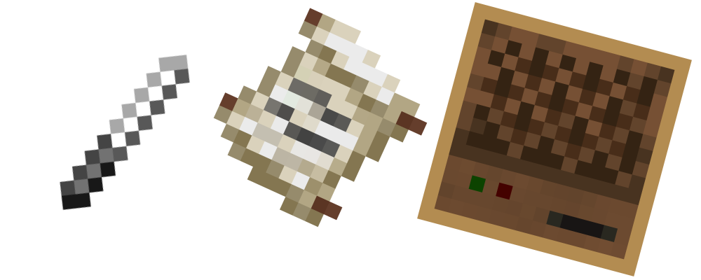
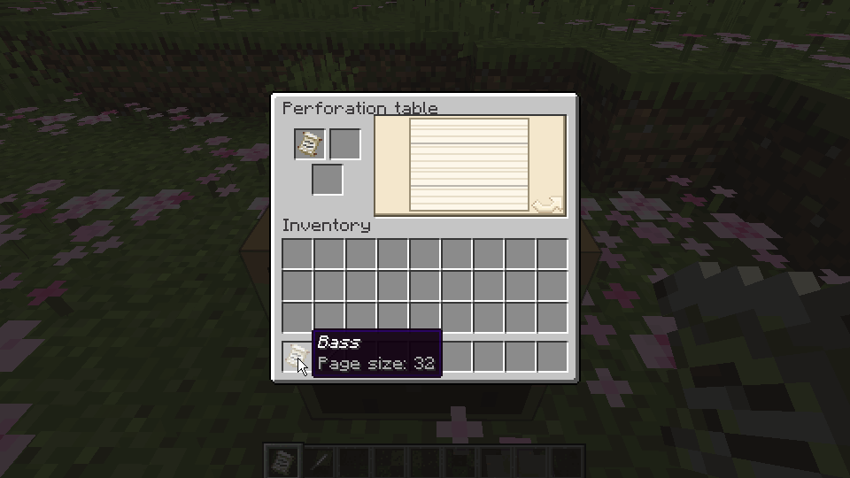
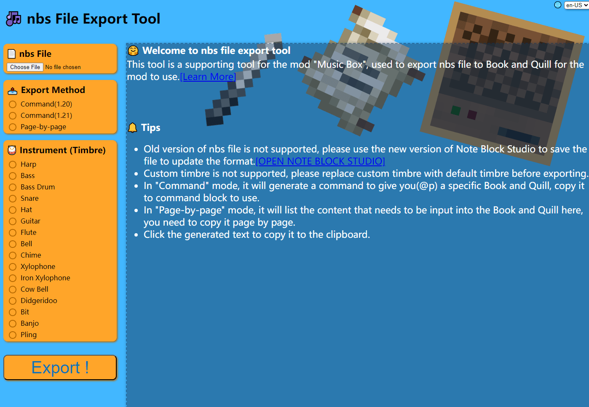

**中文 | [English](../README.md)**

# 纸带八音盒

版本 0.5.3 (2025.5) | [下载](#下载)

**在纸带上打出你喜欢的曲子，并用八音盒演奏！**

## 预览

### 控制自动化

↑ 通过比较器按照纸带的内容输出不同的红石信号。

### 打孔

↑ 在打孔台为纸带打孔。

### 声响碎片

https://github.com/user-attachments/assets/1682f6c8-a0e3-4f53-b09d-6eb9d0cd0c09

↑ 使用声响碎片记录、播放声音。

### 八度偏移

https://github.com/user-attachments/assets/af37487b-0693-4638-988d-5dac99e76190

↑ 使用锥子敲击八音盒可设置其八度偏移。

## 跳转

* [八音盒](#八音盒)
* [纸带](#纸带)
* [纸带页面](#纸带页面)
* [锥子](#锥子)
* [纸糊](#纸糊)
* [打孔台](#打孔台)
* [声响碎片](#声响碎片)
* [声响盒](#声响盒)
* [获取参考数据](#获取参考数据)

## 模组内容

### 八音盒

装载、演奏纸带。

* 根据自己下方的方块决定八音盒的音色：
    * 与原版的音符盒类似，且可以与其他为音符盒添加音色的模组共同使用(
      例如：[Instrument ++](https://github.com/Viola-Siemens/Instrument-Plus-Plus)）。
    * 方块为声响盒时，会按照其音色演奏。
* 使用锥子可设置八音盒的演奏速度：
    * 单位为`tick/beat`即每一拍所需的`tick`。
    * 速度范围为：`[1, 20]`。
    * 默认速度为`10`tick/beat。
* 使用锥子敲击八音盒可设置其八度偏移：
    * 偏移范围为`[-2, 2]`。
    * 默认偏移为`0`。
    * 注意：**某些乐器进行较大偏移后可能会十分刺耳！**
* 没装纸带时：
    * 可以对八音盒使用纸带以将其装入。
    * 可以用漏斗向八音盒塞入纸带，纸带以外的物品会被挡在漏斗里。
* 装有纸带时：
    * 按下潜行键并空手使用八音盒可取出其纸带。
    * 敲击或使用八音盒可演奏一拍。
    * 被红石信号激活时：
        * 按照设置好的速度演奏纸带上的内容。
        * 使用比较器检测会输出`[1, 15]`强度的红石信号：
            * 强度`1`：还没有演奏或这一拍没有音符。
            * 强度`n (1<n<15)`：这一拍最低音的序号（从零起）等于`n-2`。
            * 强度`15`：这一拍最低的音的序号（从零起）大于等于`13`。
    * 没有被红石信号激活时：
        * 可使用漏斗取出纸带。
        * 对八音盒使用纸带或书与笔，可将其内容叠加至当前的纸带上。（仅创造模式可用）
* 纸带播放完毕时：
    * 若八音盒的正后方有容器，纸带会直接装入该容器。
    * 若没有容器或无法放入容器，则会将其向前弹出。

### 纸带

储存曲目的载体。

* 使用可进入纸带页面（查看模式）。
* 内容格式：
    * 页：
        * 默认有`1`页。
        * 最多有`64`页。
        * 每页固定有`64`拍。
    * 拍：
        * 可以在`25`种音高里任意打孔（原版音符盒的音域）。

### 纸带页面

查看、编辑纸带内容的页面。

* 查看模式：
    * 按下空格可切换播放模式。
    * 没有播放时：
        * 使用滚轮翻页。
    * 播放时：
        * 使用`黑色`进度条表示进度。
        * 使用滚轮调整播放速度。
        * 默认音色为`竖琴(Harp)`，如果玩家主手或副手有声响碎片，会尝试按其音色演奏。
        * 只有自己能听到。
* 打孔模式：
    * 没有参考数据时：
        * 与查看模式基本相同，左键可在纸带上打孔，右键可试听所选音符加入所在拍后的效果。
    * 有参考数据时：
        * 参考数据中的内容会显示在纸带上。
        * 查看模式中的播放模式会被打孔小游戏替代：
            * 使用`红色`进度条表示进度。
            * 按鼠标任意键或键盘`z`/`x`键可为`5`tick内最近的整个拍子打孔：
                * 如果打孔失败，会扣除锥子`16`点耐久。
                * 遇到没有被打的参考数据时停下，打孔后才会继续。
* 修补模式：
    * 与查看模式基本相同。左键可修补纸带上的孔，右键可试听修补特定孔后的效果。

### 锥子

打孔、查看和设置八音盒速度、设置八音盒八度偏移的工具。

* 不按潜行键并对八音盒使用可将其速度设为锥子储存的速度。
* 按下潜行键并对八音盒使用可查看其当前速度。
* 锥子储存的速度：
    * 默认值和范围与八音盒的速度相同。
    * 不按潜行键并使用：`+1`。
    * 按下潜行键并使用：`-1`。
* 调整八音盒的八度偏移：
    * 不按潜行键并敲击：`+1`。
    * 按下潜行键并敲击：`-1`。

### 纸糊

用于修补纸带的耗材。

* 除了在工作台合成外，还可对有水的炼药锅使用纸获得。

### 打孔台

对纸带进行查看、打孔、连接的操作台。

* 使用可进入打孔台页面：
    * 若需要在页面内使用声响碎片的音色，需手持声响碎片。
* 打孔台页面：
    * 页面构成：
        * 右侧的预览图会根据不同的模式显示提示，单击预览图即可触发特定的操作。
        * 左上栏位为`操作对象`，只能放入纸带。
        * 右上栏位为`输入内容`，能放入纸带或书与笔。
        * 下方栏位为`工具`，能放入锥子、黏液球、纸糊、剪刀。
    * 查看模式：
        * 需要`操作对象`不为空，`工具`为空。
        * 可以进入查看模式的[纸带页面](#纸带页面)：
            * `操作对象`为查看的对象。
            * `输入内容`为参考数据。
    * 打孔模式：
        * 需要`操作对象`不为空，`工具`为锥子。
        * 可以进入打孔模式的[纸带页面](#纸带页面)：
            * `操作对象`为打孔的对象。
            * `输入内容`为参考数据。
            * 每个孔消耗`1`点耐久，`工具`坏掉后会自动退出该模式。
    * 连接模式：
        * 需要`操作对象`不为空，`输入内容`为纸带，`工具`为黏液球，且合并后的纸带长度不超过`64`页。
        * 可以连接两个纸带：
            * `操作对象`在前，`输入内容`在后。
            * `输入内容`与`工具`会被消耗。
    * 修补模式：
        * 需要`操作对象`不为空，`工具`为纸糊。
        * 可以进入修补模式的[纸带页面](#纸带页面)：
            * `操作对象`为修补的对象。
            * 每次修补消耗`1`个纸糊。
    * 切分模式：
        * 需要`操作对象`不为空，`输入内容`为空，`工具`为剪刀。
        * 可以在特定页的结尾将纸带分为两部分。

### 声响碎片

接收、记录、播放声音。

* 监听声音：
    * 当声响碎片没有记录声音时，使用可监听周围的声音。
    * 当监听到新的声音事件时，会有文本提示。
    * 停止接收声音时，其最后监听到的声音会被记录，并有文本提示。
    * 监听声音只会记录声音事件，不会记录声音种子。
* 记录声音：
    * 声音事件：
        * 如“哞”、“咩”等。
    * 声音种子：
        * 用于确定声音事件中的具体声音。在同一个声音事件中，不同的种子会播放不同的声音。
* 播放声音：
    * 当声响碎片录有声音时，使用可播放其声音：
        * 声音种子存在时，每次播放都会使用相同的种子，发出同样的声音。
        * 声音种子不存在时，每次播放都会使用随机的种子，发出的声音会有所不同。
    * 播放间隔：
        * 默认为`55`tick。
        * 每有`1`级效率附魔，间隔减少`10`tick，最多减少`50`tick。
* 更新声音种子：
    * 见[声响盒](#声响盒)。
    * 按下潜行键并使用可更新声音种子。（仅创造模式可用）
* 重置：
    * 对装有细雪的炼药锅使用可重置声响碎片。
    * 副手使用可重置声响碎片。（仅创造模式可用）

### 声响盒

装载、演奏声响碎片。

* 没装声响碎片时：
    * 对声响盒使用存有声音的声响碎片可装入碎片。
    * 其上方的八音盒会静音演奏。
* 装有声响碎片时：
    * 敲击、使用或受到红石信号激活时，演奏声响碎片的声音：
        * 当其上方为八音盒时，不再因此演奏。
    * 其上方的八音盒会按照声响碎片的声音演奏。
    * 相邻且指向此声响盒的避雷针被闪电击中时，会刷新并固定声响碎片的声音种子。

## 获取参考数据

通过编写书与笔的内容，可以将其作为参考数据，为纸带的打孔提供便利。

* 转换规则：
    * 每一拍使用[Note Block Studio](https://opennbs.org/)中的键位代表音符，使用“.”作为这一拍的结束。
    * 以《小星星》为例：
        * 简谱（0为空拍）：`1，1，5，5，6，6，5，0，4，4，3，3，2，2，1`。
        * 书本内容：`r.r.i.i.o.o.i..u.u.y.y.t.t.r`。
    * 如果有多声部，就在对应的拍子那里添加上对应的键位即可。
* 使用[NBS 文件导出工具](https://c20c01.github.io/Mods/MusicBox/Tool)可将你的`nbs`文件自动转换成书与笔的内容：
  
    * 只支持新版nbs文件。无法加载时，请使用新版[Note Block Studio](https://opennbs.org/)重新保存以更新文件格式。
    * 不支持自定义音色，可以先转成原版有的乐器，之后再进行导出。

[此处](Songs.md)有一些使用nbs文件（网络上收集的，有些经过了修改）进行导出后的结果。

# 下载😘

* [CurseForge](https://www.curseforge.com/minecraft/mc-mods/cc-mb)
* [Modrinth](https://modrinth.com/mod/cc-mb)